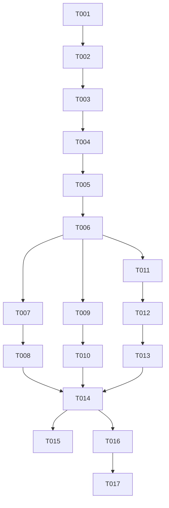

# Tasks: API 26 升级与沉浸光感适配

**Input**: Design documents from `spec/api26-immersive-material/`
**Prerequisites**: plan.md (required), spec.md (required for user stories)

**Tests**: 本特性未要求编写自动化测试任务，验证走 Verification 阶段的构建 + 部署。
**Organization**: 任务按用户故事分组，可独立实现与验证。

## Format: `[ID] [P?] [Story] Description`

- **[P]**: 可并行（不同文件、无未完成依赖）
- **[Story]**: 对应 spec.md 的用户故事（US1/US2/US3）
- 描述均以具体文件路径结尾

## Path Conventions

- 既有 HarmonyOS 单模块工程：源码在 `entry/src/main/ets/`，配置在 `build-profile.json5`（根）与 `entry/src/main/module.json5`
- 本特性任务中的路径均为绝对路径（`D:\work\pixiv-\` 前缀）

---

## Phase 1: Setup (Shared Infrastructure)

**Purpose**: SDK 版本升级与构建前提确认

- [ ] T001 确认本机已安装 6.2.0(26)+ HarmonyOS SDK（检查 DevEco Studio SDK 目录下 openharmony ets 的 oh-uni-package.json apiVersion ≥ 26）；若未安装，中止并提示用户先安装 SDK —— 路径 `C:\Program Files\Huawei\DevEco Studio\sdk`【实现阶段已检查：本机仅安装 6.1.1(24)，SDK 26 未就绪，按上级指示继续 T002–T015，构建验证阻塞】
- [X] T002 升级构建版本字段：`compileSdkVersion` 显式新增为 `"6.2.0(26)"`、`targetSdkVersion` 改为 `"6.2.0(26)"`、`compatibleSdkVersion` 保持 `"6.1.0(23)"` 不变 —— `D:\work\pixiv-\build-profile.json5`
- [ ] T003 执行一次全量构建确认纯版本升级无编译回归（不改动任何源码）—— `build_project`（debug，modules: entry）【阻塞：SDK 26 未安装，且 spec-implement 阶段禁用 build_project】

---

## Phase 2: Foundational (Blocking Prerequisites)

**Purpose**: 应用级开关与运行时判定工具，是所有用户故事的前置

**⚠️ CRITICAL**: 本阶段未完成前不得开始任何用户故事任务

- [X] T004 在 module.json5 的 module 节点追加 metadata `{ "name": "ohos.arkui.UIMaterial.state", "value": "enable" }`（与既有 abilities/extensionAbilities metadata 并存）—— `D:\work\pixiv-\entry\src\main\module.json5`
- [X] T005 新建 MaterialUtils 工具：模块级缓存的支持判定（`deviceInfo.sdkApiVersion >= 26` 短路 + `import lazy { uiMaterial } from '@kit.ArkUI'` 惰性加载 + `uiMaterial.isImmersiveMaterialSupported()`），导出 `isImmersiveSupported()` 与三个材质工厂 `viewerBarMaterial()`（ULTRA_THIN）、`pillButtonMaterial()`（ULTRA_THIN + interactive）、`fabMaterial()`（THIN + interactive），不支持时一律返回 undefined；材质对象缓存复用、运行期不变更参数；uiMaterial 仅允许在本文件内访问 —— `D:\work\pixiv-\entry\src\main\ets\utils\MaterialUtils.ets`
- [X] T006 对 T005 执行 `arkts_check` 静态检查并修复问题（已知 @kit.* 噪音 6 条可忽略）—— `D:\work\pixiv-\entry\src\main\ets\utils\MaterialUtils.ets`【剩余 1 条 `uiMaterial` 未导出错误为本机 SDK 6.1.1(24) 所致，安装 SDK 26 后自动消除】

**Checkpoint**: 应用级开关与判定工具就绪 —— 用户故事可开始

---

## Phase 3: User Story 1 - 应用级沉浸光感生效 (Priority: P1) 🎯 MVP

**Goal**: ENABLE 模式下 Toast/菜单/Dialog 等系统组件默认材质化，低版本设备无异常

**Independent Test**: API 26+ 设备触发 Toast 与长按菜单观察材质效果；无需组件级改动即可验证

### Implementation for User Story 1

- [X] T007 [US1] 排查应用级 ENABLE 后默认材质化的系统组件在本项目中的实际表现：梳理全部 `showToast`、`bindContextMenu`、`AlertDialog`、`TextPickerDialog`、`Select` 调用点，确认无组件因默认材质产生可读性/交互问题；对不符合预期的组件用 `uiMaterial.Material.empty`（经 MaterialUtils 门控封装后）单独关闭 —— 排查范围 `D:\work\pixiv-\entry\src\main\ets\pages\` 与 `D:\work\pixiv-\entry\src\main\ets\components\`，改动落在实际命中的文件【排查结论：项目未使用 Select/Chip/Slider/SegmentButton/AlphabetIndexer 组件；Toggle（SettingWidgets/LoginPage）、TextPickerDialog（SettingWidgets）、AlertDialog、bindContextMenu 菜单、Toast 均为标准系统组件默认材质化场景，无自定义背景冲突，无需单独关闭，零代码改动】
- [ ] T008 [US1] 构建验证 US1：应用级开关与排查改动编译通过 —— `build_project`【阻塞：SDK 26 未安装，且 spec-implement 阶段禁用 build_project】

**Checkpoint**: US1 独立可用 —— Toast/菜单/Dialog 默认材质生效且无回归

---

## Phase 4: User Story 2 - 图片查看器底栏沉浸光感 (Priority: P2)

**Goal**: 查看器底部图标栏在 API 26+ 设备呈现 ULTRA_THIN 材质，七项按钮功能不变

**Independent Test**: 进入 ImageViewerPage 观察底栏材质并逐项点击验证复制/页码/返回/全屏/保存/分享/HD

### Implementation for User Story 2

- [X] T009 [US2] 改造查看器底部图标栏为双分支渲染：提取栏内按钮内容到共享 @Builder；`MaterialUtils.isImmersiveSupported()` 为真时容器透明底 + `.systemMaterial(MaterialUtils.viewerBarMaterial())`（systemMaterial 置于其他样式属性之后），否则保留现状 `rgba(0, 0, 0, 0.25)` 底色；两分支均保留底部安全区 padding、`hitTestBehavior(HitTestMode.Transparent)`、SpaceEvenly 布局与全部按钮交互（SaveButton 安全控件属性用法不变、遮罩态可用性不变）—— `D:\work\pixiv-\entry\src\main\ets\pages\detail\ImageViewerPage.ets`
- [X] T010 [US2] 对改动文件执行 `arkts_check` 并修复问题 —— `D:\work\pixiv-\entry\src\main\ets\pages\detail\ImageViewerPage.ets`

**Checkpoint**: US1 + US2 均独立可用

---

## Phase 5: User Story 3 - 详情页顶栏与 FAB 沉浸光感 (Priority: P3)

**Goal**: 详情页顶栏药丸按钮（‹/⋮）与收藏 FAB 应用材质与按压反馈，全部既有交互不变

**Independent Test**: 进入任意作品详情页，观察顶栏与 FAB 材质，验证单击返回/菜单/收藏、长按 FAB 带标签收藏面板、长按下载选页弹窗

### Implementation for User Story 3

- [X] T011 [US3] 改造顶栏药丸按钮（Text('‹') 返回 / Text('⋮') 菜单）为双分支：支持材质时透明底 + `.systemMaterial(MaterialUtils.pillButtonMaterial())`，否则保留 `rgba(0, 0, 0, 0.4)` 药丸底色；`router.back()` 与 `bindContextMenu` 六项菜单、菜单内 toast 先收菜单再 setTimeout(300) 约定均不进分支 —— `D:\work\pixiv-\entry\src\main\ets\components\detail\IllustDetailPane.ets`
- [X] T012 [US3] 改造收藏 FAB 为双分支：支持材质时应用 `.systemMaterial(MaterialUtils.fabMaterial())` 并移除该分支上的自定义 shadow（材质 applyShadow 默认生效，防冲突）；否则保留现状样式与 shadow；单击 toggleBookmark、长按 BookmarkTagPanel、面板/弹窗打开时隐藏 FAB 等可见性门控不变；下载 FAB（SaveButton 安全控件）不做任何材质改动 —— `D:\work\pixiv-\entry\src\main\ets\components\detail\IllustDetailPane.ets`
- [X] T013 [US3] 对改动文件执行 `arkts_check` 并修复问题 —— `D:\work\pixiv-\entry\src\main\ets\components\detail\IllustDetailPane.ets`

**Checkpoint**: 全部用户故事独立可用

---

## Phase 6: Polish & Cross-Cutting Concerns

**Purpose**: 性能约束自查与收尾

- [X] T014 材质使用合规自查：确认全部材质落点满足官方约束（仅局部浮动组件、无材质嵌套、未与 backgroundBlurStyle/backgroundEffect 叠加、无运行时频繁变更材质参数、未在滚动列表项/动图上方使用）—— 复核 `D:\work\pixiv-\entry\src\main\ets\pages\detail\ImageViewerPage.ets`、`D:\work\pixiv-\entry\src\main\ets\components\detail\IllustDetailPane.ets`、`D:\work\pixiv-\entry\src\main\ets\utils\MaterialUtils.ets`【复核通过：仅 3 处落点、uiMaterial 仅在 MaterialUtils、材质分支无 shadow/模糊叠加、材质对象模块级缓存、SaveButton 零改动】
- [X] T015 [P] 更新 AGENTS.md 架构说明：登记 MaterialUtils 工具职责、module.json5 应用级开关、三处组件级落点与 SaveButton 例外 —— `D:\work\pixiv-\AGENTS.md`

---

## Phase 7: Verification

<!-- verification_scope: build-only -->

**Purpose**: 构建与部署验证（不含 UI 验证）

- [X] T016 全量构建项目并修复全部编译错误（build_project，迭代 修复→构建 直至成功）—— `D:\work\pixiv-\`（SDK 26 安装后构建成功；版本号格式修正为 26.0.0 新点分格式并移除显式 compileSdkVersion）
- [X] T017 部署应用到设备/模拟器并确认冷启动成功、登录/主页可达（start_app，module: entry）—— `D:\work\pixiv-\`（Mate 70 Pro+ 模拟器部署成功，SplashPage 正常加载，apiTarget=26 / compatible=23，无崩溃）

---

## Dependencies & Execution Order

### Phase Dependencies

- **Setup (Phase 1)**: 无依赖，可立即开始；T001 为硬阻塞（SDK 未安装则中止）
- **Foundational (Phase 2)**: 依赖 Setup 完成 —— 阻塞所有用户故事
- **User Stories (Phase 3–5)**: 均依赖 Foundational 完成；之后可按 P1 → P2 → P3 顺序串行，US2 与 US3 因不同文件可并行
- **Polish (Phase 6)**: 依赖全部用户故事完成
- **Verification (Phase 7)**: 依赖 Polish 完成，T016 → T017 严格串行

### User Story Dependencies

- **US1 (P1)**: Foundational 完成后即可开始，不依赖其他故事
- **US2 (P2)**: Foundational 完成后即可开始，独立可测
- **US3 (P3)**: Foundational 完成后即可开始，独立可测

### 📊 Dependency Graph



### ⚡ Parallel Execution Guide

| Phase | Tasks | Required Files | Execution Notes |
|-------|-------|----------------|-----------------|
| US2 / US3 | T009+T010 与 T011+T012+T013 | ImageViewerPage.ets / IllustDetailPane.ets | 不同文件可并行，但均为小改动，串行亦可 |
| Polish | T014 与 T015 | 3 个 ets 文件 / AGENTS.md | 复核与文档可并行 |
| Verification | T016 → T017 | 全工程 | 严格串行：构建成功后才能部署 |

---

## Parallel Example

Foundational 完成后 US2 与 US3 可同时推进（不同文件、无交叉依赖）：

```text
Task: "T009 [US2] 改造查看器底部图标栏双分支 —— ImageViewerPage.ets"
Task: "T011 [US3] 改造详情页顶栏药丸按钮双分支 —— IllustDetailPane.ets"
```

Polish 阶段 T014（合规复核）与 T015（AGENTS.md 文档）亦可并行。

---

## Implementation Strategy

### MVP First (User Story 1 Only)

1. 完成 Phase 1: Setup（SDK 升级 + 构建回归确认）
2. 完成 Phase 2: Foundational（应用级开关 + MaterialUtils）
3. 完成 Phase 3: US1（默认材质排查）
4. **STOP and VALIDATE**: 触发 Toast/菜单独立验证 US1
5. 即可交付 MVP（全应用系统组件材质化）

### Incremental Delivery

1. Setup + Foundational → 地基就绪
2. + US1 → 独立验证 → 可交付（MVP）
3. + US2 → 独立验证 → 可交付
4. + US3 → 独立验证 → 可交付
5. 每个故事增量交付且不破坏既有故事

---

## Summary Report

- **Total tasks**: 17（T001–T017）
- **Per-story count**: US1 = 2（T007–T008），US2 = 2（T009–T010），US3 = 3（T011–T013）；Setup = 3，Foundational = 3，Polish = 2，Verification = 2
- **Parallel opportunities**: US2 与 US3（不同文件）、T014 与 T015
- **Independent test criteria**: US1 触发 Toast/菜单观察材质；US2 查看器底栏材质 + 七按钮功能；US3 详情页顶栏/FAB 材质 + 单击长按交互
- **Suggested MVP scope**: Phase 1 + Phase 2 + Phase 3（US1）——仅应用级开关即可交付全应用系统组件材质化

## Notes

- 所有材质调用必须经 `MaterialUtils.isImmersiveSupported()` 门控，UI 组件不得直接 import uiMaterial
- T001 为硬阻塞：SDK 未安装时不得继续后续任务
- 双分支渲染中交互逻辑（单击/长按/菜单/toast 约定）一律放共享 @Builder，不进版本分支
