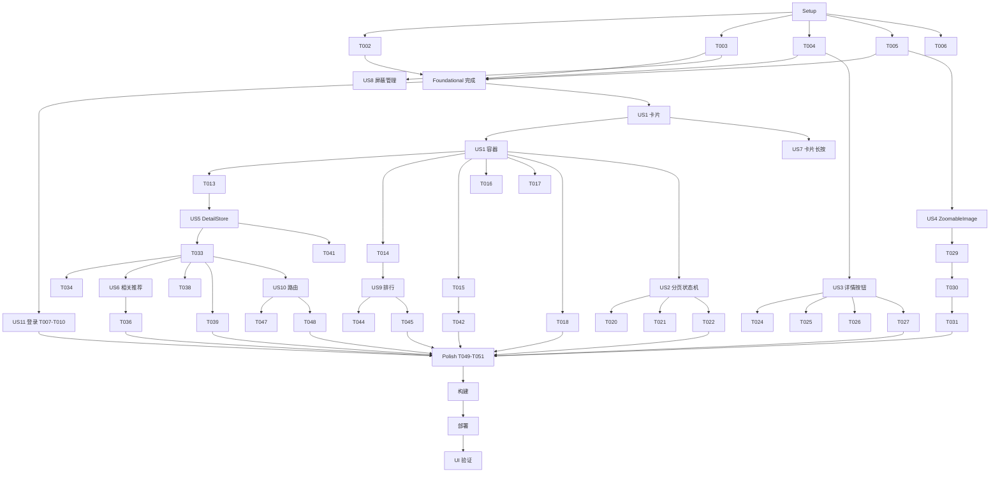

# Tasks: 浏览体验对标 PixEz 全面升级

**Input**: Design documents from `spec/browse-experience-upgrade/`
**Prerequisites**: plan.md, spec.md

**Organization**: 按用户故事分组，P1 故事（US11 登录、US1 瀑布流、US2 分页、US3 收藏、US4 查看器）优先；Foundational 阶段（fetchNext/MuteFilter/BookmarkStateStore/CachedImage 增强）阻塞所有列表类故事。

## Format: `[ID] [P?] [Story] Description`

- **[P]**: 可并行（不同文件、无未完成依赖）
- **[Story]**: 映射 spec.md 用户故事（US1~US11）
- 所有路径基于仓库根 `D:\work\pixiv-\`

---

## Phase 1: Setup (Shared Infrastructure)

- [X] T001 创建新目录骨架 `entry/src/main/ets/components/illust/` 与 `entry/src/main/ets/components/viewer/`（空目录由后续任务文件填充，无需占位文件）

---

## Phase 2: Foundational (Blocking Prerequisites)

**⚠️ CRITICAL**: 以下任务全部完成前，不得开始任何用户故事任务

- [X] T002 [P] 在 `entry/src/main/ets/network/ApiService.ets` 新增通用游标续页方法 `fetchNext(nextUrl: string): Promise<Object>`（直接 GET 完整 next_url，返回解析后的 JSON 对象）
- [X] T003 [P] 在 `entry/src/main/ets/utils/MuteFilter.ets` 新建纯函数 `isMuted(illust, settings)`：标题或任一标签名包含屏蔽词（不区分大小写）/ 作者 id 命中 muteUsers / aiFilter 开启且 illustAIType===2 时返回 true
- [X] T004 在 `entry/src/main/ets/stores/BookmarkStateStore.ets` 新建收藏状态注册表单例：`Map<illustId, 0|1|2>` 三态 + AppStorage key `bookmarkStates` 引用替换同步 + `stateOf/seedFromList/star/unstar`（star/unstar 含请求中锁、失败回滚、toast 反馈、成功后同步 illust.isBookmarked 并使 DatabaseService 详情缓存失效）
- [X] T005 [P] 增强 `entry/src/main/ets/components/common/CachedImage.ets`：支持入参自定义 aspectRatio 与 ImageFit（默认保持现状 aspectRatio(1)+Cover 兼容旧调用方），并新增静态预取方法供查看器相邻页预加载
- [X] T006 [P] 在 `entry/src/test/` 新增 MuteFilter 单元测试（屏蔽词大小写/标签匹配/作者屏蔽/AI 过滤四组用例）

**Checkpoint**: 基础设施就绪，用户故事可开始

---

## Phase 3: User Story 11 - 登录态持久化与 Token 刷新健壮性 (Priority: P1) 🎯 MVP 之一

**Goal**: 修复"莫名其妙掉登录"：刷新响应校验通过才写回 token；区分凭证失效与网络错误；刷新节流

**Independent Test**: 模拟刷新接口返回无 token 字段的错误 JSON，登录态保持不坏；模拟网络超时，不触发登出

- [ ] T007 [US11] 修改 `entry/src/main/ets/network/OAuthService.ets`：`refreshToken()` 增加响应有效性校验（responseCode===200 且 access_token 非空），失败时抛类型化错误（凭证失效 CredentialInvalidError / 网络错误 NetworkError），校验通过前不写回任何 token
- [ ] T008 [US11] 修改 `entry/src/main/ets/stores/AccountStore.ets`：`refreshToken()` 按错误类型分类处理——CredentialInvalidError 才置 needsRelogin 并提示重新登录；NetworkError 保持登录态仅返回 false；移除无差别 forceLogout
- [ ] T009 [US11] 修改 `entry/src/main/ets/network/AuthInterceptor.ets`：增加刷新节流（距上次成功刷新 <120s 直接复用当前 token）；401 重放后仍失败时按分类处理；刷新返回空 token 时不重放请求
- [ ] T010 [US11] 在登录失效路径增加用户提示：needsRelogin 时 toast/弹窗引导重新登录（ SplashPage 或 HomePage 入口检测 `AppStorage.isLoggedIn` 变化），文件 `entry/src/main/ets/pages/splash/SplashPage.ets`

**Checkpoint**: token 过期可静默续期；临时网络故障零误登出

---

## Phase 4: User Story 1 - 真实宽高比瀑布流与统一插画卡片 (Priority: P1) 🎯 MVP 之一

**Goal**: 所有列表页切换为 WaterFlow 真实宽高比瀑布流 + 唯一公共卡片组件

**Independent Test**: 推荐页渲染不同宽高比卡片无裁剪变形；长图方图；多 P 角标；红心标识

- [X] T011 [US1] 新建 `entry/src/main/ets/components/illust/IllustCard.ets`：@Reusable 卡片，按 illust 宽高比展示预览图（高/宽>3 降级方图），含标题、作者名、多 P 页数角标（pageCount>1）、红心角标（@StorageLink 读 bookmarkStates，回退 illust.isBookmarked），入参含点击/长按回调
- [X] T012 [US1] 新建 `entry/src/main/ets/components/illust/IllustWaterfall.ets`：WaterFlow + LazyForEach + 自定义 IDataSource，FlowItem 高度按列宽×宽高比+信息区高度预计算，列数读 crossCount 设置，数据入库时经 MuteFilter 过滤并调用 BookmarkStateStore.seedFromList，入参 `fetchFirst(): Promise<IllustListPage>` 与 `onCardClick`
- [X] T013 [US1] RecomPage 接入 IllustWaterfall 替换 List.lanes 与本地 IllustCard，删除本地复制代码，文件 `entry/src/main/ets/pages/home/RecomPage.ets`
- [X] T014 [P] [US1] RankPage 接入 IllustWaterfall，文件 `entry/src/main/ets/pages/home/RankPage.ets`
- [X] T015 [P] [US1] SearchPage 接入 IllustWaterfall，文件 `entry/src/main/ets/pages/search/SearchPage.ets`
- [X] T016 [P] [US1] FollowPage 接入 IllustWaterfall，文件 `entry/src/main/ets/pages/home/FollowPage.ets`
- [X] T017 [P] [US1] TagSearchPage 接入 IllustWaterfall，文件 `entry/src/main/ets/pages/search/TagSearchPage.ets`
- [X] T018 [P] [US1] BookmarkPage 接入 IllustWaterfall（保留"取消收藏"操作），文件 `entry/src/main/ets/pages/bookmark/BookmarkPage.ets`

**Checkpoint**: 六个列表页统一瀑布流，无复制卡片代码

---

## Phase 5: User Story 2 - 全列表分页加载与下拉刷新 (Priority: P1) 🎯 MVP 之一

**Goal**: 所有列表滚动到底自动续页（next_url 游标），尾部三态，下拉刷新全覆盖

**Independent Test**: 推荐页连续加载 ≥5 页无重复；末尾显示无更多；失败可重试

- [X] T019 [US2] 在 `entry/src/main/ets/components/illust/IllustWaterfall.ets` 实现分页状态机（idle/loading/noMore/error）：fetchFirst 返回 nextUrl 后经 ApiService.fetchNext 续页，防重入锁 + 按 illust.id 去重 + 尾部 footer 三态（加载中/没有更多了/失败重试）+ 触底前预加载（倒数第 N 项 onAppear 提前触发）
- [X] T020 [US2] 在 `entry/src/main/ets/components/illust/IllustWaterfall.ets` 集成 Refresh 下拉刷新容器（enableRefresh 入参可控），刷新后清空数据重新 fetchFirst
- [X] T021 [US2] 修复 FollowPage "加载更多重复拉首屏"缺陷：fetchFirst 返回真实 nextUrl 交由容器续页，文件 `entry/src/main/ets/pages/home/FollowPage.ets`
- [X] T022 [P] [US2] 修复 RankPage 续页：排行接口 next_url 接入容器分页（含 mode/date 参数保持），文件 `entry/src/main/ets/pages/home/RankPage.ets`

**Checkpoint**: 全部列表分页/刷新生效，动态页 bug 消除

---

## Phase 6: User Story 3 - 收藏状态可见、可操作、跨页同步 (Priority: P1) 🎯 MVP 之一

**Goal**: 详情页三态收藏按钮、公开/私密选择、跨页同步、收藏页增强

**Independent Test**: 详情页收藏→返回列表红心同步→收藏页可见；取消后各处状态消失

- [X] T023 [US3] 修改 `entry/src/main/ets/pages/detail/IllustDetailPage.ets` 收藏按钮接 BookmarkStateStore 三态（未收藏/请求中/已收藏，红心标识），点击调 star/unstar，失败 toast 提示
- [X] T024 [US3] 详情页收藏按钮长按弹 ActionSheet 选择公开/私密收藏（restrict 传入 BookmarkStateStore.star），文件 `entry/src/main/ets/pages/detail/IllustDetailPage.ets`
- [X] T025 [US3] 修复详情页缓存陈旧：详情加载时网络结果到达后以 BookmarkStateStore 播种为准覆盖缓存状态；注册表变更时使对应 DB 详情缓存失效，文件 `entry/src/main/ets/stores/BookmarkStateStore.ets` 与 `entry/src/main/ets/pages/detail/IllustDetailPage.ets`
- [X] T026 [US3] BookmarkPage 增加公开/私密切换（Tab 或下拉），切换后重新 fetchFirst（restrict 参数传入），文件 `entry/src/main/ets/pages/bookmark/BookmarkPage.ets`
- [X] T027 [US3] 修复 ImageViewerPage 保存时漏接 autoBookmarkOnDownload 联动（对齐详情页 handleSave 行为，走 BookmarkStateStore.star），文件 `entry/src/main/ets/pages/detail/ImageViewerPage.ets`

**Checkpoint**: 收藏全链路状态一致可见

---

## Phase 7: User Story 4 - 全屏图片查看器：缩放、翻页、进度 (Priority: P1) 🎯 MVP 之一

**Goal**: Swiper 多页翻页 + 双指缩放/双击/拖动 + 相邻页预加载

**Independent Test**: 多 P 查看器内缩放细节、双击还原、横滑翻页、页码同步

- [X] T028 [US4] 新建 `entry/src/main/ets/components/viewer/ZoomableImage.ets`：ParallelGesture(PinchGesture+PanGesture) + TapGesture(count:2) 双击，scale 限幅 1~5，offset 边界钳制，scale=1 时 offset 归零，onScaleChange 回调上报
- [X] T029 [US4] 重构 `entry/src/main/ets/pages/detail/ImageViewerPage.ets`：Swiper 承载全部页（入参改为图片 URL 数组+初始索引），自定义页码指示（x/N），scale>1 时 Swiper disableSwipe 联动解决手势冲突，顶部保留返回/保存按钮，加载中显示 LoadingProgress
- [X] T030 [US4] 相邻页预加载：当前索引变化时对 index±1 调 CachedImage 预取方法，文件 `entry/src/main/ets/pages/detail/ImageViewerPage.ets`
- [X] T031 [US4] 详情页点击进入查看器时传入整组页 URL 与当前页索引（配合 US5 行模型，过渡期内兼容旧单页入口），文件 `entry/src/main/ets/pages/detail/IllustDetailPage.ets`

**Checkpoint**: 查看器对标 photo_view 核心交互

---

## Phase 8: User Story 5 - 多 P 插画详情页纵向连续滚动重构 (Priority: P2)

**Goal**: 单 List 行模型：全部图片页纵向连续滚动 + 信息区

**Independent Test**: 10P 插画全程滑动浏览，0 次翻页点击

- [X] T032 [US5] 新建 `entry/src/main/ets/stores/IllustDetailStore.ets`：详情加载（缓存→网络→注册表播种）、DetailRow 行模型组装（image 行×pageCount + info 行）、按 metaPages 宽高比计算 image 行 aspectRatio
- [X] T033 [US5] 重构 `entry/src/main/ets/pages/detail/IllustDetailPage.ets`：单 List + LazyForEach 渲染行模型，图片行带页码占位与独立加载态，info 行含标题/作者/统计/标签/操作按钮区（收藏三态、保存、下载全部，保留 autoBookmarkOnDownload 联动），移除旧翻页按钮/圆点指示器/SwipeGesture
- [X] T034 [US5] 详情页图片行点击跳 ImageViewerPage（传整组 URL+索引），长按弹保存菜单在 US7 落地，文件 `entry/src/main/ets/pages/detail/IllustDetailPage.ets`

**Checkpoint**: 多 P 浏览形态对齐 PixEz

---

## Phase 9: User Story 6 - 详情页相关插画推荐 (Priority: P2)

**Goal**: 详情底部相关作品网格 + 分页续载 + 点击跳转

**Independent Test**: 详情页滑到底见相关网格，点击进新详情

- [X] T035 [US6] IllustDetailStore 增加相关推荐加载：getRelatedIllusts 首屏 + fetchNext 续页 + MuteFilter 过滤 + 注册表播种，行模型追加 related_header 与 related 行（每行≤3 幅），文件 `entry/src/main/ets/stores/IllustDetailStore.ets`
- [X] T036 [US6] 详情页渲染 related 行（复用 IllustCard 的 3 列排布），点击 pushUrl 新 IllustDetailPage，滚动到底触发 loadMoreRelated，文件 `entry/src/main/ets/pages/detail/IllustDetailPage.ets`

**Checkpoint**: 相关推荐闭环

---

## Phase 10: User Story 7 - 长按快捷交互 (Priority: P2)

**Goal**: 卡片/图片/标签三处长按菜单

**Independent Test**: 推荐页长按卡片保存图片 toast 成功；长按标签屏蔽后列表过滤

- [X] T037 [US7] IllustCard 接入 bindContextMenu(ResponseType.LongPress) 快捷菜单：保存图片（DownloadService）、收藏/取消收藏（BookmarkStateStore）、屏蔽该作者（UserSettingStore 追加 muteUsers 并即时过滤），文件 `entry/src/main/ets/components/illust/IllustCard.ets`
- [X] T038 [P] [US7] 详情页图片行 LongPressGesture 弹 ActionSheet（保存当前页/保存全部页），文件 `entry/src/main/ets/pages/detail/IllustDetailPage.ets`
- [X] T039 [P] [US7] 详情页标签长按弹菜单（屏蔽该标签→muteTags 追加+提示、复制标签名→剪贴板），文件 `entry/src/main/ets/pages/detail/IllustDetailPage.ets`

**Checkpoint**: 长按交互闭环

---

## Phase 11: User Story 8 - 内容屏蔽、过滤与浏览/搜索历史接通 (Priority: P2)

**Goal**: 屏蔽管理 UI + 历史记录写入与展示

**Independent Test**: 添加屏蔽词后列表立即过滤；查看详情后历史页有记录；搜索后关键词入历史

- [X] T040 [US8] SettingsPage 新增屏蔽管理区：屏蔽词列表（添加输入框+逐条删除）、屏蔽作者列表（逐条删除）、AI 过滤开关（确认既有开关生效），文件 `entry/src/main/ets/pages/settings/SettingsPage.ets`
- [X] T041 [P] [US8] 浏览历史接通：IllustDetailStore.load 成功后写 DatabaseService.addHistory，文件 `entry/src/main/ets/stores/IllustDetailStore.ets`
- [X] T042 [P] [US8] 搜索历史接通：SearchPage 执行搜索时写 addSearchHistory，搜索页展示历史记录（chips，点击直接搜索，支持清除），文件 `entry/src/main/ets/pages/search/SearchPage.ets`

**Checkpoint**: 屏蔽与历史全链路生效

---

## Phase 12: User Story 9 - 排行榜增强 (Priority: P3)

**Goal**: 多榜单类型 + 日期选择

**Independent Test**: 切换周榜+选择三天前日期，列表展示对应榜单

- [X] T043 [US9] RankPage 增加横向滚动 mode 标签条（day/week/month/rookie/original/male/female + R18 组 day_r18/week_r18/day_r18g），R18 组由设置开关 gate（默认隐藏），文件 `entry/src/main/ets/pages/home/RankPage.ets`
- [X] T044 [P] [US9] RankPage 增加 DatePickerDialog 日期选择（不晚于昨天），传入 getRankingIllusts(mode, date)，文件 `entry/src/main/ets/pages/home/RankPage.ets`
- [X] T045 [P] [US9] SettingsPage 增加"显示 R18 榜单"开关（AppSettings 新字段 + UserSettingStore 持久化），文件 `entry/src/main/ets/pages/settings/SettingsPage.ets` 与 `entry/src/main/ets/models/AppSettings.ets`、`entry/src/main/ets/stores/UserSettingStore.ets`

**Checkpoint**: 榜单类型与日期可选

---

## Phase 13: User Story 10 - 用户主页可达性修复 (Priority: P3)

**Goal**: UserProfilePage 注册路由 + 详情页作者跳转 + 关注失败提示

**Independent Test**: 详情页点作者名进主页，关注按钮状态切换

- [X] T046 [US10] `entry/src/main/resources/base/profile/main_pages.json` 注册 `pages/user/UserProfilePage`
- [X] T047 [US10] 详情页作者头像/名字区加 onClick 跳 UserProfilePage（携带 userId），文件 `entry/src/main/ets/pages/detail/IllustDetailPage.ets`
- [X] T048 [P] [US10] UserProfilePage 关注/取关失败 toast 提示（catch 路径补齐），文件 `entry/src/main/ets/pages/user/UserProfilePage.ets`

**Checkpoint**: 关注功能入口可达

---

## Phase 14: Polish & Cross-Cutting Concerns

- [X] T049 [P] 修正 `AGENTS.md` 与实际代码脱节内容（stores 实际清单、components 结构、拦截器链、新增组件/Store 说明）
- [X] T050 全局检查残留复制代码（旧 IllustCard/pickPreviewUrl 六份副本全部清除）与未使用 import，运行 code-linter 修复告警
- [X] T051 [P] 补充 BookmarkStateStore 三态流转与失败回滚单元测试，文件 `entry/src/test/`

---

## Phase 15: Verification

<!-- verification_scope: build+ui -->

**Purpose**: 构建、部署并对 11 个用户故事逐一 UI 验证

- [X] T052 构建项目并修复所有编译错误（调用 build_project，迭代 修复→构建 直至成功）
- [X] T053 部署应用到模拟器/真机（调用 start_app）
- [X] T054 运行 UI 验证（调用 verify_ui，按 spec.md 11 个用户故事的验收场景逐一验证）

---

## 📊 Dependency Graph



---

## ⚡ Parallel Execution Guide

| Phase | Tasks | Required Files | Execution Notes |
|---|---|---|---|
| Foundational | T002, T003, T005, T006 | ApiService.ets / MuteFilter.ets / CachedImage.ets / test | T004 独立文件也可并行，但需最先完成以解锁 US3 |
| US1 页面接入 | T014~T018 | 5 个页面文件各自独立 | T013 先行验证容器契约后其余并行 |
| US2 | T021, T022 | FollowPage / RankPage | 依赖 T019 容器状态机完成 |
| US3 | T024, T026, T027 | 详情页 / BookmarkPage / ImageViewerPage | 均依赖 T023 |
| US7 | T038, T039 | IllustDetailPage 不同区块 | 同文件顺序执行 |
| US8 | T041, T042 | IllustDetailStore / SearchPage | 文件独立可并行 |
| US9 | T044, T045 | RankPage / Settings+Store | 文件独立可并行 |
| Polish | T049, T051 | AGENTS.md / test | 与 T050 串行（避免冲突） |

---

## Summary Report

- **总任务数**: 54（Setup 1 / Foundational 5 / US11 4 / US1 8 / US2 4 / US3 5 / US4 4 / US5 3 / US6 2 / US7 3 / US8 3 / US9 3 / US10 3 / Polish 3 / Verification 3）
- **并行机会**: Foundational 4 项、US1 页面接入 5 项、US8/US9 内部各 2 项
- **建议 MVP 范围**: Phase 1-2 + US11 + US1 + US2 + US3 + US4（P1 全部），即 31 个任务即可交付核心价值
- **独立测试标准**: 每个故事 Phase 头部 Independent Test 即验收入口，与 spec.md 验收场景一一对应

---

## Path Conventions

- 单模块项目：源码根为 `entry/src/main/ets/`，资源根为 `entry/src/main/resources/`
- 单元测试：`entry/src/test/`；页面路由注册：`entry/src/main/resources/base/profile/main_pages.json`
- 组件按职责分目录：`components/common/`（通用）、`components/illust/`（插画域）、`components/viewer/`（查看器）

## Dependencies & Execution Order

### Phase Dependencies

- **Setup (Phase 1)**: 无依赖，立即开始
- **Foundational (Phase 2)**: 依赖 Setup，**阻塞所有用户故事**
- **User Stories (Phase 3+)**: 均依赖 Foundational 完成；P1 故事（US11→US1→US2→US3→US4）优先串行，P2/P3 可在 P1 完成后并行推进
- **Polish (Phase 14)**: 依赖全部用户故事完成
- **Verification (Phase 15)**: 最后执行

### User Story Dependencies

- **US11**: 仅依赖 Foundational，与其他故事完全独立
- **US1**: 依赖 Foundational（T003 过滤、T004 注册表、T005 CachedImage）
- **US2**: 依赖 US1 容器（T012）
- **US3**: 依赖 T004 注册表；T026 依赖 US1/US2 的 BookmarkPage 接入
- **US4**: 依赖 T005 预取能力；T031 与 US5 有衔接但兼容旧入口
- **US5**: 依赖 US1 完成（详情页行模型复用卡片/容器约定）
- **US6**: 依赖 US5 行模型
- **US7**: T037 依赖 US1 卡片；T038/T039 依赖 US5 详情重构
- **US8**: T040 依赖 T003；T041 依赖 US5 Store；T042 依赖 US1 的 SearchPage 接入
- **US9**: 依赖 US1/US2 的 RankPage 接入
- **US10**: T047 依赖 US5 详情重构

### Within Each User Story

- 模型/工具（Store、纯函数）先于 UI；核心实现先于集成；故事完成再进入下一优先级

## Parallel Example: User Story 1

```text
# T013 验证容器契约后，五个页面接入并行推进：
Task: "RankPage 接入 IllustWaterfall (T014)"
Task: "SearchPage 接入 IllustWaterfall (T015)"
Task: "FollowPage 接入 IllustWaterfall (T016)"
Task: "TagSearchPage 接入 IllustWaterfall (T017)"
Task: "BookmarkPage 接入 IllustWaterfall (T018)"
```

## Implementation Strategy

### MVP First

1. 完成 Setup + Foundational（T001-T006）
2. 完成 US11（登录地基）→ US1 → US2 → US3 → US4（P1 全部）
3. **STOP and VALIDATE**：构建部署验证 P1 增量
4. 继续 P2（US5-US8）→ P3（US9-US10）→ Polish → Verification

### Incremental Delivery

每个故事 Phase 结束即独立可测、可演示；任何 Checkpoint 失败不进入下一阶段。

## Notes

- [P] 任务 = 不同文件且无未完成依赖；同文件多任务（如 T038/T039）必须串行
- [USx] 标签与 spec.md 用户故事一一对应，保证可追溯
- 实现过程中如 ArkTS 严格模式报错，优先检查显式类型/动态访问/对象字面量类型上下文
- 每个 Checkpoint 处暂停验证故事独立性，禁止携带已知缺陷进入下一阶段
