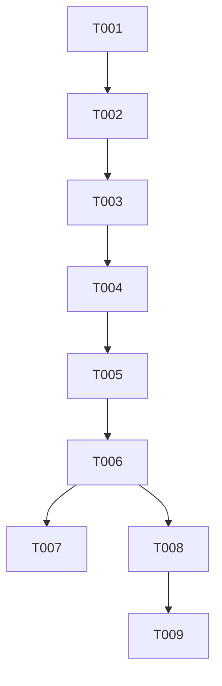

# Tasks: 下拉刷新指示改为顶部小条

**Input**: Design documents from `spec/compact-refresh-indicator/`
**Prerequisites**: plan.md (required), spec.md (required for user stories)

**Tests**: 本特性未要求自动化测试任务，验证走 Verification 阶段的构建 + 部署。
**Organization**: 单一用户故事，任务线性执行。

## Format: `[ID] [P?] [Story] Description`

- **[P]**: 可并行（不同文件、无未完成依赖）
- **[Story]**: 对应 spec.md 的用户故事（US1）
- 描述均以具体文件路径结尾

## Path Conventions

- 既有 HarmonyOS 单模块工程：源码在 `entry/src/main/ets/`
- 本特性任务中的路径均为绝对路径（`D:\work\pixiv-\` 前缀）

---

## Phase 1: Setup (Shared Infrastructure)

**Purpose**: 本特性无工程初始化需求（既有工程增量改动）

- [X] T001 阅读现有 Refresh 用法与 refresh()/isRefreshing 数据流，确认改动锚点 —— `D:\work\pixiv-\entry\src\main\ets\components\illust\IllustWaterfall.ets`

---

## Phase 2: Foundational (Blocking Prerequisites)

**Purpose**: 无跨故事前置基础设施（单文件改动，直接进入用户故事）

（本阶段无任务）

---

## Phase 3: User Story 1 - 下拉刷新内容不动、顶部小条指示 (Priority: P1) 🎯 MVP

**Goal**: 下拉时列表内容不跟随手势位移；超阈值松手触发刷新，顶部悬浮小药丸指示（进度环→菊花），完成自动消失；所有瀑布流页面统一生效

**Independent Test**: 推荐页下拉观察列表不动 → 松手触发刷新 → 顶部小条指示 → 完成消失且数据更新

### Implementation for User Story 1

- [X] T002 [US1] 新增刷新指示呈现层状态与构建器：新增 `@State refreshState: RefreshStatus` 与 `@State refreshPullOffset: number`；新增私有 @Builder 刷新指示（顶部居中小药丸：半透明白底圆角容器约 48vp + `Progress` 环形约 32vp，Drag/OverDrag 时 value=refreshPullOffset/total=64 进度态，Refresh 时 `ProgressStatus.LOADING` 菊花态，Inactive/Done 隐藏；clip + constraintSize(minHeight) 防塌缩，模式参照官方 Refresh 文档示例 6）—— `D:\work\pixiv-\entry\src\main\ets\components\illust\IllustWaterfall.ets`
- [X] T003 [US1] 改造 Refresh 容器用法：`Refresh({ refreshing: $$this.isRefreshing, builder: 指示构建器 })`；瀑布流子组件加 `.position({ x: 0, y: 0 })` 固定不跟手；挂 `.refreshOffset(64)`、`.maxPullDownDistance(96)`、`.pullToRefresh(true)`、`.onStateChange`（同步 refreshState）、`.onOffsetChange`（同步 refreshPullOffset）；移除 deprecated 的 `offset`/`friction` 参数；`onRefreshing` 与 `refresh()` 数据流保持不变；`enableRefresh=false` 旁路分支不加 position（影响范围仅限 Refresh 分支）—— `D:\work\pixiv-\entry\src\main\ets\components\illust\IllustWaterfall.ets`
- [X] T004 [US1] 对改动文件执行 `arkts_check` 并修复问题（已知 @kit.* 噪音 6 条可忽略）—— `D:\work\pixiv-\entry\src\main\ets\components\illust\IllustWaterfall.ets`
- [X] T005 [US1] 构建验证改动编译通过 —— `build_project`（debug，modules: entry）

**Checkpoint**: US1 完成，单一故事即全部需求

---

## Phase 4: Polish & Cross-Cutting Concerns

**Purpose**: 回归自查与文档收尾

- [X] T006 回归自查：确认触底 loadMore/onScrollIndex 预加载、scrollTopToken 回顶、ErrorView/LoadingView 分支、enableRefresh=false 旁路、BookmarkTagPanel 宿主均未受影响；确认 Refresh 分支外无 position 副作用 —— `D:\work\pixiv-\entry\src\main\ets\components\illust\IllustWaterfall.ets`
- [X] T007 [P] 更新 AGENTS.md「列表与收藏同步」节：登记下拉刷新新交互（内容不动+顶部小药丸指示、position 固定机制、maxPullDownDistance 96）—— `D:\work\pixiv-\AGENTS.md`

---

## Phase 5: Verification

<!-- verification_scope: build-only -->

**Purpose**: 构建与部署验证（不含 UI 验证）

- [X] T008 全量构建项目并修复全部编译错误（build_project，迭代 修复→构建 直至成功）—— `D:\work\pixiv-\`（一次通过）
- [X] T009 部署应用到设备/模拟器并确认冷启动成功、推荐页列表可达（start_app，module: entry）—— `D:\work\pixiv-\`（Mate 70 Pro+ 部署成功，无 jscrash）

---

## Dependencies & Execution Order

### Phase Dependencies

- **Setup (Phase 1)**: 无依赖
- **US1 (Phase 3)**: 依赖 T001 锚点确认，T002 → T003 → T004 → T005 严格串行（同文件）
- **Polish (Phase 4)**: 依赖 US1 完成
- **Verification (Phase 5)**: 依赖 Polish 完成，T008 → T009 严格串行

### User Story Dependencies

- **US1 (P1)**: 唯一故事，无故事间依赖

### 📊 Dependency Graph

### ⚡ Parallel Execution Guide

| Phase | Tasks | Required Files | Execution Notes |
|-------|-------|----------------|-----------------|
| Polish | T006 与 T007 | IllustWaterfall.ets / AGENTS.md | 自查与文档可并行 |
| Verification | T008 → T009 | 全工程 | 严格串行 |

---

## Parallel Example

本特性为单文件串行改动，无实现期并行任务；Polish 阶段 T006（回归自查）与 T007（AGENTS.md 文档）可并行。

---

## Implementation Strategy

### MVP First (User Story 1 Only)

1. T001 锚点确认 → T002+T003 单文件改造 → T004 静态检查 → T005 构建验证
2. **STOP and VALIDATE**: 推荐页下拉验证内容不动 + 顶部小条指示
3. 即交付全部需求（单一故事覆盖完整范围）

### Incremental Delivery

单故事特性，一次交付；Polish 与 Verification 收尾。

---

## Summary Report

- **Total tasks**: 9（T001–T009）
- **Per-story count**: US1 = 4（T002–T005）；Setup = 1，Polish = 2，Verification = 2
- **Parallel opportunities**: T006 与 T007
- **Independent test criteria**: 推荐页下拉列表不动；超阈值松手顶部小药丸指示；刷新完成指示消失数据更新
- **Suggested MVP scope**: Phase 1 + Phase 3（即全部需求）

## Notes

- 改动仅限 `IllustWaterfall.ets` 呈现层；`refresh()` 数据流、`isRefreshing` 绑定、`onRefreshing` 语义不得变更
- `position({x:0,y:0})` 只允许加在 Refresh 分支的瀑布流子组件上
