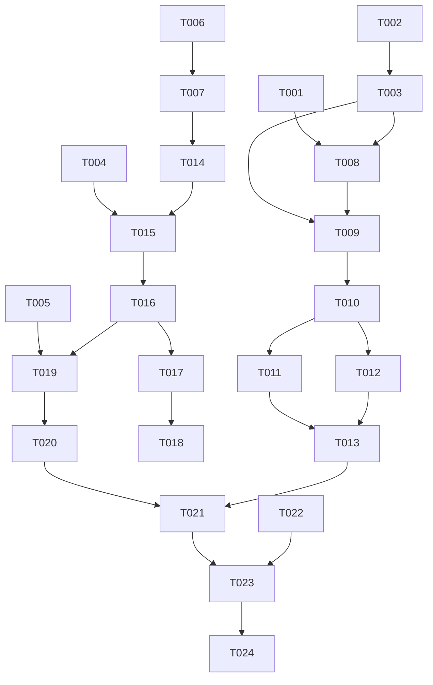

# Tasks: 多端流转与鸿蒙设备间数据同步（Cross-Device Sync）

**Input**: Design documents from `spec/cross-device-sync/`
**Prerequisites**: plan.md, spec.md

**Tests**: 规格未要求测试任务，本清单不含测试任务。

**Organization**: 按用户故事分组，US1（详情页流转）为 MVP。

## Format: `[ID] [P?] [Story] Description`

- **[P]**: 可并行（不同文件、无未完成依赖）
- **[Story]**: 对应 spec.md 用户故事（US1-US5）
- 描述中均包含确切文件路径

## Path Conventions

- 单模块项目：源码根 `entry/src/main/ets/`，配置 `entry/src/main/module.json5`，文档 `spec/cross-device-sync/`
- 服务单例惯例：`XxxService.getInstance()` + 模块级 `export const xxxService`
- 模型序列化惯例：`fromJson → Options 接口 → new Model`，as 断言仅限 fromJson 内部层

---

## Phase 1: Setup (Shared Infrastructure)

**Purpose**: 配置层准备与共享模型

- [X] T001 在 `entry/src/main/module.json5` abilities 段为 EntryAbility 增加 `"continuable": true`，并在 requestPermissions 追加 `ohos.permission.DISTRIBUTED_DATASYNC`（含 reason/usedScene 声明）
- [X] T002 [P] 新建 `entry/src/main/ets/models/ContinuationPayload.ets`：ContinuationPayload 类（version/page/illustId?/userId?/tabIndex?）、DistributedSyncMeta 接口（deviceId/updatedAt/schemaVersion）、载荷序列化/解析纯函数（buildContinuationPayloadJson/parseContinuationPayloadJson、parseSettingsSyncJson/parseHistorySyncJson/parseSearchHistorySyncJson，解析失败返回 null 不抛异常），遵循项目 fromJson→Options→new Model 惯例

---

## Phase 2: Foundational (Blocking Prerequisites)

**Purpose**: 两个核心服务单例 + 写钩子 fan-out 升级，所有用户故事的前置

**⚠️ CRITICAL**: 本阶段完成前不得开始任何用户故事

- [X] T003 新建 `entry/src/main/ets/services/ContinuationService.ets`：单例（getInstance + 模块级 export const），方法 `setCurrentPageState(state: ContinuationPayload | null)`、`buildWantParam(): Record<string, Object>`、`parseWant(want: Want): ContinuationPayload | null`、`consumePendingPayload(): ContinuationPayload | null`（读写 AppStorage 键 `continuationPayload`，一次性消费后删除）；不依赖 PreferenceService（纯内存 + AppStorage，可无 lazy 直接 import）
- [X] T004 [P] 升级 `entry/src/main/ets/stores/UserSettingStore.ets` 写钩子为监听器数组：新增 `addSettingsWriteHook(hook)` / `removeSettingsWriteHook(hook)`，保留 `setSettingsWriteHook` 兼容包装（清空后单注册），`notifySettingsWrite` 遍历触发；既有 Relay SyncService 调用点行为不变
- [X] T005 [P] 升级 `entry/src/main/ets/services/DatabaseService.ets` 写钩子为监听器数组：`addSyncWriteHook(hook)` / `removeSyncWriteHook(hook)` + `setSyncWriteHook` 兼容包装，`notifySyncWrite` 遍历触发
- [X] T006 [P] 在 `entry/src/main/ets/models/AppSettings.ets` 增加 `deviceSyncEnabled: boolean = true` 字段（设备本地，注释标注不参与任何同步域），并在 `entry/src/main/ets/stores/UserSettingStore.ets` 增加偏好键 `device_sync_enabled` 的 load/save 与 `setDeviceSyncEnabled()` setter（不触发任何写钩子）
- [X] T007 新建 `entry/src/main/ets/services/DistributedSyncService.ets`：单例骨架——`init()`（读 deviceSyncEnabled，关闭则直接返回；创建 distributedDataObject 单对象：根属性 settingsJson/historyJson/searchHistoryJson/metaJson 四个字符串 + updatedAt；注册 change/status 监听）、`setEnabled(enabled)`（开启=abilityAccessCtrl 申请 DISTRIBUTED_DATASYNC→授权后 setSessionId('arkpix_device_sync')；关闭=setSessionId('') 退会话，本地数据保留）、`isActive(): boolean`、suppress 回声标志位；全部系统调用 try-catch + hilog，失败静默降级；本任务只交付骨架与生命周期，同步载荷逻辑在 US3-US5 填充
- [X] T008 在 `entry/src/main/ets/entryability/EntryAbility.ets` 实现 `onContinue(wantParam)`：版本校验（低于阈值返回 `AbilityConstant.OnContinueResult.MISMATCH`）→ 写入 `ContinuationService.buildWantParam()` 结果 → 返回 AGREE；实现 `onNewWant` 与修改 `onCreate`：`launchReason === AbilityConstant.LaunchReason.CONTINUATION` 时 `parseWant` 成功则 `AppStorage.setOrCreate('continuationPayload', payload)`；onCreate 末尾 `import lazy` 调 `distributedSyncService.init()`（遵循既有 lazy import 防冷启动闪退约束）；既有初始化顺序（context → customizeSchemes → hoster → localProxyServer）保持不变

**Checkpoint**: ContinuationService/DistributedSyncService 骨架就绪，写钩子支持多监听，接续载荷可双向解析

---

## Phase 3: User Story 1 - 插画详情页跨设备流转 (Priority: P1) 🎯 MVP

**Goal**: 详情页（illustId）跨设备接续恢复

**Independent Test**: 双端满足接续条件，源端停留详情页，对端拉起后进入相同 illustId 详情页

- [X] T009 [US1] 在 `entry/src/main/ets/pages/splash/SplashPage.ets` 路由决策（+1500ms setTimeout）最前插入接续分支：`continuationService.consumePendingPayload()` 非空且已登录时按 page 类型 replaceUrl（illust_detail→`pages/detail/IllustDetailPage` 带 `{illustId}`）；载荷非法/未登录回退既有路由逻辑
- [X] T010 [US1] 在 `entry/src/main/ets/pages/detail/IllustDetailPage.ets` aboutToAppear 登记 `continuationService.setCurrentPageState({version:1, page:'illust_detail', illustId})`、aboutToDisappear 清除（传 null）

**Checkpoint**: US1 可双真机验证接续恢复详情页

---

## Phase 4: User Story 2 - 主页/用户主页流转 (Priority: P2)

**Goal**: 主页 Tab 位置与用户主页（userId）接续恢复

**Independent Test**: 源端停留主页某 Tab / 某用户主页，对端接续恢复对应页面

- [X] T011 [P] [US2] 在 `entry/src/main/ets/pages/home/HomePage.ets`：aboutToAppear 登记 `{page:'home', tabIndex: currentIndex}`，`.onChange` 切 Tab 时同步更新登记；支持接续恢复——SplashPage 跳转 HomePage 携带 `{tabIndex}` 参数时 aboutToAppear 读取并用 `tabsController.changeIndex()` 定位（router.getParams 解析模式与既有一致）
- [X] T012 [P] [US2] 在 `entry/src/main/ets/pages/user/UserProfilePage.ets` aboutToAppear 登记 `{page:'user_profile', userId}`、aboutToDisappear 清除
- [X] T013 [US2] 在 `entry/src/main/ets/pages/splash/SplashPage.ets` 接续分支补齐 home/user_profile 两个 case（home→replaceUrl HomePage 带 `{tabIndex}`；user_profile→replaceUrl UserProfilePage 带 `{userId}`），未知 page 值回退主页

**Checkpoint**: 三类页面接续全部可用，未覆盖页面自动回退主页

---

## Phase 5: User Story 3 - 应用设置跨设备同步 (Priority: P2)

**Goal**: AppSettings（含画质/网络/防社死等）经分布式对象双向同步

**Independent Test**: 双端组网在线，A 端改设置，B 端数秒内生效且重启后保持

- [X] T014 [US3] 在 `entry/src/main/ets/services/DistributedSyncService.ets` 实现 settingsJson 序列化：从 `userSettingStore.getSettings()` 导出可同步字段全集（排除 deviceSyncEnabled/autoSyncForeground/relay*/prev* 设备本地字段），序列化为 JSON；metaJson 携带 deviceId（随机生成并持久化到 PreferenceService）与 updatedAt
- [X] T015 [US3] 实现设置上行：通过 `addSettingsWriteHook` 监听 settings 域本地写 → 防抖 2s → 重建 settingsJson/metaJson 根属性赋值（suppress 标志位防回声）
- [X] T016 [US3] 实现设置下行：change 监听命中 settingsJson → 解析 → metaJson.updatedAt 严格大于本地偏好记录的上次应用时间才应用 → 逐字段经 UserSettingStore 既有 setter（suppress 期间）落偏好 → AppStorage 刷新驱动 UI；未知字段跳过不崩溃

**Checkpoint**: 设置同步双端可用

---

## Phase 6: User Story 4 - 屏蔽列表与 EXIF 配置同步 (Priority: P3)

**Goal**: muteTags/muteUsers/exifMutedTags/exifMergedTags/exifTagPriority 随设置域同步

**Independent Test**: A 端加屏蔽词与 EXIF 合并规则，B 端对应页面可见且过滤行为一致

- [X] T017 [US4] 扩展 `entry/src/main/ets/services/DistributedSyncService.ets`：监听 `mute`/`exif_config` 域写钩子并入设置上行通道（settingsJson 已含这些字段，确认防抖重建覆盖）；下行应用时 mute 走 `setMuteTags/setMuteUsers`、EXIF 走 `setExifMutedTags/setExifMergedTags/setExifTagPriority`（均为 hook-free 或 suppress 保护路径）
- [X] T018 [P] [US4] 在 `entry/src/main/ets/pages/settings/GeneralSettingsPage.ets` 增加"设备间同步"设置项：开关绑定 deviceSyncEnabled，首开触发 `distributedSyncService.setEnabled(true)`（权限拒绝时开关回退 + toast）；状态文字显示 未开启/未授权/已加入会话

**Checkpoint**: 屏蔽与 EXIF 配置同步可用，开关可控

---

## Phase 7: User Story 5 - 浏览/搜索历史跨设备同步 (Priority: P3)

**Goal**: 裁剪后历史（浏览 100 条/搜索 50 条）双向同步并条目级 LWW 合并

**Independent Test**: A 端产生浏览/搜索历史，B 端历史页可见且无重复

- [X] T019 [US5] 在 `entry/src/main/ets/services/DistributedSyncService.ets` 实现 historyJson/searchHistoryJson 上行：监听 history/search_history 域写钩子 → 防抖 2s → `getHistory(100)`/`getSearchHistory(50)` 裁剪序列化赋值对应根属性
- [X] T020 [US5] 实现历史下行：change 命中 historyJson/searchHistoryJson → 解析条目 → 逐条经既有 applier `upsertHistory`/`upsertSearchHistory`（内部 getXxxTimestamp 做 LWW 判新，hook-free 无回声）落库

**Checkpoint**: 全部 5 个用户故事功能完整

---

## Phase 8: Polish & Cross-Cutting Concerns

- [X] T021 更新 `AGENTS.md`：补充 EntryAbility 接续生命周期、ContinuationService/DistributedSyncService 说明、写钩子多监听变更、DISTRIBUTED_DATASYNC 权限、deviceSyncEnabled 字段
- [X] T022 全量自查：无 any/unknown/as 断言泄漏（fromJson 内部层除外）、`arkts_check` 对新增/修改 .ets 文件无实质错误（@kit.* 环境噪音忽略）、接续载荷 <100KB 与同步载荷 <500KB 的编码断言

---

## Phase 9: Verification（变更轮次 1 前）

<!-- verification_scope: build-only -->

**Purpose**: 构建 + 部署验证（接续/分布式同步模拟器不可验，UI 验证不纳入；真机双端验证由用户执行）

- [X] T023 调用 build_project 构建并修复全部编译错误（fix → build 迭代直至成功）
- [X] T024 调用 start_app 部署应用到设备/模拟器，确认冷启动无闪退（lazy import 约束回归）、主流程可进主页

---

## Phase 10: 变更轮次 1 修复（浏览设置排除 / 授权状态刷新 / 接续返回栈）

**Purpose**: 对应 spec.md FR-012/013/014 与 plan.md Changelog 2026-08-15

- [X] T025 [P] 修改 `entry/src/main/ets/services/DistributedSyncService.ets`：`buildSettingsPayload()` 移除 pictureQuality/mangaQuality/previewQuality/detailQuality/fullScreenQuality/crossCount/isTopMode 共 7 个字段；下行应用侧移除对应 applyNumberField/applyBooleanField 分支（对端旧载荷残留字段跳过不应用）
- [X] T026 [P] 修改 `entry/src/main/ets/models/AppSettings.ets`：上述 7 个字段补注释"设备本地，不参与设备间同步"
- [X] T027 修改 `entry/src/main/ets/services/DistributedSyncService.ets`：`sessionActive` 每次变更（joinSession 成功/失败、leaveSession）写入 `AppStorage.setOrCreate('deviceSyncActive', v)`；init() 写入初值 false；`setEnabled(true)` 授权成功后 joinSession 失败时延迟 2s 重试一次（仍失败保持降级）
- [X] T028 修改 `entry/src/main/ets/pages/settings/GeneralSettingsPage.ets`：`deviceSyncActive` 改用 `@StorageLink('deviceSyncActive')` 替代手动轮询，移除 enableDeviceSync 中的 setTimeout 延时刷新（保留 refreshSyncState 中 settings 刷新）
- [X] T029 修改 `entry/src/main/ets/pages/splash/SplashPage.ets` `routeByContinuation`：illust_detail 改为 `router.replaceUrl(HomePage)` + `router.pushUrl(IllustDetailPage, {illustId})`；user_profile 改为 `router.replaceUrl(HomePage)` + `router.pushUrl(UserProfilePage, {userId})`；home case 维持不变

---

## Phase 11: Verification（变更轮次 1）

<!-- verification_scope: build-only -->

**Purpose**: 构建 + 部署验证（分布式同步行为模拟器不可验，不纳入失败判定）

- [X] T030 调用 build_project 构建并修复全部编译错误（fix → build 迭代直至成功）
- [X] T031 调用 start_app 部署应用，确认冷启动无闪退、主流程可进主页、通用设置页可打开且开关区域渲染正常

---

## Phase 12: 变更轮次 2 修复（Relay 通道浏览设置排除）

**Purpose**: 对应 spec.md FR-012 全通道化与 plan.md Changelog 2026-08-16；真机反馈列数仍经 Relay settings 域同步

- [X] T032 修改 `entry/src/main/ets/services/SyncService.ets`：`SettingsSyncPayload` 接口移除 pictureQuality/mangaQuality/previewQuality/detailQuality/fullScreenQuality/crossCount/isTopMode 共 7 个可选字段；`collectSettings()` 上行载荷移除对应 7 行赋值；`applySettings()` 下行移除对应 7 个应用分支；补 FR-012 全通道排除注释；downloadQuality 及其余字段保留
- [X] T033 修改 `AGENTS.md`：同步域说明处补充"浏览相关设置（5 画质+crossCount+isTopMode）设备本地，双通道均不同步"

---

## Phase 13: Verification（变更轮次 2）

<!-- verification_scope: build-only -->

**Purpose**: 构建 + 部署验证

- [X] T034 调用 build_project 构建并修复全部编译错误（fix → build 迭代直至成功）
- [X] T035 调用 start_app 部署应用，确认冷启动无闪退、主流程可进主页（用户手动构建真机测试通过）

---

## 📊 Dependency Graph



## ⚡ Parallel Execution Guide

| Phase | Tasks | Required Files | Execution Notes |
|-------|-------|----------------|-----------------|
| Setup | T001 ∥ T002 | module.json5 / ContinuationPayload.ets | 不同文件可并行 |
| Foundational | T004 ∥ T005 ∥ T006 | UserSettingStore / DatabaseService / AppSettings | 钩子升级与字段新增互不阻塞；T003/T007 串行主干，T008 收尾 |
| US2 | T011 ∥ T012 | HomePage / UserProfilePage | 不同页面文件并行，T013 依赖两者 |
| US4 | T018 可与 T017 并行 | GeneralSettingsPage / DistributedSyncService | 不同文件 |
| Polish | T021 → T022 | AGENTS.md / 全量代码 | T022 依赖全部实现完成 |

---

## Implementation Strategy

### MVP First (US1 Only)

1. Phase 1 Setup + Phase 2 Foundational（T001-T008）
2. Phase 3 US1（T009-T010）→ 双真机验证详情页接续
3. 即可交付 MVP

### Incremental Delivery

US1（详情页流转）→ US2（扩展页面流转）→ US3（设置同步）→ US4（屏蔽/EXIF + 开关）→ US5（历史同步）→ Polish → Verification

---

## Summary Report

- **总任务数**: 24
- **按故事分布**: Setup 2 / Foundational 6 / US1 2 / US2 3 / US3 3 / US4 2 / US5 2 / Polish 2 / Verification 2
- **并行机会**: T001∥T002、T004∥T005∥T006、T011∥T012、T017∥T018
- **独立测试标准**: US1 双端接续详情页；US2 主页 Tab/用户主页接续；US3 设置 5s 内同步且重启保持；US4 屏蔽/EXIF 页面一致 + 开关可控；US5 历史可见率 ≥95% 无重复
- **建议 MVP 范围**: T001-T010（接续 MVP）
- **执行提醒**: 接续与分布式同步均不可在模拟器验证；T024 仅验证部署与不崩溃，双端行为验证需用户真机执行

---

## Dependencies & Execution Order

### Phase Dependencies

- **Setup (Phase 1)**: 无依赖，立即开始
- **Foundational (Phase 2)**: 依赖 Setup，**阻塞所有用户故事**
- **User Stories (Phase 3-7)**: 均依赖 Foundational 完成；按优先级顺序串行执行（P1 → P2 → P3），US2/US4 内部有并行机会
- **Polish (Phase 8)**: 依赖全部用户故事完成
- **Verification (Phase 9)**: 依赖 Polish 完成

### User Story Dependencies

- **US1 (P1)**: 依赖 Foundational（ContinuationService + EntryAbility 接续回调）；与同步类故事（US3-US5）完全解耦
- **US2 (P2)**: 依赖 US1 的 SplashPage 接续分支骨架（T009 先行）
- **US3 (P2)**: 依赖 Foundational（DistributedSyncService 骨架 + 写钩子 fan-out）
- **US4 (P3)**: 依赖 US3 设置同步通道（复用 settingsJson 载荷）
- **US5 (P3)**: 依赖 US3 上行/下行框架（扩展历史根属性）

### Within Each User Story

- 服务层逻辑先于页面接线；下行应用必须先确认 suppress/防回声路径就绪
- 每个故事完成后可独立验证（双真机）

## Parallel Example

```text
# Foundational 钩子升级三任务并行（不同文件）：
Task: "升级 UserSettingStore.ets 写钩子为监听器数组"
Task: "升级 DatabaseService.ets 写钩子为监听器数组"
Task: "AppSettings.ets 增加 deviceSyncEnabled 字段"

# US2 页面登记两任务并行（不同页面文件）：
Task: "HomePage.ets 登记 tabIndex 状态 + 恢复支持"
Task: "UserProfilePage.ets 登记 userId 状态"
```

## Notes

- [P] 任务 = 不同文件、无未完成前置依赖
- [USx] 标签实现需求 → 任务的可追溯性
- 接续/分布式同步无模拟器支持：所有故事级验证依赖双真机，Phase 9 仅做构建 + 部署冒烟
- EntryAbility 任何涉及 Store 单例的 import 必须 lazy（既有冷启动闪退教训）
- 分布式对象复杂类型仅根属性变更触发同步：所有域载荷保持根属性 = JSON 字符串设计，不得在实现中改为嵌套对象
- 远端数据落库只能走 hook-free applier（upsertXxx/deleteXxx）或 suppress 保护路径，防止回声循环
- 避免：模糊任务、同文件跨任务冲突、破坏故事独立性的跨故事依赖
