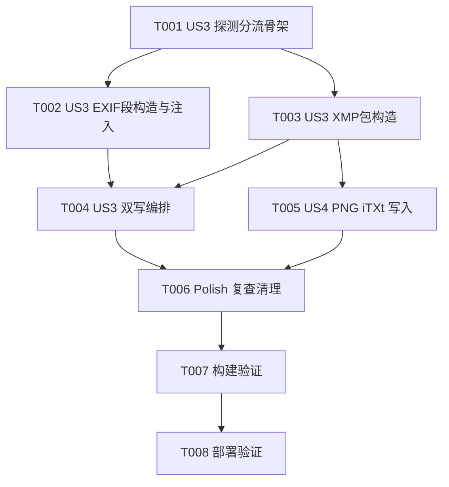

# Tasks: EXIF 备注元数据修复（EXIF+XMP 双写）

**Input**: Design documents from `spec/exif-comment-template/`
**Prerequisites**: plan.md, spec.md（第三轮修订）

**Tests**: 未请求测试任务，不包含（手动验证链路：构建 + 下载图片查看备注）。
**Organization**: 本轮修复对应 spec.md 的 User Story 3（JPEG 双写，P1）与 User Story 4（PNG XMP，P2）；US1/US2/US5/US6 已在既往轮次实现，不在本任务列表内。全部实现集中于 `ImageExifService.ets`（同文件任务强制串行）。

## Format: `[ID] [P?] [Story] Description`

- **[P]**: 可并行（不同文件、无依赖）
- **[Story]**: 所属用户故事（US3/US4 对应 spec.md 本轮修复范围）

## Path Conventions

- 单模块 HarmonyOS 工程，源码位于 `entry/src/main/ets/`
- 本轮涉及：`entry/src/main/ets/services/ImageExifService.ets`（主）、`entry/src/main/ets/services/DownloadService.ets`（按需微调）

---

## Phase 1: User Story 3 - JPEG 双写：无 EXIF 的图也能写入备注 (Priority: P1) 🎯 MVP

**Goal**: JPEG 图片 EXIF + XMP 双重写入。先探测源图 EXIF 存在性：有 EXIF 走 modifyImageProperty 探测式截断 + packToData 后注入 XMP APP1；无 EXIF 注入手工 EXIF APP1（不重编码）+ XMP APP1。两载体独立，任一成功即嵌入成功，均失败才降级。

**Independent Test**: 下载无 EXIF 的 JPEG（如问题图 146416153_p0）：图库备注可见；文件含 EXIF 与 XMP 双段；未重编码（画质同原图）。

### Implementation for User Story 3

- [X] T001 [US3] 在 embedExif 中实现分流骨架：新增模块内私有 hasExif（getImageProperty 带默认值探测，62980123 → false，其他异常 → false + console.error 日志）；embedExif 按扩展名与探测结果分流（JPEG 有 EXIF / JPEG 无 EXIF / PNG / GIF 直接返回 false 走既有降级），保持 Promise<boolean> 签名与全异常捕获不变 in entry/src/main/ets/services/ImageExifService.ets
- [X] T002 [US3] 实现 buildExifSegment（按 plan.md D10 构造小端 TIFF 的最小 EXIF APP1 段：ImageDescription/Artist/Copyright/UserComment，UserComment 带 "ASCII\0\0\0" 前缀 + UTF-8 字节，段容量触顶时按 UTF-8 安全截断）与 injectJpegSegments（剥离源字节中已有 EXIF/XMP APP1 段，SOI 后插入新段，纯字节拼接不重编码）in entry/src/main/ets/services/ImageExifService.ets（依赖 T001）
- [X] T003 [US3] 实现 buildXmpPacket（按 plan.md D11 构造标准 x:xmpmeta RDF：dc:description←模板渲染备注全文、dc:title←标题、dc:creator←作者、dc:rights←'Pixiv'，XML 特殊字符转义）与 buildXmpApp1Segment（"http://ns.adobe.com/xap/1.0/\0" 标识头 + XMP packet 的 APP1 段）in entry/src/main/ets/services/ImageExifService.ets（可与 T002 同文件串行推进）
- [X] T004 [US3] embedExif 双写编排（plan.md D9/D13）：无 EXIF 分支——原始字节经 injectJpegSegments 注入 EXIF APP1 + XMP APP1；有 EXIF 分支——safeWriteExif 各字段 + packToData 重打包后再对输出字节注入 XMP APP1；两载体写入各自独立 try/catch，任一成功返回 true 并写出 dstPath，均失败清理半成品返回 false；各失败点 console.error 含载体与原因 in entry/src/main/ets/services/ImageExifService.ets（依赖 T002、T003）

**Checkpoint**: JPEG 双路径双载体写入按 D9/D13 工作，失败语义符合 FR-005/FR-009。

---

## Phase 2: User Story 4 - PNG 等格式通过 XMP 写入备注 (Priority: P2)

**Goal**: PNG 下载文件包含 XMP iTXt chunk（keyword `XML:com.adobe.xmp`），内容与模板渲染结果一致；不触碰像素数据；失败降级保存原图。

**Independent Test**: 下载一张 PNG 作品：文件内可检出 XMP 块且内容符合模板渲染；图片正常打开显示；下载记录成功。

### Implementation for User Story 4

- [X] T005 [US4] 实现 crc32（IEEE 多项式表驱动）、buildPngItxtChunk（keyword "XML:com.adobe.xmp" + 压缩标志 0 + 空语言/翻译 tag + UTF-8 XMP packet + CRC32）、injectPngItxt（移除已有 XMP iTXt 防重复，IEND 前插入，校验 PNG 签名合法性）；embedExif 的 PNG 分支接入：构造并插入 iTXt，成功返回 true，失败返回 false 走既有降级 in entry/src/main/ets/services/ImageExifService.ets（依赖 T003 的 buildXmpPacket）

**Checkpoint**: PNG XMP 写入链路完整，失败语义符合 FR-012/FR-013。

---

## Phase 3: Polish & Cross-Cutting Concerns

**Purpose**: 清理与收尾

- [X] T006 [P] 通读 ImageExifService.ets 与 DownloadService.ets：确认 ArkTS 严格模式合规（无 any/unknown/as/动态访问）、无因本轮重构产生的死代码/无效引用、日志覆盖所有降级点；必要时对 DownloadService 做适配微调 in entry/src/main/ets/services/ImageExifService.ets

---

## Phase 4: Verification

<!-- verification_scope: build-only -->

**Purpose**: 构建与部署验证（不含 UI 验证；运行时任一载体的实际写入效果需人工下载图片确认备注）

- [X] T007 调用 build_project 构建整个 APP，修复所有编译错误（ArkTS 严格模式），迭代 修复 → 构建 直至成功
- [X] T008 调用 start_app 将应用部署到设备/模拟器并启动 EntryAbility，确认应用可正常安装运行

---

## Phase 5: 第四轮修复 - UserComment 移入 Exif SubIFD (Priority: P1)

**Goal**: 修复手工 EXIF 段的结构性缺陷：UserComment (0x9286) 按 EXIF 规范必须位于 Exif SubIFD（由 IFD0 的 0x8769 ExifIFDPointer 指向），初版实现错误地放在 IFD0 导致严格解码器（HarmonyOS 系统/piexif）读不到备注。已经 Python 1:1 复现验证修正方案有效（piexif 可读 UserComment，PIL 结构校验通过）。

**Independent Test**: 下载无 EXIF 的 JPEG（问题图 126689499_p0），图库备注可见。

- [X] T009 [US3] 重构 buildExifSegment：IFD0 条目改为 0x010E/0x013B/0x8298 + 0x8769 ExifIFDPointer（LONG，内联存 SubIFD 的 TIFF 相对偏移），UserComment 0x9286 移入 Exif SubIFD（紧随 IFD0 之后，数据区再其后）；同步调整 EXIF_FIXED_SIZE 与数据区偏移计算（IFD0 54 字节 + SubIFD 18 字节）；保持段容量防御截断逻辑 in entry/src/main/ets/services/ImageExifService.ets
- [X] T010 调用 build_project 构建整个 APP，修复编译错误直至成功
- [X] T011 调用 start_app 部署到模拟器并启动，确认可正常运行

---

## Phase 6: 第五轮修复 - 字节级 EXIF 检测 + 设备端自检 (Priority: P1)

**Goal**: 消除 hasExif 误判嫌疑——getImageProperty(defaultValue) 对无 EXIF 图片可能不抛异常而返回默认值，导致 EXIF-less 源图被误判走系统接口路径（字段全写失败但 packToData 成功，输出无 EXIF 文件）。改为字节级确定检测；同时加设备端回读自检与可见日志，一次性锁定真相。

**Independent Test**: 重新下载 139445186_p0（无 EXIF JPEG），图库备注可见；设备日志（hilog tag PixEzExif）可见分支选择与回读结果。

- [X] T012 [US3] ImageExifService.ets：(1) 新增字节级 EXIF 检测（遍历 JPEG 段查找 FFE1+"Exif\0\0"，替代 getImageProperty 探测；embedJpeg 起始即读 srcBytes 供检测与注入复用，系统接口路径在检测后再创建 ImageSource）；(2) 两处 JPEG 路径写出 dstPath 后用系统 API 回读 USER_COMMENT 做自检并记录结果；(3) 本文件 console.* 全部替换为 @kit.PerformanceAnalysisKit 的 hilog（tag 统一 'PixEzExif'），确保设备日志可见 in entry/src/main/ets/services/ImageExifService.ets
- [X] T013 调用 build_project 构建整个 APP，修复编译错误直至成功
- [X] T014 调用 start_app 部署到模拟器并启动，确认可正常运行

---

## Phase 7: 第六轮修复 - EXIF 字段 128 字节设备上限 (Priority: P1)

**Goal**: 设备实证确认 MediaLibrary 入册扫描器对 EXIF 字段有约 128 字节上限：备注 67b/123b 的图正常，148b/155b 的图整个 EXIF 段被拒（62980123）。修复：EXIF 各字段值统一按 120 UTF-8 字节截断（UserComment 8 字节前缀 + 120 = 正好 128；截断附加 '...'），XMP 保留完整渲染内容（XMP 无此限制）。

**Independent Test**: 删除图库旧副本后重新下载 135842873_p0 与 129339284_p0（148b/155b 失败样本），图库备注可见（截断后以 '...' 结尾）。

- [X] T015 [US3] buildExifSegment 中对 desc/artist/copyright/comment 四个字段值统一按 120 UTF-8 字节截断（超长时 utf8ByteSubstring(117) + '...'，UserComment 另加既有 8 字节前缀）；buildXmpPacket 保持完整渲染不截断；safeWriteExif 的指数退避起始预算改为 min(字节数/2, 120) 以加速收敛到设备上限以下 in entry/src/main/ets/services/ImageExifService.ets
- [X] T016 调用 build_project 构建整个 APP，修复编译错误直至成功
- [X] T017 调用 start_app 部署到模拟器，并强制冷启动应用（aa force-stop + aa start），确保运行新代码

---

## 📊 Dependency Graph



## ⚡ Parallel Execution Guide

| Phase | Tasks | Required Files | Execution Notes |
|-------|-------|---------------|-----------------|
| US3 | T001 → T002/T003 → T004 | entry/src/main/ets/services/ImageExifService.ets | 同文件，全部串行；T002/T003 为内部顺序推进 |
| US4 | T005 | entry/src/main/ets/services/ImageExifService.ets | 复用 T003 的 buildXmpPacket |
| Polish | T006 | ImageExifService.ets / DownloadService.ets | 实现全部完成后执行 |
| Verification | T007 → T008 | 全工程 | 构建通过后才能部署 |

---

## Dependencies & Execution Order

### Phase Dependencies

- **US3 (Phase 1)**: T001 → T002/T003 → T004 串行（同文件演进）
- **US4 (Phase 2)**: 依赖 T003（复用 buildXmpPacket）
- **Polish (Phase 3)**: 依赖 US3+US4 完成
- **Verification (Phase 4)**: 依赖全部实现任务完成

### User Story Dependencies

- **US3 (P1)**: 无故事间依赖，为 MVP
- **US4 (P2)**: 依赖 US3 的 XMP 构造能力（T003），其余独立

---

## Parallel Example: User Story 3

```text
# 同文件任务无法真正并行，T002 与 T003 为同文件内的相邻独立函数，
# 由同一执行者连续完成，无需等待彼此之外的依赖：
Task: "T002 buildExifSegment + injectJpegSegments"
Task: "T003 buildXmpPacket + buildXmpApp1Segment"
```

---

## Implementation Strategy

### MVP First

1. 完成 T001–T004（US3 JPEG 双写）→ 覆盖本轮核心修复场景（无 EXIF JPEG 备注写入）
2. **STOP and VALIDATE**: 构建通过后即可人工下载问题图验证备注
3. 继续 T005（US4 PNG XMP）→ 完整格式覆盖

### Incremental Delivery

1. T001 → 分流骨架
2. T002 → EXIF 手工注入（无 EXIF JPEG 可写备注，最小闭环）
3. T003–T004 → XMP 载体 + 双写编排
4. T005 → PNG XMP
5. T006 → 复查清理
6. T007–T008 → 构建与部署验证

---

## Notes

- [P] 任务 = 不同文件、无依赖；本轮实现任务均在 ImageExifService.ets，实际全部串行
- 总任务数 8：US3 ×4、US4 ×1、Polish ×1、Verification ×2
- 独立验证标准：US3——无 EXIF JPEG 图库备注可见 + 双段存在 + 未重编码；US4——PNG 文件含 XMP 块且图片可正常打开
- 建议 MVP 范围：T001–T004（US3 即覆盖核心修复价值）
- ArkTS 严格模式红线：禁止 any/unknown/as 断言/动态属性访问；字节操作统一使用 Uint8Array/DataView
- 验证范围为 build-only：实际备注写入效果需人工在设备上下载图片确认（上轮教训记录在此）
