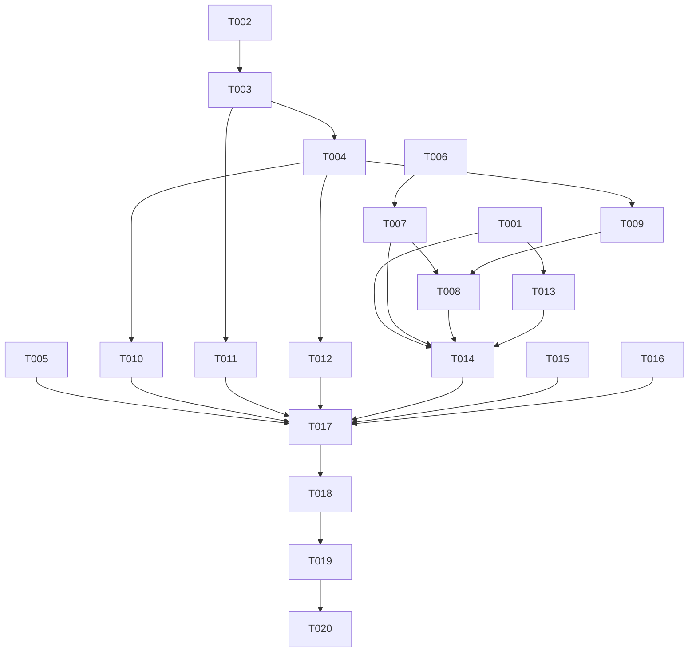

# Tasks: FAB 与下载增强（fab-download-enhancements）

**Input**: Design documents from `spec/fab-download-enhancements/`
**Prerequisites**: plan.md, spec.md

**Tests**: 仅 DateUtils 纯函数含单测。

**Organization**: 任务按用户故事分组，每个故事可独立实现与验证。

## Format: `[ID] [P?] [Story] Description`

- **[P]**: 可并行（不同文件、无未完成依赖）
- **[Story]**: 对应 spec.md 用户故事（US1-US5）
- 描述必须含确切文件路径

## Path Conventions

- 源码根：`entry/src/main/ets/`（pages/、stores/、models/、network/、services/、utils/、components/）
- 测试：`entry/src/test/`

## Phase 1: Setup (Shared Infrastructure)

**Purpose**: 无新页面/新基建

- [X] T001 [P] 新建 `entry/src/main/ets/utils/DateUtils.ets`：`formatCreateDate(iso: string): string`（`new Date(iso)` 解析 + 手动 padStart 拼本地时区 `yyyy-MM-dd HH:mm`；解析失败返回 ''）

---

## Phase 2: Foundational (Blocking Prerequisites)

**Purpose**: 设置项与下载调度层是 US3 的阻塞前置；其余故事无全局阻塞

- [X] T002 [P] 修改 `entry/src/main/ets/models/AppSettings.ets`：新增 `downloadConcurrency: number = 3`（Options 接口 + 字段 + 构造函数 ?? 3）
- [X] T003 修改 `entry/src/main/ets/stores/UserSettingStore.ets`：downloadConcurrency 的 load（getNumber 默认 3）/ save（setNumber）/ getSettings 防御拷贝 / `setDownloadConcurrency(value: number)` setter（依赖 T002，参照 downloadQuality 模式）
- [X] T004 修改 `entry/src/main/ets/services/DownloadService.ets`：加内存调度层——公开 `enqueue(...)` fire-and-forget 入口（先写 DB pending 记录入 FIFO 队列；activeCount < 当前上限立即执行否则排队；任务结束补位；上限每次读 `userSettingStore.getSettings().downloadConcurrency`）；`downloadToCache` 转 private；`applyToGallery` 并入任务体；`retryAllFailed` 内部改走 enqueue（依赖 T003）

**⚠️ 同文件串行约束**：IllustDetailPage.ets（T007→T008→T011）；IllustDetailStore.ets（T009→T010）；DownloadService.ets（T004→T010）；SettingsPage.ets（T005 独立）

**Checkpoint**: 调度层就绪——US3 与其余故事可并行

---

## Phase 3: User Story 1 - PID/UID 直达回归修复 (Priority: P1) 🎯 MVP

**Goal**: 纯数字输入时直达入口恢复可见

**Independent Test**: 提交过一次搜索后再输入数字，直达入口仍显示并可用

### Implementation for User Story 1

- [X] T005 [US1] 修改 `entry/src/main/ets/pages/search/SearchPage.ets`：将数字直达块（isNumericInput 分支，插画ID/画师ID两个入口）从 `if (!this.hasSearched)` 门控内移出，放到输入框 Row 之下、建议区/结果区两分支共用位置；验证 hasSearched=true 时直达入口仍渲染、写历史（pid/uid）与跳转正常

**Checkpoint**: US1 独立可用

---

## Phase 4: User Story 2 - FAB 视觉规范与下载交互改造 (Priority: P1)

**Goal**: FAB 图标规范；下载 FAB 单击下载全部、长按缩略图选页弹窗（含拖选）

**Independent Test**: 未收藏=灰空心♡/已收藏=红❤/下载蓝底白↓；多页单击全量入队、长按弹选页弹窗拖选下载选中页

### Implementation for User Story 2

- [X] T006 [P] [US2] 修改 `entry/src/main/ets/pages/detail/IllustDetailPage.ets` FAB 视觉：收藏 FAB 未收藏态 Text('♡') 浅灰、已收藏 Text('❤') 红色（bookmarkState 驱动，请求中灰色沿用）；下载 FAB 蓝底圆（#0096FA）+ 白色 Text('↓')
- [X] T007 [US2] 修改 `IllustDetailPage.ets` 下载 FAB 交互：单击改 `handleSaveAll()`（多页）/`handleSavePage(0)`（单页）；长按（仅多页）打开选页弹窗状态（替代原 SaveMenuBuilder 菜单）；EXIF Picker 续走状态由 `exifPickerIsSaveAll` 扩展为 `exifPickerPendingPages: number[]`（与 T006 同文件串行）
- [X] T008 [US2] 修改 `IllustDetailPage.ets`：新增选页弹窗内联覆盖层（半透明遮罩+底部弹层：缩略图网格 3-4 列 CachedImage+勾选角标+页码，防社死页遮罩样式；全选/清空；取消/确定下载(N)；空选择不发起）。多选交互：单击单格切换 + 长按 ≥300ms 激活拖选、PanGesture 滑动按经过格区间批量置为目标状态（起始格定方向）；弹窗打开时 FAB 隐藏（依赖 T007）
- [X] T009 [US2] 修改 `entry/src/main/ets/stores/IllustDetailStore.ets`：新增 `savePages(pageIndexes: number[])`（逐页 isDownloaded 过滤，有重复走 showAlertDialog 跳过/重下）+ private `doSavePages(pageIndexes)`（循环入队）；`doSaveAll(skipPages)` 重构复用 doSavePages；`saveAll` 重复确认由 showActionSheet 迁移为 AlertDialog（跳过已下载页=doSavePages(补集)/全部重下=doSavePages(全集)）；下载调用点改 fire-and-forget 入队；汇总 toast 改"已加入 N 个下载任务"（依赖 T004）
- [X] T010 [US2] 修改入队调用点：`entry/src/main/ets/components/illust/IllustCard.ets`（长按保存）与 `entry/src/main/ets/pages/detail/ImageViewerPage.ets`（保存）的 downloadToCache 调用改 enqueue 模式（依赖 T004）

**Checkpoint**: US2 独立可用

---

## Phase 5: User Story 3 - 图片下载多任务并发 (Priority: P2)

**Goal**: 设置线程数 1-5 默认 3；超限排队自动补位；即时生效

**Independent Test**: 设 3 线程发起 6+ 页下载，下载管理页同时 downloading ≤3 且有 pending 排队，陆续补位完成

### Implementation for User Story 3

- [X] T011 [US3] 修改 `entry/src/main/ets/pages/settings/SettingsPage.ets` 下载组：新增"下载线程数"SettingItem + TextPickerDialog（选项 1-5，参照 showQualityPicker 模式），onSelect 调 `userSettingStore.setDownloadConcurrency` + 页面 refresh（依赖 T003）
- [X] T012 [US3] 修改 `entry/src/main/ets/pages/settings/DownloadPage.ets`：任务列表支持 pending 状态展示（"排队中"），确认 1.5s 轮询+事件回调下 pending→downloading→completed/failed 状态流转正确（依赖 T004）

**Checkpoint**: US3 独立可用（调度层已在 T004 完成）

---

## Phase 6: User Story 4 - 详情页展示发布日期 (Priority: P2)

**Goal**: 统计区展示发布日期+时间

**Independent Test**: 打开详情页统计区可见 yyyy-MM-dd HH:mm 且与 Pixiv 网页一致

### Tests for User Story 4

- [X] T013 [P] [US4] 新建 `entry/src/test/DateUtils.test.ets`：单测 formatCreateDate（ISO+09:00 输入的本地时区输出、非法输入返回 ''）

### Implementation for User Story 4

- [X] T014 [US4] 修改 `entry/src/main/ets/pages/detail/IllustDetailPage.ets` InfoRow：统计区新增发布日期行（`formatCreateDate(illust.createDate)`，空串不渲染该行）（依赖 T001，与 T007/T008 同文件串行）

**Checkpoint**: US4 独立可用

---

## Phase 7: User Story 5 - 搜索历史包含 tag 跳转 (Priority: P2)

**Goal**: 详情页点 tag 跳转写搜索历史

**Independent Test**: 详情页点任意 tag→历史页搜索 Tab 出现该 tag（illust 类型）且点击回放正确

### Implementation for User Story 5

- [X] T015 [US5] 修改 `entry/src/main/ets/pages/search/TagSearchPage.ets`：`aboutToAppear` 中 `db.addSearchHistory(keyword, 'illust')`（走既有先删后插去重；历史回放导致的重写仅刷新时间戳，可接受）

**Checkpoint**: US5 独立可用

---

## Phase 8: Polish & Cross-Cutting Concerns

- [X] T016 [P] 更新 `AGENTS.md`：FAB 视觉与交互（单击全部/长按选页弹窗+拖选）、savePages 入口、ActionSheet 例外已清除、下载并发调度层（enqueue/pending/线程数设置）、发布日期展示、tag 跳转写历史、直达入口门控修复
- [X] T017 回归走查：详情页 EXIF 保存全流程（合并审查→Picker→入队）、选页弹窗与 EXIF Picker/合并审查的层级顺序、下载管理页状态机、搜索页建议区/结果区布局（代码走查）

---

## Phase 9: Verification

<!-- verification_scope: build+ui -->

**Purpose**: 构建、部署与逐故事 UI 验证

- [ ] T018 构建项目并修复全部编译错误（调用 build_project，迭代 fix → build 直至成功）
- [ ] T019 部署应用到设备/模拟器（调用 start_app）
- [ ] T020 对部署应用执行 UI 验证（调用 verify_ui，按 spec.md 五个用户故事逐条验证）

---

## 📊 Dependency Graph



---

## Dependencies & Execution Order

### Phase Dependencies

- **Setup (Phase 1)**: T001 无依赖
- **Foundational (Phase 2)**: T002→T003→T004 链式（US3 阻塞前置）；US1/US5 不依赖本阶段
- **User Stories (Phase 3-7)**: US2 依赖 T004（入队改造）；US3 依赖 T002/T003/T004；US4 依赖 T001；US1/US5 独立
- **Polish (Phase 8)**: 依赖全部故事完成
- **Verification (Phase 9)**: 依赖 Polish；含 UI 验证任务

### User Story Dependencies

- **US1**: 单任务独立（回归修复）
- **US2**: T006→T007→T008 同文件串行；T009 依赖 T004；T010 依赖 T004
- **US3**: T011 依赖 T003；T012 依赖 T004
- **US4**: T014 依赖 T001 且与 US2 的 T007/T008 同文件串行
- **US5**: 单任务独立

### Within Each User Story

- 模型/设置项先行（T002→T003），服务调度层次之（T004），页面层最后
- 每个故事完成后即可独立验证

### Parallel Opportunities

- T001 与 T002 并行；US1(T005) 与 Foundational 链并行
- US2 的 T009/T010（store 与调用点）在 T004 后可并行
- US3 的 T011 与 US2 各任务并行（不同文件）
- T013 单测与 US2 实现并行
- US5(T015) 与所有故事并行

---

## ⚡ Parallel Execution Guide

| Phase | Tasks | Required Files | Execution Notes |
|-------|-------|----------------|-----------------|
| Setup/Foundational | T001 ∥ T002 | utils/DateUtils / models/AppSettings | 并行；T003→T004 链式跟随 |
| Stories | US1(T005) ∥ US5(T015) ∥ Foundational | SearchPage / TagSearchPage | 独立无冲突 |
| US2 | T009 ∥ T010（T004 后） | IllustDetailStore / IllustCard+ImageViewerPage | 并行；T006→T007→T008 同页串行 |
| US3 | T011 | SettingsPage | 与 US2 并行 |

---

## Parallel Example: 跨故事并行

```bash
# Foundational 链推进的同时，两个独立故事并行：
Task: "US1 直达块移出 hasSearched 门控 in SearchPage.ets"
Task: "US5 TagSearchPage aboutToAppear 写搜索历史"
Task: "T002 AppSettings.downloadConcurrency 字段"
```

---

## Implementation Strategy

### MVP First

1. T001+T002→T003→T004（调度层）
2. US1（回归修复，单任务）→ 独立验证
3. US2（FAB 主改造）→ 独立验证
4. US3/US4/US5 → 独立验证
5. Polish → Verification（含 UI 验证）

### Incremental Delivery

建议顺序：T002-T004 调度层 → US1 → US2 → US3 → US4 → US5；每个故事独立可交付。

---

## Notes

- [P] 任务 = 不同文件、无未完成依赖
- [USx] 标签用于需求追溯（spec.md User Story x）
- 同文件串行约束：IllustDetailPage（T006→T007→T008→T014）、IllustDetailStore（T009）、DownloadService（T004 先行）
- 选页弹窗与 EXIF Picker/合并审查的串场顺序：合并审查预检 → EXIF 超限 Picker → 入队，与现有 handleSaveAll 一致
- saveAll 的 showActionSheet 迁移后，项目弹窗约定例外清零，AGENTS.md 同步更新
- 避免：并行修改同一文件；破坏既有 EXIF/合并审查前置流程；引入新图标资源文件

---

## Summary Report

- **总任务数**: 20（Setup 1 / Foundational 3 / US1 1 / US2 5 / US3 2 / US4 2 / US5 1 / Polish 2 / Verification 3）
- **并行机会**: T001∥T002、US1∥US5∥Foundational、US2 内 T009∥T010、US3 与 US2 并行、T013 与实现并行
- **独立验证**: US1 直达恢复；US2 FAB 视觉+单击全部+选页拖选；US3 并发排队补位；US4 日期显示；US5 tag 历史
- **建议 MVP**: 调度层（T002-T004）+ US1 + US2
