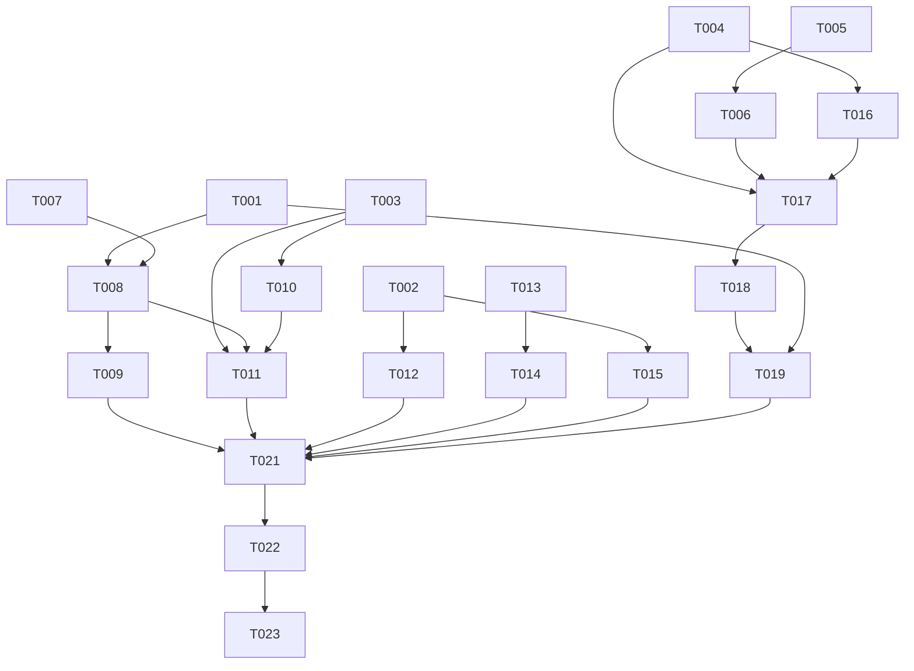

# Tasks: 历史记录与导出、Token 导出、搜索扩展、详情页 PID 与评论区

**Input**: Design documents from `spec/history-search-comments/`
**Prerequisites**: plan.md, spec.md

**Tests**: 仅包含纯函数单元测试（评论解析、导出构建），非 TDD。

**Organization**: 任务按用户故事分组，每个故事可独立实现与验证。

## Format: `[ID] [P?] [Story] Description`

- **[P]**: 可并行（不同文件、无未完成依赖）
- **[Story]**: 对应 spec.md 用户故事（US1-US6）
- 描述必须含确切文件路径

## Path Conventions

- 源码根：`entry/src/main/ets/`（pages/、stores/、models/、network/、services/、utils/）
- 测试：`entry/src/test/`
- 路由注册：`entry/src/main/resources/base/profile/main_pages.json`

## Phase 1: Setup (Shared Infrastructure)

**Purpose**: 新文件骨架与路由注册

- [X] T001 在 `entry/src/main/resources/base/profile/main_pages.json` 注册 `pages/settings/HistoryPage` 与 `pages/detail/CommentPage`
- [X] T002 [P] 新建 `entry/src/main/ets/utils/ClipboardUtils.ets`：基于 `@kit.BasicServicesKit` pasteboard 的 `copyText(text: string): Promise<boolean>`（createData(MIMETYPE_TEXT_PLAIN) + systemPasteboard.setData，异常捕获返回 false）
- [X] T003 [P] 新建 `entry/src/main/ets/utils/HistoryExport.ets`：纯函数 `buildHistoryExportJson(items: HistoryItem[]): string`（version/appName/type/exportedAt/count/items 结构）与 `buildHistoryPidText(items: HistoryItem[]): string`（每行一个 illust_id），HistoryItem 类型从 `entry/src/main/ets/services/DatabaseService.ets` 导入

---

## Phase 2: Foundational (Blocking Prerequisites)

**Purpose**: 模型修复与网络层扩展，阻塞 US6（评论全部依赖本层）与 US1（历史去重）

**⚠️ CRITICAL**: 本阶段完成前不得开始任何用户故事

- [X] T004 [P] 修复 `entry/src/main/ets/models/Comment.ets`：`UserPreview` 导入来源从 `./User` 改为 `./Illust`；新增 `replyToUserName: string` 字段；新增 `commentFromJson(raw)` 解析函数（遵循项目 fromJson→Options→new Model 模式，解析 id/comment/date/user/parent_comment.user.name→replyToUserName）
- [X] T005 [P] 在 `entry/src/main/ets/network/PixivEndpoints.ets` 新增 `illustCommentReplies(commentId: number)`（GET `/v2/illust/comment/replies?comment_id=`）与 `illustCommentAdd()`（POST `/v1/illust/comment/add`）
- [X] T006 在 `entry/src/main/ets/network/ApiService.ets` 新增 `getIllustCommentReplies(commentId)` 与 `addIllustComment(illustId, text, parentCommentId?)`（form 编码复用现有 post，字段 illust_id/text/可选 parent_comment_id）（依赖 T005）
- [X] T007 [P] 修正 `entry/src/main/ets/services/DatabaseService.ets` 的 `addHistory`：先 `DELETE FROM history WHERE illust_id = ?` 再 INSERT（修 INSERT OR REPLACE 不去重的存量 bug）；`getHistory` 的 limit 默认值调大（如 500）供历史页使用

**Checkpoint**: 模型与网络层就绪——用户故事实现可以开始

---

## Phase 3: User Story 1 - 浏览/搜索历史记录页 (Priority: P1) 🎯 MVP

**Goal**: 设置页进入历史记录页，浏览/搜索双 Tab 展示、点击跳转、可清空

**Independent Test**: 浏览若干作品详情 → 设置→历史记录 → 浏览 Tab 看到条目并点击回到详情；搜索历史 Tab 看到关键词并点击触发搜索；清空后为空

### Implementation for User Story 1

- [X] T008 [US1] 新建 `entry/src/main/ets/pages/settings/HistoryPage.ets`：顶部标题栏 + `Tabs`（浏览历史 / 搜索历史）。浏览 Tab：网格列表（缩略图用 `CachedImage` + 标题 + 作者，时间倒序，数据 `db.getHistory()`），点击 pushUrl `pages/detail/IllustDetailPage { illustId }`；空态用 `CommonViews.EmptyView`。搜索 Tab：关键词列表（数据 `db.getSearchHistory(30)`），点击 pushUrl `pages/search/TagSearchPage { keyword }`；支持清空搜索历史（AlertDialog 确认，复用 `db` 现有清空方法）（依赖 T001、T007）
- [X] T009 [US1] 在 `entry/src/main/ets/pages/settings/SettingsPage.ets` 的"其他"分组（我的收藏附近）新增"历史记录"条目，pushUrl `pages/settings/HistoryPage`

**Checkpoint**: US1 独立可用

---

## Phase 4: User Story 2 - 历史记录导出 (Priority: P2)

**Goal**: 历史页菜单导出浏览历史为 JSON 或 PID 纯文本

**Independent Test**: 有浏览历史时分别导出两种格式，验证文件内容；空历史时提示不弹选择器

### Tests for User Story 2

- [X] T010 [P] [US2] 新建 `entry/src/test/HistoryExport.test.ets`：单测 `buildHistoryExportJson`（结构/字段/count 正确性）与 `buildHistoryPidText`（行数与内容）

### Implementation for User Story 2

- [X] T011 [US2] 在 `HistoryPage.ets` 顶部加菜单按钮（bindContextMenu：导出 JSON / 导出 PID 列表 / 清空浏览历史），导出沿用 ExifTagConfigPage 的 `picker.DocumentViewPicker` + `DocumentSaveOptions`（默认文件名 `arkpix-history.json` / `arkpix-history-pids.txt`）+ fileIo 写入，内容来自 `HistoryExport` 纯函数；空历史时 toast"暂无历史记录"；清空浏览历史带 AlertDialog 确认（依赖 T003、T008）

**Checkpoint**: US2 独立可用（依赖 US1 页面作为载体）

---

## Phase 5: User Story 3 - Token 导出 (Priority: P2)

**Goal**: 设置页账户组"导出 Token"，警告确认后复制剪贴板或导出 JSON 文件

**Independent Test**: 确认弹窗取消无动作；复制后粘贴验证；导出文件验证 JSON 内容

### Implementation for User Story 3

- [X] T012 [US3] 在 `SettingsPage.ets` 账户组（退出登录上方）新增"导出 Token"条目：点击 → `getUIContext().showAlertDialog`（message 为泄露风险警告，primaryButton"复制到剪贴板"、secondaryButton"导出为文件"、遮罩/返回即取消）。复制：`ClipboardUtils.copyText(refreshToken)` + toast（数据来自 `accountStore.getCurrentAccount()`，为 null 时提示无可用 token）。导出文件：DocumentSavePicker 默认名 `arkpix-token.json`，JSON 含 version/appName/type/userId/userName/account/refreshToken/exportedAt（依赖 T002）

**Checkpoint**: US3 独立可用

---

## Phase 6: User Story 4 - 搜索 PID/UID 直达与作者名称搜索 (Priority: P1)

**Goal**: 纯数字输入出直达入口；结果区分插画/画师双 Tab

**Independent Test**: 输入有效/无效 PID 与 UID 分别直达；输入作者名提交后切画师 Tab 看用户列表并进入主页

### Implementation for User Story 4

- [X] T013 [US4] 修改 `entry/src/main/ets/pages/search/SearchPage.ets`：输入监听判断纯数字（非空且全为数字），建议区顶部显示"插画 ID 直达：{n}"（pushUrl `pages/detail/IllustDetailPage { illustId }`）与"画师 ID 直达：{n}"（pushUrl `pages/user/UserProfilePage { userId }`）两个条目；非数字输入不显示
- [X] T014 [US4] 修改 `SearchPage.ets` 搜索结果区为 `Tabs`（插画 / 画师）：插画 Tab 保持现有 `IllustWaterfall` + `searchIllusts`；画师 Tab 内联用户列表（头像 `CachedImage` + 名称 + 账号，`apiService.searchUsers(word)` 首屏 + `fetchNext(nextUrl)` 游标分页，解析 `user_previews` 用 `Illust.ets` 的 `UserPreview.fromJson`），点击 pushUrl `pages/user/UserProfilePage { userId }`；加载/错误/空态用 `CommonViews`

**Checkpoint**: US4 独立可用

---

## Phase 7: User Story 5 - 详情页展示 PID (Priority: P1)

**Goal**: InfoRow 展示 PID，长按复制

**Independent Test**: 打开任意详情页可见 PID；长按后粘贴验证一致

### Implementation for User Story 5

- [X] T015 [US5] 修改 `entry/src/main/ets/pages/detail/IllustDetailPage.ets` 的 `InfoRow`：统计区新增一行 `PID: {illust.id}`，绑 LongPressGesture → `ClipboardUtils.copyText` + toast"已复制 PID"（依赖 T002）

**Checkpoint**: US5 独立可用

---

## Phase 8: User Story 6 - 评论区（查看/发表/回复）(Priority: P2)

**Goal**: 详情页入口进评论页，列表/分页/回复楼/发表/回复

**Independent Test**: 高评论量作品进评论页→分页→查看回复楼→发表评论→对评论发表回复

### Tests for User Story 6

- [X] T016 [P] [US6] 新建 `entry/src/test/Comment.test.ets`：单测 `commentFromJson`（字段映射、parent_comment→replyToUserName、缺字段默认值）（依赖 T004）

### Implementation for User Story 6

- [X] T017 [US6] 新建 `entry/src/main/ets/stores/CommentStore.ets`（非单例，同 IllustDetailStore 模式）：状态 comments/isLoading/isLoadingMore/nextUrl/error/replyTarget；方法 `loadFirst(illustId)`（/v3）、`loadReplies(commentId)`（/v2 replies）、`loadMore()`（fetchNext 游标）、`postComment(illustId, text)`、`postReply(illustId, parentCommentId, text)`；发表成功主楼插列表头、回复楼追加并 toast；错误捕获置 error（依赖 T004、T006）
- [X] T018 [US6] 新建 `entry/src/main/ets/pages/detail/CommentPage.ets`：路由参数 `{ illustId, illustTitle?, parentCommentId?, replyToName? }`，parentCommentId 存在即回复楼模式（标题"回复列表"，显示"回复 @{replyToName}"上下文）。列表行：头像 CachedImage + 用户名 + 时间 + 正文（comment 为空且含 stamp 显示"[贴图]"）+ "回复"入口（设置输入框指向）+ 主楼模式的"查看回复"入口（pushUrl 同页回复楼参数）。底部输入栏：TextInput（maxLength 140）+ 发送按钮，回复态显示"回复 @{name}"并可取消；加载更多上拉触发；空态/错误态用 CommonViews（依赖 T017）
- [X] T019 [US6] 修改 `IllustDetailPage.ets` 的 `InfoRow`：按钮区新增"查看评论"按钮 → pushUrl `pages/detail/CommentPage { illustId, illustTitle }`（依赖 T001、T018）

**Checkpoint**: US6 独立可用，全部故事完成

---

## Phase 9: Polish & Cross-Cutting Concerns

- [X] T020 [P] 更新 `AGENTS.md`：新增页面（HistoryPage/CommentPage）、新端点、搜索双 Tab、历史去重修正、ClipboardUtils 等架构描述同步
- [X] T021 全量回归检查：详情页 tag 长按/保存流程、EXIF 弹层、设置页既有条目无回归（代码走查 + 构建）

---

## Phase 10: Verification

<!-- verification_scope: build-only -->

**Purpose**: 构建与部署验证（不含 UI 验证）

- [X] T022 构建项目并修复全部编译错误（调用 build_project，迭代 fix → build 直至成功）
- [X] T023 部署应用到设备/模拟器（调用 start_app）

---

## 📊 Dependency Graph



---

## Dependencies & Execution Order

### Phase Dependencies

- **Setup (Phase 1)**: 无依赖，可立即开始
- **Foundational (Phase 2)**: 依赖 Setup（T001 不阻塞，但建议先行），阻塞所有用户故事
- **User Stories (Phase 3-8)**: 依赖 Foundational 完成；US1→US2 有载体依赖，其余故事间无依赖
- **Polish (Phase 9)**: 依赖全部故事完成
- **Verification (Phase 10)**: 依赖 Polish

### User Story Dependencies

- **US1 (P1)**: Foundational 后可开始（需 T007 去重修正）
- **US2 (P2)**: 依赖 US1 的 HistoryPage 作为导出入口载体
- **US3 (P2)**: 仅需 T002（ClipboardUtils），与其余故事完全独立
- **US4 (P1)**: 无跨故事依赖
- **US5 (P1)**: 仅需 T002
- **US6 (P2)**: 依赖 T004/T006（Foundational），内部 T017→T018→T019 链式

### Within Each User Story

- 模型/工具先行，再服务层，再 UI
- 每个故事完成后即可独立验证

### Parallel Opportunities

- T002 与 T003 并行（不同文件）
- T004、T005、T007 并行（不同文件）；T006 待 T005
- US3、US4、US5 三组跨文件可并行推进
- 测试任务 T010、T016 与对应实现任务并行启动

---

## ⚡ Parallel Execution Guide

| Phase | Tasks | Required Files | Execution Notes |
|-------|-------|----------------|-----------------|
| Setup | T002, T003 | utils/ClipboardUtils.ets, utils/HistoryExport.ets | T001 后可并行 |
| Foundational | T004, T005, T007 | models/Comment.ets, network/PixivEndpoints.ets, services/DatabaseService.ets | 三文件无交集；T006 须待 T005 |
| Stories | US3(T012), US4(T013-014), US5(T015) | SettingsPage, SearchPage, IllustDetailPage | 不同文件可并行；US1→US2、T017→T018→T019 有链式依赖 |
| Tests | T010, T016 | entry/src/test/ | 与对应实现并行 |

---

## Parallel Example: User Story 6

```bash
# 测试与 Store 可并行启动（不同文件）：
Task: "单测 commentFromJson in entry/src/test/Comment.test.ets"
Task: "新建 CommentStore in entry/src/main/ets/stores/CommentStore.ets"

# Foundational 三件套并行：
Task: "修复 Comment.ets"
Task: "新增 PixivEndpoints 评论端点"
Task: "修正 DatabaseService.addHistory 去重"
```

---

## Implementation Strategy

### MVP First (User Story 1 Only)

1. 完成 Phase 1: Setup
2. 完成 Phase 2: Foundational（关键，阻塞所有故事）
3. 完成 Phase 3: US1 历史记录页
4. **STOP and VALIDATE**：独立验证 US1
5. 即可交付"历史记录可用"最小增量

### Incremental Delivery

1. Setup + Foundational → 基础就绪
2. +US1 → 独立验证（MVP）
3. +US4、US5（P1 搜索与 PID）→ 独立验证
4. +US2、US3、US6（P2）→ 独立验证
5. Polish → Verification

---

## Notes

- [P] 任务 = 不同文件、无未完成依赖
- [USx] 标签用于需求追溯（spec.md User Story x）
- 每个故事独立可完成、可验证
- 建议每个逻辑任务组完成后提交一次
- 任何 Checkpoint 处可停下来单独验证该故事
- 避免：跨故事共享文件同时修改（SettingsPage 被 US1/US3 共用、IllustDetailPage 被 US5/US6 共用，顺序执行而非并行）

---

## Summary Report

- **总任务数**: 23（Setup 3 / Foundational 4 / US1 2 / US2 2 / US3 1 / US4 2 / US5 1 / US6 4 / Polish 2 / Verification 2）
- **并行机会**: T002+T003、T004+T005+T007、US3/US4/US5 三组跨文件并行、两个测试任务与实现并行
- **独立验证**: US1 浏览后看历史；US2 导出两格式；US3 复制+导出 token；US4 数字直达+画师 Tab；US5 长按复制 PID；US6 评论全链路
- **建议 MVP**: Phase 1-3（Setup + Foundational + US1）即可交付"历史记录可用"最小增量
