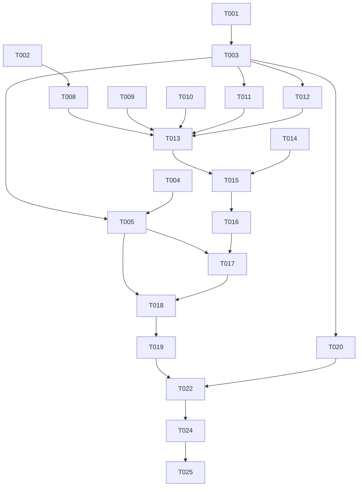

# Tasks: 多语言全球化（Multi-language Internationalization）

**Input**: Design documents from `spec/multi-language-i18n/`
**Prerequisites**: plan.md, spec.md

**Tests**: 未请求测试任务（无 TDD 要求），验证走 Phase 7 build + deploy。

**Organization**: 任务按用户故事分组，可独立实现与验证。

## Format: `[ID] [P?] [Story] Description`

- **[P]**: 可并行（不同文件、无未完成依赖）
- **[Story]**: 对应 spec.md 用户故事（US1/US2/US3）
- 所有描述含确切文件路径

---

## Phase 1: Setup (Shared Infrastructure)

**Purpose**: 资源目录骨架与 key 规范

- [X] T001 创建资源限定词目录骨架 `entry/src/main/resources/zh_CN/element/`、`entry/src/main/resources/zh_TW/element/`、`entry/src/main/resources/en_US/element/`，各放置空 `string.json`（含既有 6 条系统条目 module_desc/EntryAbility_desc/EntryAbility_label/权限 reason 的对应语言值）
- [X] T002 全仓扫描 `entry/src/main/ets/` 下含 CJK 的字符串字面量，产出 key 命名清单（页面/功能前缀分组规范，同语义复用同 key；排除注释、`pages/novel/NovelPage.ets`、`components/common/TagExifPicker.ets`、用户自定义模板、日志、功能性常量），清单写入 `spec/multi-language-i18n/string-inventory.md`

---

## Phase 2: Foundational (Blocking Prerequisites)

**Purpose**: 语言偏好链路与取串基础设施，所有用户故事的前置

**⚠️ CRITICAL**: 本阶段完成前不得开始任何用户故事任务

- [X] T003 新建 `entry/src/main/ets/utils/I18nUtils.ets`：getStr/getStrf（经 AppStorage('context') 的 resourceManager 同步取串，支持 %s/%d 格式化）、normalizeLanguagePref（存量 'zh-CN' 及非法值→'system'）、prefToLocale（'system'→'default'，其余→zh-Hans/zh-Hant/en-Latn-US）、effectiveAcceptLanguage（system 时结合 I18n.System.getSystemLanguage() 解析，非三语→en-US）
- [X] T004 [P] 改造 `entry/src/main/ets/models/AppSettings.ets`：language 字段语义升级为 'system'|'zh-Hans'|'zh-Hant'|'en-Latn-US'，默认 'system'；Options 接口与构造器同步
- [X] T005 改造 `entry/src/main/ets/stores/UserSettingStore.ets`：loadSettings 读取 language 时经 normalizeLanguagePref 归一化；setLanguage 归一化入参并在保存后调用 I18n.System.setAppPreferredLanguage（即时生效）；getSettings 防御性拷贝链路不变
- [X] T006 [P] 改造 `entry/src/main/ets/entryability/EntryAbility.ets`：onCreate 在 AppStorage context 注入后，用 preferences API 直读 pixiv_settings 的 language 键（不静态 import UserSettingStore），非 'system' 时调 setAppPreferredLanguage 重放
- [X] T007 [P] 从同步载荷移除 language 字段：`entry/src/main/ets/services/SyncService.ets`（collectSettings/applySettingsItem 2 处）与 `entry/src/main/ets/services/DistributedSyncService.ets`（buildSettingsPayload/applySettingsFields 2 处）

**Checkpoint**: 偏好读写/归一化/启动重放/系统切换链路就绪

---

## Phase 3: User Story 1 - 跟随系统语言自动显示对应界面 (Priority: P1) 🎯 MVP

**Goal**: 全部用户可见文本资源化为三语；无偏好时自动跟随系统语言；不支持语种回退英文

**Independent Test**: 系统语言分别设为简中/繁中/英文/日语，冷启动应用逐页检查文本语言正确、无残留硬编码中文

### Implementation for User Story 1

- [X] T008 [P] [US1] 资源化 `entry/src/main/ets/pages/settings/` 全部页面与 `SettingWidgets.ets`（约 390 条：SettingsPage/7 个分类子页/DownloadPage/ExifTagConfigPage/HistoryPage/MutePage/FilenameTemplatePage/ExifTemplatePage/About 等），硬编码中文替换为 `$r('app.string.*')`，key 写入 zh_CN string.json
- [X] T009 [P] [US1] 资源化 `entry/src/main/ets/pages/` 其余页面（detail/IllustDetailPage、detail/CommentPage、search/*、user/UserProfilePage、home/*、login/*、splash、bookmark/*、ImageViewerPage 等，约 200 条）
- [X] T010 [P] [US1] 资源化 `entry/src/main/ets/components/`（illust/IllustCard.ets、illust/IllustWaterfall.ets、common/CommonViews.ets 等，约 40 条；排除死代码 TagExifPicker.ets）
- [X] T011 [P] [US1] 资源化 `entry/src/main/ets/stores/` 与 `entry/src/main/ets/services/` 的用户可见文案（toast/错误描述/自检项名，约 150 条），非组件上下文经 I18nUtils.getStr/getStrf 取串；EXIF 默认模板值与注释不动
- [X] T012 [P] [US1] 资源化 `entry/src/main/ets/network/` 用户可见错误描述（RelayClient.ets、OAuthService.ets 等约 40 条），经 I18nUtils 取串；Accept-Language 注入点本阶段不动
- [X] T013 [US1] 基于 T008–T012 产出的 zh_CN key 全集，生成 `entry/src/main/resources/zh_TW/element/string.json` 繁体中文全集翻译（key 集合与 zh_CN 完全一致）
- [X] T014 [P] [US1] 基于 zh_CN key 全集，生成 `entry/src/main/resources/en_US/element/string.json` 与改写 `entry/src/main/resources/base/element/string.json` 为英文全集（key 集合一致，base 作为不支持语种兜底）
- [X] T015 [US1] 三语言 key 集合一致性校验：base/zh_CN/zh_TW/en_US 四份 string.json 的 key 完全相同，缺失补齐；含参文案 %s/%d 占位各语言对齐

**Checkpoint**: US1 完成——任意系统语言冷启动界面全量本地化，可独立演示 MVP

---

## Phase 4: User Story 2 - 应用内切换界面语言 (Priority: P2)

**Goal**: 设置页与登录页均可切换语言（跟随系统/简中/繁中/英文），立即生效、持久化

**Independent Test**: 设置页切英文→各页面即时英文；重启保持；改回跟随系统恢复随系统；登录页切繁体→登录流程即时繁体

### Implementation for User Story 2

- [X] T016 [US2] `entry/src/main/ets/pages/settings/SettingWidgets.ets` 新增 LANGUAGE_OPTIONS 四选项数组（label 走 $r 资源），沿用 QualityOption + showQualityPicker 模式
- [X] T017 [US2] `entry/src/main/ets/pages/settings/GeneralSettingsPage.ets` "通用"分组新增"语言"设置行（SettingItem + TextPickerDialog），setter 走 userSettingStore.setLanguage；`entry/src/main/ets/pages/settings/SettingsPage.ets` "通用"入口摘要显示当前语言
- [X] T018 [US2] `entry/src/main/ets/pages/login/LoginPage.ets` 右上角既有"设置"入口旁新增"语言"入口，点击弹语言选择（遵循项目弹窗约定，多值选择用 TextPickerDialog），与设置页共用 LANGUAGE_OPTIONS 与 setLanguage
- [X] T019 [US2] 验证语言切换全页面即时刷新：切换后检查 Tab 容器页、路由栈中页面、已打开弹层的 $r 文本均刷新；若个别场景不刷新，记录并在该处补充刷新手段（禁止整栈重建以外的重启提示方案除外，优先依赖配置变更自动刷新）

**Checkpoint**: US1+US2 均独立可用

---

## Phase 5: User Story 3 - API 内容语言随界面语言联动 (Priority: P3)

**Goal**: Pixiv API Accept-Language 随生效语言动态取值（zh-CN/zh-TW/en-US）

**Independent Test**: 英文界面下浏览含可翻译 tag 的作品详情，tag 翻译名为英文；切简中后同一作品翻译名为中文

### Implementation for User Story 3

- [X] T020 [US3] 改造 `entry/src/main/ets/network/AuthInterceptor.ets`：Accept-Language 注入由字面量 'zh-CN' 改为 I18nUtils.effectiveAcceptLanguage(当前偏好)
- [X] T021 [P] [US3] 清理 `entry/src/main/ets/utils/Constants.ets` 断链常量 ACCEPT_LANGUAGE（移除或改造，全仓无引用）

**Checkpoint**: 三个用户故事全部独立可用

---

## Phase 6: Polish & Cross-Cutting Concerns

**Purpose**: 残留清理与边界确认

- [X] T022 残留硬编码扫描：对 `entry/src/main/ets/` 全量 grep CJK 字面量，确认剩余仅为注释/死代码/功能性常量/用户自定义模板默认值，形成豁免清单附于 `spec/multi-language-i18n/string-inventory.md`
- [X] T023 [P] 长文本布局检查：英文译文在 Tab 标签、按钮、设置行、FAB 等紧凑布局不溢出截断，必要时调整宽度/省略策略（仅限样式微调，不改交互）

---

## Phase 7: Verification

<!-- verification_scope: build-only -->

**Purpose**: 构建与部署验证

- [X] T024 Build project and fix any compilation errors (invoke build_project; iterate fix → build until success)
- [X] T025 Deploy application to device/emulator (invoke start_app)

---

## Dependencies & Execution Order

### Phase Dependencies

- **Setup (Phase 1)**: 无依赖，立即开始
- **Foundational (Phase 2)**: 依赖 Setup；T003 阻塞 T011/T012/T020；T004/T006/T007 相互可并行；T005 依赖 T003+T004
- **User Stories**: 全部依赖 Foundational 完成
  - US1 内：T008–T012 可并行（不同文件，均向 zh_CN string.json 追加 key——需按分组分配 key 前缀段避免冲突）；T013/T014 依赖 T008–T012 的 key 全集；T015 依赖 T013/T014
  - US2 依赖 US1 的资源 key（语言选项 label 走 $r）
  - US3 依赖 T003（I18nUtils），与 US1/US2 无代码冲突
- **Polish**: 依赖全部用户故事完成
- **Verification**: 最后执行

### User Story Dependencies

- **US1 (P1)**: Foundational 后可开始，不依赖其他故事
- **US2 (P2)**: 依赖 US1 产出的资源 key（选项 label 引用），建议 US1 完成后开始
- **US3 (P3)**: 仅依赖 Foundational 的 T003，可与 US1 并行

---

## 📊 Dependency Graph



---

## ⚡ Parallel Execution Guide

| Phase | Tasks | Required Files | Execution Notes |
|---|---|---|---|
| Foundational | T004, T006, T007 | AppSettings.ets / EntryAbility.ets / SyncService.ets + DistributedSyncService.ets | 互不冲突可并行 |
| US1 提取 | T008, T009, T010, T011, T012 | pages/settings/ 与其余 pages/、components/、stores/+services/、network/ | 不同文件；zh_CN string.json 追加按 key 前缀分段避免写冲突 |
| US1 翻译 | T013, T014 | zh_TW/ 与 en_US/+base/ string.json | key 全集冻结后并行 |
| US3 | T020, T021 | AuthInterceptor.ets / Constants.ets | 与 US1/US2 全程可并行 |

---

## Summary Report

- **Total tasks**: 25
- **Per-story count**: US1 = 8（T008–T015），US2 = 4（T016–T019），US3 = 2（T020–T021）
- **Setup/Foundational/Polish/Verification**: 2 / 5 / 2 / 4（含 T024/T025）
- **Parallel opportunities**: Foundational 3 项、US1 提取 5 项、US1 翻译 2 项、US3 2 项
- **Independent test criteria**: 见各故事 Phase 头部 Independent Test
- **Suggested MVP scope**: Phase 1 + Phase 2 + Phase 3（US1）——即可交付三语跟随系统的完整界面
- **Format validation**: 全部任务以 `- [ ]` 开头、ID 连续唯一（T001–T025）、US 阶段任务均带 [USx] 标签、Setup/Foundational/Polish/Verification 无故事标签 ✅

---

## Path Conventions

- 源码：`entry/src/main/ets/`（pages/、components/、stores/、services/、network/、utils/、entryability/）
- 资源：`entry/src/main/resources/{base,zh_CN,zh_TW,en_US}/element/string.json`
- 文档：`spec/multi-language-i18n/`

---

## Parallel Example: User Story 1

```text
# 五组提取任务可并行（不同源文件，key 前缀分段写入 zh_CN string.json）：
Task: "T008 资源化 pages/settings/（key 前缀 settings_*）"
Task: "T009 资源化 pages/ 其余页面（key 前缀 detail_/search_/user_/home_/login_ 等）"
Task: "T010 资源化 components/（key 前缀 card_/waterfall_/common_）"
Task: "T011 资源化 stores/+services/（key 前缀 store_/svc_）"
Task: "T012 资源化 network/（key 前缀 net_）"

# key 全集冻结后两份翻译并行：
Task: "T013 生成 zh_TW string.json"
Task: "T014 生成 en_US + 改写 base string.json"
```

---

## Implementation Strategy

### MVP First (User Story 1 Only)

1. 完成 Phase 1: Setup
2. 完成 Phase 2: Foundational（关键——阻塞所有故事）
3. 完成 Phase 3: User Story 1（三语资源化 + 跟随系统）
4. **STOP and VALIDATE**：切换系统语言独立验证 US1
5. 可交付 MVP

### Incremental Delivery

1. Setup + Foundational → 基础设施就绪
2. US1 → 独立验证 → MVP（跟随系统三语界面）
3. US2 → 独立验证 → 应用内切换（含登录页入口）
4. US3 → 独立验证 → API 内容语言联动
5. 每个故事增量交付且不破坏既有故事

### Parallel Team Strategy

1. 共同完成 Setup + Foundational
2. Foundational 完成后：US1 五组提取任务并行；US3 可同步推进
3. US1 key 全集冻结后 US2 开始

---

## Notes

- [P] 任务 = 不同文件、无未完成依赖
- [Story] 标签用于溯源至 spec.md 用户故事
- 每个用户故事可独立完成与测试
- 每完成一个任务或逻辑组建议提交一次
- 可在任意 Checkpoint 暂停独立验证故事
- 避免：模糊任务、同文件冲突、破坏故事独立性的跨故事依赖
