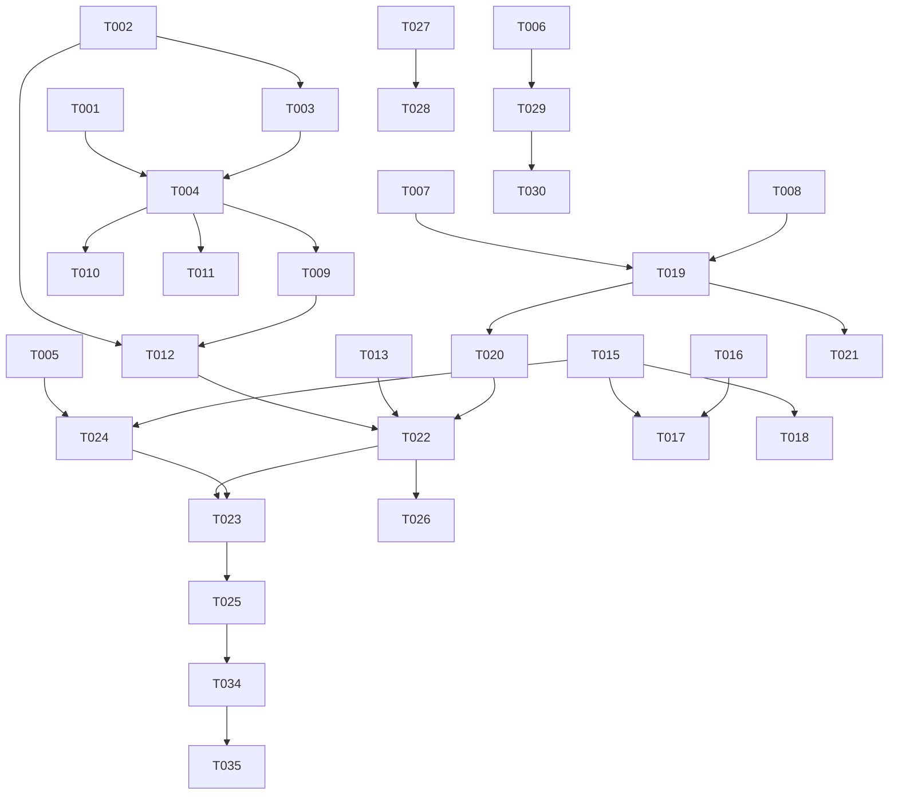

# Tasks: pixez 交互全面对齐

**Input**: Design documents from `spec/pixez-interaction-alignment/`
**Prerequisites**: plan.md, spec.md

**Tests**: 未请求自动化测试，不生成测试任务；人工测试方案见 Polish 阶段 T033 产出物。

**Organization**: 任务按用户故事分组，每个故事可独立实现与验证。

## Format: `[ID] [P?] [Story] Description`

- **[P]**: 可并行（不同文件、无未完成依赖）
- **[Story]**: 对应 spec.md 用户故事（US1~US8）
- 所有路径相对项目根 `D:\work\pixiv-\`

---

## Phase 1: Setup (Shared Infrastructure)

**Purpose**: 权限与新设置项的底层字段（无行为变化）

- [X] T001 在 `entry/src/main/module.json5` 的 requestPermissions 中追加 `ohos.permission.VIBRATE`（normal 级，无需 ACL/运行时申请），补 reason 字符串资源（中/英文）
- [X] T002 [P] `models/AppSettings.ets` 新增设备本地字段 `hapticFeedback: boolean = true` 与 `longPressSaveConfirm: boolean = false`（Options 接口 + 类字段 + 构造器三处）
- [X] T003 `stores/UserSettingStore.ets` 接入两新字段：loadSettings 读偏好、saveSettings 写偏好、getSettings 拷贝、新增 `setHapticFeedback`/`setLongPressSaveConfirm` setter（**设备本地：不调 notifySettingsWrite**，不动 SyncService/DistributedSyncService 载荷）

---

## Phase 2: Foundational (Blocking Prerequisites)

**Purpose**: 全部用户故事依赖的共享工具与服务

**⚠️ CRITICAL**: 本阶段完成前不得开始任何用户故事任务

- [X] T004 [P] 新建 `entry/src/main/ets/utils/HapticUtils.ets`：静态四级语义入口 selectionClick/light/medium/heavy；映射 vibrator 预置效果（SOFT intensity 40 / SOFT 70 / HARD 80 / HARD 100，`{usage:'touch'}`）；读 `userSettingStore.getSettings().hapticFeedback` 开关；50ms 全局节流；首次 `isSupportEffectSync` 探测缓存，不支持降级 VibrateTime 时长分档（10/20/35/50ms）；全程 try/catch 静默（依赖 T002/T003）
- [X] T005 [P] 新建 `entry/src/main/ets/services/DetailListContextRegistry.ets`：模块级 `Map<string, DetailListContext>`；Context 含 `ids: number[]`、`nextUrl: string`、`fetchNext` 闭包；register(ctx)→token、get(token)→ctx|null、append(token, page) 追加续页
- [X] T006 [P] 新建 `entry/src/main/ets/utils/PixivLinkParser.ets`：纯函数 parse(input)→`{kind:'illust'|'user', id} | null`；支持 `www.pixiv.net/artworks/{id}`、`/users/{id}`、`member_illust.php?illust_id=`、`pixiv://illusts/{id}`、`pixiv://user/{id}`；不识别返回 null
- [X] T007 `network/PixivEndpoints.ets` 新增 `/v1/user/bookmark-tags/illust` 端点；`network/ApiService.ets` 新增 `getBookmarkTags(restrict): Promise<BookmarkTag[]>`（BookmarkTag 模型含 name/count，遵循 fromJson→Options→Model 模式，可放 models/Bookmark.ets）
- [X] T008 `stores/BookmarkStateStore.ets` 的 `star` 追加可选参数 `tags: string[] = []` 并透传 `apiService.addBookmark`（向后兼容；请求中锁/失败回滚/toast 语义不变）

**Checkpoint**: 基础设施就绪——用户故事可并行开始

---

## Phase 3: User Story 1 - 全局触觉反馈 (Priority: P1) 🎯 MVP

**Goal**: FR-004 全部触点经 HapticUtils 获得对应级别震动，开关关闭时全静默

**Independent Test**: 设置页开/关触觉反馈，逐触点验证四级震动有无与节流

### Implementation for User Story 1

- [X] T009 [US1] 触点接入 A：`components/illust/IllustCard.ets` 点击→selectionClick、长按→heavy；`pages/home/HomePage.ets` Tab 切换→selectionClick；`pages/settings/SettingWidgets.ets` SwitchItem onToggle→light
- [X] T010 [US1] 触点接入 B：收藏成功→medium、取消收藏→light（在 `stores/BookmarkStateStore.ets` star/unstar 成功/回滚分支处调用）
- [X] T011 [US1] 触点接入 C：`pages/detail/CommentPage.ets` 发送成功→medium；`pages/detail/ImageViewerPage.ets` 保存点击→selectionClick；破坏性确认对话框确认分支（清除历史/清空下载等既有 AlertDialog 确认处）→heavy

**Checkpoint**: US1 独立可用

---

## Phase 4: User Story 2 - 卡片长按直接保存 (Priority: P1)

**Goal**: 长按卡片直存（单页存 p0、多页存全部），可选确认框；旧长按菜单移除，屏蔽作者迁移

**Independent Test**: 推荐列表长按单页/多页卡片验证直存与 toast；开确认开关后验证先弹框

### Implementation for User Story 2

- [X] T012 [US2] 改造 `components/illust/IllustCard.ets` 长按：heavy 震动（T009 已含震动，此处接行为）→ `longPressSaveConfirm` 开启时 AlertDialog 确认 → 单页 enqueue 第 0 页 / 多页循环 enqueue 全部页；复用 `downloadService.isDownloaded` 重复检测（命中弹既有"跳过/全部重新下载"对话框）与 autoBookmarkOnDownload 联动；移除 bindContextMenu 三项旧菜单
- [X] T013 [US2] 「屏蔽作者」迁移：`pages/detail/IllustDetailPage.ets` 画师行新增长按 bindContextMenu（屏蔽该作者=调 `userSettingStore.addMuteUser`+toast；复制 UID=ClipboardUtils+toast）
- [X] T014 [US2] `pages/settings/DownloadSettingsPage.ets` 新增"长按保存前确认"SwitchItem（读 `settings.longPressSaveConfirm`，调 setLongPressSaveConfirm；资源字符串补全）

**Checkpoint**: US2 独立可用，长按保存 1 步完成（SC-001）

---

## Phase 5: User Story 3 - 底栏 Tab 再点回顶 (Priority: P2)

**Goal**: 再点当前底栏 Tab，对应列表平滑回顶；排行页转发到当前榜单

**Independent Test**: 推荐/动态/排行/搜索各 Tab 下滑后再点当前 Tab 验证回顶

### Implementation for User Story 3

- [X] T015 [US3] `components/illust/IllustWaterfall.ets`：内部持 `Scroller` 挂到 WaterFlow；新增 `@Prop @Watch scrollTopToken: number = 0`，变更时 `scroller.scrollEdge(Edge.Top)`
- [X] T016 [US3] `pages/home/HomePage.ets`：TabBuilder 的 tabBar 项加 onClick——点击项等于 currentIndex 时写 AppStorage `tabRetapToken`（值 `"<index>:<epochMs>"`）
- [X] T017 [P] [US3] `pages/home/RecomPage.ets` 与 `pages/home/FollowPage.ets`：`@StorageLink('tabRetapToken') @Watch` 解析自身 tabIndex（0/1），匹配则递增本地令牌传给 IllustWaterfall 的 scrollTopToken
- [X] T018 [P] [US3] `pages/home/RankPage.ets`（tabIndex 2）与 `pages/search/SearchPage.ets`（tabIndex 3）：同 T017 方式接入（RankPage 单瀑布流直接回顶当前榜单）

**Checkpoint**: US3 独立可用

---

## Phase 6: User Story 4 - 带标签收藏 (Priority: P2)

**Goal**: 长按收藏入口弹标签面板（多选标签+公开/私密），空标签退化普通收藏

**Independent Test**: 详情页 FAB 长按与列表卡片星标长按均弹面板；勾选标签收藏生效

### Implementation for User Story 4

- [X] T019 [US4] 新建 `entry/src/main/ets/components/illust/BookmarkTagPanel.ets`：内联底部弹层（半透明遮罩+底部弹层，`.onClick(()=>{})` 防冒泡，禁 hitTestBehavior Block）；打开时调 `getBookmarkTags` 加载标签 chip 流式多选；公开/私密切换；确认/取消；加载失败错误态+无标签确认兜底（依赖 T007/T008）
- [X] T020 [US4] 详情页收藏 FAB 长按由现公开/私密菜单改为打开 BookmarkTagPanel（可见性并入面板）；确认调 `bookmarkStateStore.star(illust, restrict, tags)`（作用于 `pages/detail/IllustDetailPage.ets`，若 T022 已完成则落在 Pane 内）
- [X] T021 [US4] 卡片星标可交互化 + 面板宿主：`components/illust/IllustCard.ets` 星标单击=selectionClick+快速收藏/取消、长按=heavy+上抛 `onStarLongPress` 回调；`components/illust/IllustWaterfall.ets` 根 Stack 承载 BookmarkTagPanel（缺省宿主），确认回调 star(illust, restrict, tags)

**Checkpoint**: US4 独立可用

---

## Phase 7: User Story 5 - 详情页作品间滑动 (Priority: P2)

**Goal**: 列表进入的详情页支持左右滑动切换同列表作品，末尾预取，No More 收尾；非列表入口行为不变

**Independent Test**: 推荐列表第 N 项进详情，左右滑验证相邻作品；滑到末尾验证预取与 No More

### Implementation for User Story 5

- [X] T022 [US5] 抽取详情内容为 `entry/src/main/ets/components/detail/IllustDetailPane.ets`：入参 illustId + isActive；承载现有全部内容（图片行/信息行/相关作品/双 FAB/EXIF Picker/合并审查/选页弹窗/T013 画师行菜单/T020 FAB 标签面板）；每实例独立 `new IllustDetailStore()`；isActive 变 true 时做接续登记。**抽取必须基于合入 T013/T020 后的最新 IllustDetailPage 内容**
- [X] T023 [US5] 改造 `pages/detail/IllustDetailPage.ets` 为壳：路由参数扩展 `{ illustId, contextToken?, contextIndex? }`；无 token=渲染单 Pane（行为同现状）；有 token=Swiper+LazyForEach（cachedCount 1）按上下文 ids 渲染 Pane 序列，初始定位 contextIndex，onChange 更新接续登记为当前 illustId
- [X] T024 [US5] `components/illust/IllustWaterfall.ets` 默认 onCardClick：先向 DetailListContextRegistry 注册（ids=dataSource 当前 id 序列、nextUrl、fetchNext 闭包），再 pushUrl 传 `{ illustId, contextToken, contextIndex }`（依赖 T005/T015）
- [X] T025 [US5] 末尾预取与 No More：Swiper onChange 至倒数第 2 项且 nextUrl 非空时调 fetchNext 追加 ids 到 Registry；nextUrl 为空时序列尾部追加"No More"占位页（转圈/失败重试/无更多三态对齐 pixez PictureListNextPage）

**Checkpoint**: US5 独立可用，连续浏览 5 作品无需返回列表（SC-004）

---

## Phase 8: User Story 6 - 详情页屏蔽占位 (Priority: P3)

**Goal**: 命中屏蔽的详情页整页占位，支持临时查看（会话级）与跳屏蔽设置

**Independent Test**: 屏蔽某作者后经历史进入其作品详情→占位→临时查看→返回再进仍占位

### Implementation for User Story 6

- [X] T026 [US6] `components/detail/IllustDetailPane.ets`（若 T022 未完成则先在 `pages/detail/IllustDetailPage.ets`）：详情加载完成后以 `MuteFilter.isMuted(illust, userSettingStore.getSettings())` 判定；命中且 tempRevealed=false 时整页替换为占位视图（屏蔽提示+"查看屏蔽设置"跳 MutePage+"临时查看"置 tempRevealed=true）；tempRevealed 为组件内存态

**Checkpoint**: US6 独立可用（SC-005）

---

## Phase 9: User Story 7 - 关注按钮三态与精细关注 (Priority: P3)

**Goal**: FollowButton 三态视觉+单击快关+长按精细菜单；画师主页与详情页画师行复用

**Independent Test**: 画师主页单击关注/取关、长按切悄悄关注；详情页画师行按钮同行为

### Implementation for User Story 7

- [X] T027 [US7] 新建 `entry/src/main/ets/components/common/FollowButton.ets`：入参 userId/isFollowed/onChanged；三态（未关注实心 #0096FA/已关注描边/请求中原地 12px LoadingProgress 尺寸不变）；单击=light/medium 震动+followUser/unfollowUser；长按=heavy 震动+bindContextMenu（公开关注/悄悄关注 restrict='private'/取消关注，按当前态显隐）
- [X] T028 [US7] `pages/user/UserProfilePage.ets` 替换现有关注 Button 为 FollowButton；详情页画师行（IllustDetailPane）右侧新增 FollowButton

**Checkpoint**: US7 独立可用

---

## Phase 10: User Story 8 - 搜索输入智能分流 (Priority: P3)

**Goal**: pixiv 链接直达入口 + 自动补全下拉（多词仅替换末词）

**Independent Test**: 输入作品链接出现直达并可跳转；输入"原神 甘雨"点补全仅替换"甘雨"

### Implementation for User Story 8

- [X] T029 [US8] `pages/search/SearchPage.ets`：输入框下新增"链接直达"分支（与 NumericDirectEntries 并列）：输入 trim 后以 https:// 或 pixiv:// 开头时经 PixivLinkParser.parse 判定，命中显示直达行，点击跳详情/画师页并写搜索历史（复用 pid/uid 类型）；null 静默不显示（依赖 T006）
- [X] T030 [US8] `pages/search/SearchPage.ets` 补全下拉：onChange 300ms 防抖（非数字非 URL 时）调 `apiService.getAutoComplete`，输入框下渲染建议列表（最多 10 条）；点选：多词（空格分词≥2）仅替换末词+光标置末尾不提交；单词回填并提交；提交/失焦/清空时收起

**Checkpoint**: 全部 8 个故事独立可用

---

## Phase 11: Polish & Cross-Cutting Concerns

**Purpose**: 质量收尾与文档

- [X] T031 全量 `arkts_check` 检查所有改动 .ets 文件并清零新增告警（`@kit.*` 的 6 条 SDK d.ts 噪音除外）；检查 ForEach key 陷阱（新列表的可变字段入 key）与 Scroll align(TopStart) 约定
- [X] T032 更新 `AGENTS.md`：新增 HapticUtils/卡片长按直存/Tab 回顶令牌/带标签收藏/作品间滑动上下文/屏蔽占位/FollowButton/搜索补全等条目，移除"卡片长按菜单"过时描述
- [X] T033 编写人工测试方案 `spec/pixez-interaction-alignment/manual-test-plan.md`：按 8 个用户故事组织，每故事列前置条件/操作步骤/预期结果（含震动级别、节流、降级、边界 case），供用户真机自测

---

## Phase 12: Verification

<!-- verification_scope: build-only -->

**Purpose**: 构建 + 部署验证（用户已选择不含 UI 自动化验证，人工验证依据 T033 测试方案自测）

- [X] T034 构建项目并修复编译错误（build_project，迭代 修复→构建 直至成功）
- [X] T035 部署应用到设备/模拟器（start_app），确认冷启动无闪退、主页可达

---

## Phase 13: R2 - 任意列表入口滑动 + 下载标题修复

**Goal**: US9（相关作品/历史记录进详情可滑动）+ US10（下载管理器任务行标题修复）

**Independent Test**: 详情页点相关作品→滑动切换；历史页点条目→滑动切换；下载管理器任务行显示作品 ID

- [X] T036 [US9] `components/detail/IllustDetailPane.ets` 相关作品点击改为注册滑动上下文：快照 store.relatedIllusts 的 id 序列（已过滤）+ relatedNextUrl 快照 + fetchNext 闭包（自持局部游标，apiService.fetchNext + parseIllustListPage + MuteFilter 过滤 + 按 id 去重），注册 DetailListContextRegistry 后 pushUrl 传 `{ illustId, contextToken, contextIndex }`（D10）
- [X] T037 [US9] `pages/settings/HistoryPage.ets` 浏览历史点击注册滑动上下文：ids=当前展示序列 illust_id（时间倒序去重）、nextUrl=''、fetchNext 返回空页，pushUrl 传 contextToken/contextIndex；搜索历史 pid 回放保持单作品不注册（D11）
- [X] T038 [US10] `pages/settings/DownloadPage.ets` 任务行标题改传字符串实参（illust_id/pageIndex 显式 toString）；并全量 grep 排查 `getStrf(` 调用点的占位符/实参类型一致性（%d 配 number、%s 配 string），同类型不匹配一并修复（D12）
- [X] T039 arkts_check 检查 R2 改动文件；`AGENTS.md` 增补"相关作品/历史记录入口也注册滑动上下文"；`manual-test-plan.md` 增补 US9/US10 测试用例

## Phase 14: R2 Verification

<!-- verification_scope: build-only -->

- [X] T040 构建项目并修复编译错误（build_project，迭代直至成功）
- [X] T041 部署应用到模拟器（start_app），确认冷启动无闪退

## Phase 15: R3 - User Story 11 下载管理页增强（Priority: P2）

**Goal**: 对齐 pixez JobPage 核心：任务行缩略图（三级回退）、点击跳详情带滑动上下文、状态筛选 chips。权限模型维持现状（FR-028）。

- [X] T042 [US11] `pages/settings/DownloadPage.ets` 新增内联 `TaskThumb` 子组件：@Prop localPath/imageUrl + @State useLocal=true；useLocal 且 localPath 非空时 `Image('file://' + localPath)` 挂 onError 置 useLocal=false，否则回退 CachedImage(imageUrl)；56vp 方图 + 4vp 圆角置行首（D13）
- [X] T043 [US11] `pages/settings/DownloadPage.ets` 新增 `openTaskDetail(task)`：ids=当前筛选后可见任务按 illust_id 去重（保序）、nextUrl=''、fetchNext 返回空 IllustListPage，注册 DetailListContextRegistry 后 pushUrl `{illustId, contextToken, contextIndex}`；任务行 onClick 绑定（D14）
- [X] T044 [US11] `pages/settings/DownloadPage.ets` 新增 `@State filterMode`（'all'|'active'|'completed'|'failed'，active=pending+downloading）+ 标题栏下筛选 chips（选中高亮 #0096FA）+ `getFilteredTasks()` 成员方法接入 ForEach；确认 1.5s 轮询 refreshTasksSilently 不打断筛选、批量按钮语义不变（D15）
- [X] T045 arkts_check 检查 DownloadPage.ets；`AGENTS.md` 增补 R3 说明（缩略图回退/跳详情上下文/筛选）；`manual-test-plan.md` 增补 US11 测试用例

## Phase 16: R3 Verification

<!-- verification_scope: build-only -->

- [X] T046 构建项目并修复编译错误（build_project，迭代直至成功）
- [X] T047 部署应用到模拟器（start_app），确认冷启动无闪退

## Phase 17: R4 - 详情页/缩放页对齐 pixez 剩余差异

**Goal**: US12-US17：简介富文本（可点链接）、详情页顶栏溢出菜单、缩放页底栏（HD/复制图片/全屏）、保存反馈四态、分辨率、相关作品自动加载。排除项：翻译/举报/长按只存不收藏（FR-035）。

### User Story 12 - 简介富文本 (P2)

- [X] T048 [US12] 新增 `utils/CaptionParser.ets` 纯函数 `parseCaptionHtml(html): CaptionSegment[]`（`<a>` 提取 href、`<br>`→`\n`、基础实体解码、其余标签剥离、畸形兜底纯文本）；`models/Illust.ets` 补 `caption` 字段（Options 接口 + fromJson 解析）（D16）
- [X] T049 [US12] `components/detail/IllustDetailPane.ets` tag 区后插入简介行：`Text(){ ForEach(segments, Span) }`，链接 Span 高亮 #0096FA + onClick（PixivLinkParser 命中→应用内跳详情/画师页；否则 openLink 开浏览器）；空 caption 不渲染；若 Text 内 ForEach(Span) 编译失败降级 StyledString（D16）

### User Story 13 - 顶栏溢出菜单 (P2)

- [X] T050 [US13] `components/detail/IllustDetailPane.ets` 根 Stack 顶部叠加顶栏（左返回 router.back / 右 ⋮，半透明背景，不遮挡交互）；⋮ bindContextMenu 六项：分享（systemShare 作品 URL）、复制链接、复制文案（标题+简介纯文本）、画师信息、多图保存（开既有选页弹窗）、屏蔽作者（复用既有逻辑）（D17）

### User Story 14 - 缩放页底栏 (P2)

- [X] T051 [US14] `pages/detail/ImageViewerPage.ets` 底部工具栏（与页码合并一行）：①HD 切换 @State showOriginal，当前页 URL=showOriginal?downloadUrls:urls（CachedImage @Watch 重载）；②复制图片：缓存文件→createImageSource→createPixelMap→pasteboard PixelMap，失败回退复制 URL+toast；③全屏开关 setSpecificSystemBarEnabled('status')，aboutToDisappear 恢复（D18）

### User Story 15 - 保存反馈四态 (P3)

- [X] T052 [US15] `services/DownloadService.ets` enqueue 增加同步返回值 `'enqueued'|'inflight'`（inflight 不入队）；调用点按返回值 toast（inflight→新增资源"已在下载队列中"）：IllustDetailPane savePage/savePages/saveAll、ImageViewerPage.doSave、IllustCard 长按直存（D19）

### User Story 16 - 分辨率 (P3)

- [X] T053 [US16] `components/detail/IllustDetailPane.ets` InfoRow 统计区追加 `{width}×{height}` 行，0 值不渲染（D20）

### User Story 17 - 相关作品自动加载 (P3)

- [X] T054 [US17] `components/detail/IllustDetailPane.ets` 根 List 加 onReachEnd 触发 loadMoreRelated（hasMore 且非加载中门控），保留手动按钮作失败兜底（D21）

### 收尾

- [X] T055 arkts_check 全部 R4 改动文件；`AGENTS.md` 增补 R4 说明（简介/顶栏/缩放页底栏/四态反馈/分辨率/自动加载）；`manual-test-plan.md` 增补 US12-US17 测试用例

## Phase 18: R4 Verification

<!-- verification_scope: build-only -->

- [X] T056 构建项目并修复编译错误（build_project，迭代直至成功）
- [X] T057 部署应用到模拟器（start_app），确认冷启动无闪退

## Phase 19: R5 - 查看器底栏 pixez 化 + 分享图片

**Goal**: US18 底栏重排（去顶栏、底部单行图标）+ US19 分享图片（缓存文件 image 记录，未缓存置灰 toast）。不做加载百分比（FR-039）。

- [X] T058 [US18] `pages/detail/ImageViewerPage.ets` 移除顶部工具栏 Column，改为底部单行图标栏（Row SpaceEvenly + hitTestBehavior Transparent + 底部安全区 padding）：复制图片/页码（仅多页）/返回/全屏/SaveButton(icon-only)/分享/HD，白色图标 20~22vp 悬浮黑底；回调全部复用 R4 既有实现（D22）
- [X] T059 [US19] `pages/detail/ImageViewerPage.ets` 分享按钮 `shareCurrentImage()`：当前档位 URL→缓存路径解析（复用 R4 复制图片路径）→ fs 存在则 ShareKit SharedData 图片记录（image utd + fileUri，用法先 `devecocli docs search 分享图片` 查官方示例）拉起面板；未缓存/异常 → @State 置灰 + toast"图片加载后可分享"；HD 档位间缓存回退（D23）
- [X] T060 arkts_check ImageViewerPage.ets；`AGENTS.md` 查看器章节更新 R5 说明（底栏重排+分享图片）；`manual-test-plan.md` 增补 US18/US19 用例

## Phase 20: R5 Verification

<!-- verification_scope: build-only -->

- [X] T061 构建项目并修复编译错误（build_project，迭代直至成功）
- [X] T062 部署应用到模拟器（start_app），确认冷启动无闪退

## Phase 21: R5b - 查看器底栏图标尺寸修复

**Goal**: 修复 R5 底栏三个 Path 图标（复制/全屏/分享）渲染成小点的缺陷。根因：固定 `width/height(22)` 的 Shape 上叠加 `.padding(8)`，内容区被挤压到 6vp。修复：图标保持 22vp 无 padding，触摸区域由外层容器（padding 8）承载；其余元素（页码/返回/SaveButton/HD）不变。

- [X] T063 `pages/detail/ImageViewerPage.ets` 三个 Path 图标：移除 Shape 上的 `.padding(8)`，改为外层包裹容器（如 Stack/Column）挂 padding 与 onClick/opacity，Shape 仅保留 22vp + viewPort；arkts_check 通过；`AGENTS.md` 查看器章节增补该陷阱记录（固定尺寸 Shape 禁叠加 padding）
- [X] T064 构建项目并修复编译错误（build_project）
- [X] T065 部署应用到模拟器（start_app），确认冷启动无闪退

## Phase 22: R5c - 查看器图标二次修复（Path 显式尺寸）

**Goal**: R5b 修复后图标仍为小点。真根因经官方文档核实：Shape+Path 官方示例中 **Path 必须显式设 `.width('100%').height('100%')`**，否则 Path 无内在尺寸坍缩为零，viewPort 无可缩放内容。修复：三个图标的 Path 补显式尺寸。

- [X] T066 `pages/detail/ImageViewerPage.ets` 三个图标（复制/全屏/分享）的 Path 增加 `.width('100%').height('100%')`（对齐官方 Shape+Path 用法）；arkts_check；AGENTS.md 陷阱记录修正为"Path 无显式尺寸坍缩为零"为真根因
- [X] T067 构建项目并修复编译错误（build_project）
- [X] T068 部署应用到模拟器（start_app），确认冷启动无闪退

## Phase 23: R5d - 查看器图标三次修复（SVG 资源替代 Shape/Path）

**Goal**: R5c 后图标仍尺寸异常（约 1/3 大小）。放弃 Shape/Path 方案，改用确定性方案：SVG 矢量资源（resources/base/media/*.svg，24×24 viewBox 白色描边）+ `Image($r(...)).width(22).height(22)`。验证范围升级为 build+UI（截图确认图标尺寸）。

- [X] T069 `entry/src/main/resources/base/media/` 新增三个 SVG：`ic_viewer_copy.svg` / `ic_viewer_fullscreen.svg` / `ic_viewer_share.svg`（24×24 viewBox、stroke #FFFFFF、stroke-width 1.8~2、仅基础 path/rect/line/polyline，不用 CSS）；`pages/detail/ImageViewerPage.ets` 三个图标从 Shape+Path 改为 `Image($r('app.media.ic_viewer_xxx')).width(22).height(22)`，外层 Column 的 padding/opacity/onClick 结构保持（R5b）；arkts_check + build_project；AGENTS.md 陷阱记录更新：Shape/Path 小尺寸图标渲染不可控，一律用 SVG 资源 + Image
- [X] T070 部署启动（start_app）+ **UI 截图验证**：打开任一作品详情→点图进查看器→截图确认底栏七图标尺寸正常（约 22vp，与 HD 文本视觉协调）；不正常则继续修复直至正常（注：spec-verify 子代理返回空报告无结论；2026-09-18 用户目检确认图标正常，勾选收尾）

## Phase 24: R6 - 收藏页"已删除"占位卡误判修复

**Goal**: BookmarkPage 将"不在 API 第一页"误判为已删除（收藏超一页全误报、公开/私密 Tab 交叉误报）。改为：restrict 过滤 + 后台走完全部收藏分页确认后才判删；失败/超上限不插入（宁漏勿误）。

- [X] T071 [US20] `pages/bookmark/BookmarkPage.ets` 重构判删逻辑：①快照候选按 `snapshot.restrict === this.restrict` 过滤；②fetchFirst 不再即时插入占位卡，改由后台 `classifyDeletedSnapshots()` 走完收藏列表全部分页（复用 apiService.fetchNext 游标，上限 20 页）收集 id；③走查完整结束（nextUrl 为空且未超上限）后差集确认，confirmed 快照构造占位 Illust 前置插入并 reloadToken++ 刷新；④走查失败/超上限/无候选 → 不插入；⑤restrict 切换重置分类状态防重复走查
- [X] T072 arkts_check BookmarkPage.ets；`AGENTS.md` 收藏同步章节增补 R6 判删规则；`manual-test-plan.md` 增补 US20 用例（多页收藏无误报/私密 Tab 不串/断网不误报/真删除仍显示）
- [X] T073 构建项目并修复编译错误（build_project）
- [X] T074 部署应用到模拟器（start_app），确认冷启动无闪退

## Phase 25: R7 - 详情页滑动相邻作品预取

**Goal**: 详情壳 Swiper 相邻 ±1 作品在当前作品加载完成后静默预取（DB 详情缓存 + detailQuality 档位首图），滑动激活秒出；预取无副作用（不写历史）、快速连滑有作废机制。

- [X] T075 [US21] `pages/detail/IllustDetailPage.ets` 新增 `prefetchNeighbors(index)`：contextToken 模式下对 index±1 作品做「DB 缓存查询→未命中则 getIllustDetail+setIllustDetailCache→prefetchCachedImage(p0, 当前 detailQuality)」；`prefetchedIds` Set 去重 + 失败移除重试；`prefetchGen` 代数作废。`components/detail/IllustDetailPane.ets` loadDetail 成功后经新回调 `onDetailLoaded` 通知壳页触发
- [X] T076 arkts_check 两个改动文件；`AGENTS.md` "详情页 = 壳 + Pane"章节增补预取机制说明；`manual-test-plan.md` 增补 US21 用例（列表进详情→滑相邻秒出/快速连滑无堆积/单作品模式不预取/预取不写历史/断网预取静默失败不影响展示）
- [X] T078 部署应用到模拟器（start_app），确认冷启动无闪退

## Phase 26: R8 - 详情页缓存优先渲染

**Goal**: store.load 拆缓存段+网络段；Pane 激活缓存命中先渲染（不等网络）+立即触发相邻预取+后台静默刷新；预取链路补可观测日志。R7 预取效果（滑动秒出）由此可见。

- [X] T079 [US22] `stores/IllustDetailStore.ets` 拆分 loadFromCache/refreshFromNetwork（复用原缓存分支与网络路径代码，收藏对账/落缓存/写历史语义不变）；`components/detail/IllustDetailPane.ets` loadDetail 重排：缓存命中立即渲染+写历史+触发 onDetailLoaded→后台 refreshFromNetwork 静默刷新；未命中/forceRefresh 走原路径
- [X] T080 `pages/detail/IllustDetailPage.ets` prefetchOne 补 console.info（成功：id+cache/api 来源；代数中止：id+gen）；arkts_check 三个改动文件
- [X] T081 `AGENTS.md` R7 预取条目增补"缓存优先渲染"说明（store.load 已拆分勿回退）；`manual-test-plan.md` 增补 US22 用例（滑动秒出/后台静默刷新/断网缓存可看/强刷不变/历史重访秒出）
- [X] T082 构建项目并修复编译错误（build_project）
- [X] T083 部署应用到模拟器（start_app），确认冷启动无闪退

<!-- verification_scope: build-only -->

---

## 📊 Dependency Graph



## ⚡ Parallel Execution Guide

| Phase | Tasks | Required Files | Execution Notes |
|---|---|---|---|
| Setup | T002（与 T001 并行） | models/AppSettings.ets | T001 改 module.json5，互不冲突 |
| Foundational | T004/T005/T006 并行 | utils/HapticUtils.ets、services/DetailListContextRegistry.ets、utils/PixivLinkParser.ets | T004 需 T002/T003 先行 |
| US3 | T017/T018 并行 | home 与 search 页文件 | 均需 T015/T016 完成 |
| 跨故事 | US1/US2 先行（P1），US6/US7/US8（P3）互不冲突 | 见各任务路径 | US5 的 T022 必须等 T013/T020 内容合入后抽取 |

## Path Conventions

- 单项目结构：源代码在 `entry/src/main/ets/`，资源在 `entry/src/main/resources/`，权限在 `entry/src/main/module.json5`
- 本特性产物文档在 `spec/pixez-interaction-alignment/`

## Dependencies & Execution Order

### Phase Dependencies

- **Setup (Phase 1)**: 无依赖，可立即开始
- **Foundational (Phase 2)**: 依赖 Setup（T004 依赖 T002/T003）——阻塞全部用户故事
- **User Stories (Phase 3-10)**: 依赖 Foundational 完成；按 P1→P2→P3 顺序执行
- **Polish (Phase 11)**: 依赖全部用户故事完成
- **Verification (Phase 12)**: 依赖 Polish 完成

### User Story Dependencies

- **US1 (P1)**: 依赖 T004；触点接入互不依赖
- **US2 (P1)**: 依赖 T002/T003（确认开关）与 T009（震动触点）；T013 改详情页画师行，须在 T022 抽取之前合入
- **US3 (P2)**: 依赖 T015（Scroller）；T016 与 T017/T018 为广播-接收关系
- **US4 (P2)**: 依赖 T007/T008（API 与 star tags）；T020 改详情页 FAB，须在 T022 抽取之前合入
- **US5 (P2)**: 依赖 T005（Registry）、T015、T013、T020；T022 是全特性最大风险任务
- **US6 (P3)**: 依赖 T022（Pane 落点）；若 US5 未做则暂落 IllustDetailPage
- **US7 (P3)**: 无跨故事依赖（T027 独立新组件）
- **US8 (P3)**: 依赖 T006（LinkParser）

### Within Each User Story

- 模型/工具 → 服务/Store → UI → 集成；故事完成后进入下一优先级

## Parallel Example

```bash
# Foundational 阶段三个纯新文件可并行：
Task: "T004 新建 utils/HapticUtils.ets"
Task: "T005 新建 services/DetailListContextRegistry.ets"
Task: "T006 新建 utils/PixivLinkParser.ets"

# US3 接收端两页可并行：
Task: "T017 RecomPage/FollowPage 回顶接入"
Task: "T018 RankPage/SearchPage 回顶接入"
```

## Implementation Strategy

### MVP First (US1 + US2)

1. 完成 Setup + Foundational
2. 完成 US1（触觉反馈）+ US2（长按直存）
3. **STOP and VALIDATE**：真机验证四级震动与一步保存
4. 此时已可交付核心质感提升

### Incremental Delivery

1. Setup + Foundational → 基础就绪
2. US1 + US2（P1）→ 验证 → MVP
3. US3 + US4 + US5（P2）→ 逐故事验证
4. US6 + US7 + US8（P3）→ 逐故事验证
5. Polish + Verification → 收尾交付

## Notes

- [P] 任务 = 不同文件、无未完成依赖
- [USx] 标签可回溯至 spec.md 用户故事
- T022 抽取前必须确认 T013/T020 已合入，避免内容丢失
- 震动在模拟器/无马达设备静默降级，不视为失败
- T033 人工测试方案是用户自测依据，须覆盖全部 8 个故事的验收场景
- 避免：T022 与其他详情页改动并行（同一文件冲突）

---

## Summary Report

- **总任务数**: 35（Setup 3 / Foundational 5 / US1 3 / US2 3 / US3 4 / US4 3 / US5 4 / US6 1 / US7 2 / US8 2 / Polish 3 / Verification 2）
- **每故事独立验证标准**: 见各 Phase 的 Independent Test 与 Checkpoint
- **并行机会**: T002∥T001；T004∥T005∥T006；T017∥T018；US6/US7/US8 三故事间可并行
- **建议 MVP 范围**: Setup + Foundational + US1 + US2（触觉反馈 + 长按直存，即可感知的核心质感提升）
- **最大风险任务**: T022（详情页千行抽取，需基于 T013/T020 合入后的最新内容）
