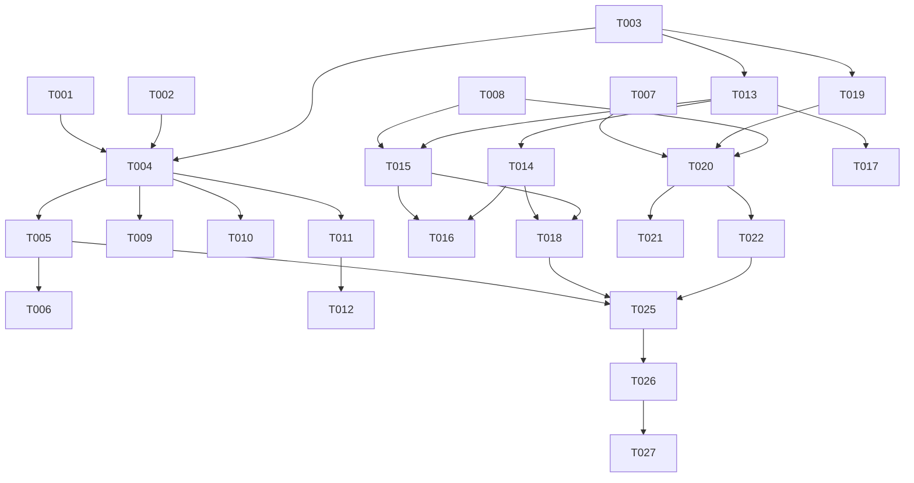

# Tasks: Relay Server 客户端集成

**Input**: Design documents from `spec/relay-server-integration/`
**Prerequisites**: plan.md, spec.md

**后端契约备注**（来自 D:\work\pix_backend\PLAN.md，M0–M5 已验收，M6 仍在开发）：
- register 响应含 `serverVersion` + `capabilities:["relay","img","sync","recover"]`；refresh 响应不含 accountKey（客户端注册时已持有）
- relay/img 强制 https URL，否则 400；relay 响应头白名单仅 `content-type/cache-control/retry-after`（小写键）；响应体超 1MB → 502
- 401 错误码 `INVALID_TOKEN`；429 带 `Retry-After` 头与 `RATE_LIMITED`；错误体统一 `{error:{code,message,requestId}}`
- **同步（M5 偏差）**：syncToken 格式 `st_<seq>_<6hex>`（客户端按不透明串持久化即可）；push 的 baseToken 不一致但在 90 天保留期内**正常接受**（服务端权威 LWW 幂等），仅过旧才 409 SYNC_FULL_REQUIRED；pull 的 since 传空串=全量，无效/过旧同样 409；hasMore 时用响应内续页 token 续拉；domain 必须 6 域之一否则 400；单域单次 >500 条 → 400（客户端分批必须 ≤500）；bookmark_snapshot 非墓碑条目 **illustId 必填（数字）**、imageUrls 可空数组但元素须全 string；**服务端递归拒写字段名含 token（不敏感大小写）的数据 → 400 SENSITIVE_FIELD_REJECTED**，客户端上行数据必须彻底排除
- M6（/recover）后端未开始，客户端按 docs/backend-design.md §8 契约先行实现

## Format: `[ID] [P?] [Story] Description`

- **[P]**: 可并行（不同文件、无未完成依赖）
- **[Story]**: 用户故事标签（US1/US2/US3，对应 spec.md 优先级 P1/P2/P3）

## Path Conventions

- 源码根：`entry/src/main/ets/`（pages/ components/ stores/ network/ services/ models/ utils/ entryability/）
- 测试根：`entry/src/test/`
- 规格目录：`spec/relay-server-integration/`

## Phase 1: Setup (Shared Infrastructure)

- [X] T001 `entry/src/main/ets/utils/Constants.ets`：新增 `MODE_RELAY = 'relay'` 常量与 `isRelayMode(mode)`；`normalizeMode` 放行 `relay`（其余归一化行为不变）
- [X] T002 [P] `entry/src/main/ets/models/AppSettings.ets` + `entry/src/main/ets/stores/UserSettingStore.ets`：新增 `relayServerUrl=''`、`syncEnabled=false`、`prevAuthMode='standard'`、`prevApiMode='standard'` 四字段，同步覆盖 AppSettingsOptions/loadSettings/saveSettings/getSettings 拷贝/setter 六处

## Phase 2: Foundational (Blocking Prerequisites)

**⚠️ CRITICAL**: 以下任务全部完成前不得开始任何用户故事

- [X] T003 `entry/src/main/ets/models/RelayModels.ets`（新增）：RelayAccount、RelayRegisterResult、SyncItem、SyncPushResult（含 fullRequired）、SyncPullResult、BookmarkSnapshot、RecoverPage、RecoverResult 模型与 fromJson（遵循 fromJson→Options→new Model 模式，data 字段用 JSON string 避免动态对象）
- [X] T004 `entry/src/main/ets/network/RelayClient.ets`（新增，单例）：`register(serverUrl,deviceName,inviteCode?,accountKey?)`、`refreshAccessToken()`（轮换写回，不依赖响应含 accountKey）、`getValidToken()`（过期前自动刷新）、`isRegistered()`、`getCapabilities()`、`relayRequest(options)`（包装 method/url/白名单头/bodyBase64 → POST {relay}/relay/v1/request，URL 强制 https；注入 `Authorization: Bearer <relayAccessToken>`；401 自动刷新一次重放，失败抛类型化错误；502/超时连续计数 ≥3 时 toast + 回落 prevAuthMode/prevApiMode，成功清零；解包时响应头按小写键读取）、`buildImageUrl(pixivUrl)`（拼 `/img/v1/fetch?url=<encoded>`）、`logout()`；令牌/accountKey/capabilities 走 PreferenceService（`relay_*` key），不进 AppSettings；依赖 T001–T003
- [X] T005 `entry/src/main/ets/network/HttpClient.ets`：`resolveMode` 识别 relay；`doRequest` 末端 relay 分支——跳过 applyDirectIp/remoteValidation:'skip'，委派 `RelayClient.relayRequest(options)`，解包响应还原原始 status/header/body 返回；非 relay 路径零改动；依赖 T004
- [X] T006 `entry/src/main/ets/network/OAuthService.ets`：`authMode==='relay'` 时 exchangeToken/refreshToken 旁路 postTokenNoSni（TLSSocket），改走 HttpClient.post 到 `https://oauth.secure.pixiv.net/auth/token`（由 doRequest 自动包装中继）；现有错误分类（CredentialInvalidError/NetworkError）语义保持；依赖 T005
- [X] T007 `entry/src/main/ets/network/ApiService.ets`：新增携带 statusCode 的错误类型（如 HttpStatusError），`ensureSuccess` 抛出时附带 HTTP 状态码，供详情页识别 404；现有消息格式不变
- [X] T008 [P] `entry/src/main/ets/services/DatabaseService.ets`：新增 `bookmark_snapshots (illust_id INTEGER PRIMARY KEY, data TEXT, updated_at INTEGER, deleted INTEGER DEFAULT 0)`（CREATE TABLE IF NOT EXISTS 模式）及 `upsertBookmarkSnapshot/getBookmarkSnapshot(illustId)/getAliveBookmarkSnapshots/markBookmarkSnapshotDeleted`

**Checkpoint**: Foundation ready - 用户故事可开始

## Phase 3: User Story 1 - 配置中继服务器并以 relay 模式浏览 (Priority: P1) 🎯 MVP

**Goal**: 设置页配置中继 + 注册 → 切 relay 模式 → 全部 API/OAuth/图片经中继转发

**Independent Test**: 配置中继地址并注册后切换 relay 模式，推荐/详情/搜索正常加载，图片正常显示

- [X] T009 [P] [US1] `entry/src/main/ets/services/ImageCacheService.ets`：`apiMode==='relay'` 时 getLocalPath 的 URL 处理链改为 `RelayClient.buildImageUrl(url)`，跳过 applyImageHost/applyDirectIp/Host 头/remoteValidation:'skip'/Referer 注入，注入 relay Bearer 头；非 relay 路径零改动
- [X] T010 [P] [US1] `entry/src/main/ets/services/DownloadService.ets`：downloadToCache 同构改造（同 T009 判定与跳过规则），非 relay 路径零改动
- [X] T011 [US1] `entry/src/main/ets/pages/settings/SettingsPage.ets`：新增"中继服务器"配置组——服务器地址输入（TextInputItem）、注册/登录按钮（deviceName 自动取设备名，可选 inviteCode/accountKey 导入输入）、已连接状态展示（账号 + serverVersion）、注销按钮；capabilities 缺失 sync/recover 时对应入口隐藏；注册失败展示服务端错误 message
- [X] T012 [US1] `entry/src/main/ets/pages/settings/SettingsPage.ets` 网络组：认证方式/API 方式选项新增"中继"（networkModeOptions/networkModeValues 扩展）；选中 relay 时若 relayServerUrl 为空弹引导提示且不生效（不落 setter）；从非 relay 切到 relay 前把当前值写入 prevAuthMode/prevApiMode

**Checkpoint**: US1 独立可用（MVP）

## Phase 4: User Story 2 - 多设备数据同步 (Priority: P2)

**Goal**: 六域上行备份/下行恢复，启动 pull + 10s 防抖 push，accountKey 导出/导入

**Independent Test**: 设备 A 产生历史/屏蔽/设置变更 → 立即同步 → 设备 B 导入同一 accountKey 拉取后可见

- [X] T013 [US2] `entry/src/main/ets/services/SyncService.ets`（新增，单例）骨架：每域游标与最后同步时间持久化（`sync_token_<domain>`/`sync_last_<domain>`，token 按不透明串处理）、`schedulePush(domain)`（10s 防抖，单域分批每批 ≤500 条）、`startupPull()`、`syncNow()`（全域 push 后 pull）、`getLastSyncText(domain)`；push/pull 遇 409 SYNC_FULL_REQUIRED → 清空本地域后 since 空串全量 pull 重建；pull hasMore 时用响应续页 token 续拉至末页；离线/失败静默保留下轮重试；依赖 T003/T004
- [X] T014 [US2] `entry/src/main/ets/services/SyncService.ets` 六域 collector/applier：history（DB history 表，key=illust_id，viewed_at LWW）、search_history（key=keyword+search_type，LWW）、mute（AppSettings muteTags/muteUsers/aiFilter，key=tag:xxx/user:xxx/ai，LWW+墓碑=集合并集）、exif_config（四字段整条 LWW，key 固定）、settings（AppSettings 非敏感字段整条 LWW，key 固定）、bookmark_snapshot（DB bookmark_snapshots 表，快照 illustId 必填数字、imageUrls 元素全 string）；**上行数据严格排除字段名含 token 的任何键**（含嵌套），避免服务端 400 SENSITIVE_FIELD_REJECTED
- [X] T015 [US2] `entry/src/main/ets/stores/BookmarkStateStore.ets`：新增 `registerBookmarkChangeListener/unregisterBookmarkChangeListener` 回调注册表，star/unstar 成功后触发；`entry/src/main/ets/services/SyncService.ets` 注册回调生成快照（BookmarkSnapshot：元数据 + imageUrls + bookmarkedAt）push / unstar 推墓碑，fire-and-forget 失败下轮重试（写 bookmark_snapshots 表暂存）；依赖 T008/T013
- [X] T016 [US2] 写入点接线：`entry/src/main/ets/services/DatabaseService.ets` addHistory/addSearchHistory/clearHistory/clearSearchHistory 与 `entry/src/main/ets/stores/UserSettingStore.ets` 相关 setter（mute/exif/settings 类）调用 `SyncService.schedulePush(domain)`；注意避免与 SyncService 反向依赖成环（懒解析或回调注册）
- [X] T017 [US2] `entry/src/main/ets/entryability/EntryAbility.ets`：onCreate 中 `localProxyServer.start()` 后 setTimeout(5000) 调 `SyncService.startupPull()`（内部判 syncEnabled + 已注册）
- [X] T018 [US2] `entry/src/main/ets/pages/settings/SettingsPage.ets` 中继组扩展：同步开关（syncEnabled）、"立即同步"按钮 + 进行中状态、六域最后同步时间展示、"导出同步账号"（复制 accountKey + 泄露风险 AlertDialog）/"导入同步账号"（输入 accountKey 重新注册加入）

**Checkpoint**: US1+US2 均独立可用

## Phase 5: User Story 3 - 收藏快照与已删除作品恢复 (Priority: P3)

**Goal**: 详情页 404 快照兜底 + 第三方恢复轮询 + 查看器展示 + 收藏页占位卡片

**Independent Test**: 收藏→快照上行→作品 API 404→详情页显示快照与恢复按钮→轮询→成功展示或明确失败提示

- [X] T019 [P] [US3] `entry/src/main/ets/services/RecoverService.ets`（新增，单例）：`query(pid)` GET {relay}/recover/v1/illust/{pid}（relay Bearer 鉴权）；`pollUntilReady(pid, onProgress, maxAttempts=30)` 按 retryAfterSec 间隔轮询、支持取消令牌；200 ready/202 fetching/404 not_found 三态映射 RecoverResult；依赖 T003/T004
- [X] T020 [US3] `entry/src/main/ets/stores/IllustDetailStore.ets`：load 捕获带 statusCode 的错误（T007），404 时查 `DatabaseService.getBookmarkSnapshot(illustId)`，命中则置 `deletedSnapshot` 与兜底态；新增 `recoverState`（idle/polling/ready/failed）与 `startRecover()`（编排 RecoverService 轮询，成功置 pages 供页面跳查看器）
- [X] T021 [US3] `entry/src/main/ets/pages/detail/IllustDetailPage.ets`：404 + 有快照时渲染快照元数据卡（标题/作者/页数/标签）+ "尝试从第三方恢复"按钮（无快照维持现有 ErrorView）；轮询中显示进度 + 取消按钮；恢复成功用恢复 pages 跳 ImageViewerPage；not_found toast "暂无法从第三方恢复该作品"；aboutToDisappear 取消轮询
- [X] T022 [P] [US3] `entry/src/main/ets/pages/bookmark/BookmarkPage.ets`：收藏列表混入 `getAliveBookmarkSnapshots` 中已删除作品的灰色占位卡片（快照标题 + "已删除"角标），按 bookmarkedAt 倒序混排，点击进详情走 T020/T021 兜底流程

**Checkpoint**: 三个用户故事均独立可用

## Phase 6: Polish & Cross-Cutting Concerns

- [X] T023 [P] `entry/src/test/`：纯函数单元测试——relay URL 包装/解包、六域 LWW 合并与墓碑语义、settings 敏感字段排除（字段名含 token 递归剔除）、BookmarkSnapshot 序列化（illustId 数字、imageUrls 全 string）
- [X] T024 全量自审：arkts_check 检查全部新增/修改 .ets 文件；确认非 relay 路径行为零回归（standard/compatible/ech 模式 URL 链不变）；确认无敏感字段进入上行数据

## Phase 7: Verification

<!-- verification_scope: build-only -->
<!-- 用户已决定取消 UI 验证（无法及时操作）；改为应用内置"后端自检"功能留作快速验证手段 -->

**Purpose**: 构建与部署验证

- [X] T025 Build project and fix any compilation errors（build_project 已通过：BUILD SUCCESSFUL）
- [X] T026 Deploy application to device/emulator（start_app，模块 entry / EntryAbility）（模拟器 Mate 70 RS 部署启动成功）
- [X] ~~T027 Run UI verification~~ （用户取消 UI 验证）
- [X] T028 契约核查与内置自检（对照 pix_backend/docs/api.md 逐端点核查并修复 5 处偏差：refresh 401/400 语义、relay timeoutMs、sync data 对象化上行+limit=100、recover meta 解析、buildImageUrl 双重包装守卫；新增 services/RelaySelfTestService.ets 六端点自检 + SettingsPage"后端自检"入口 + spec/relay-server-integration/RESUME.md 交接文档）

---

## 📊 Dependency Graph



## ⚡ Parallel Execution Guide

| Phase | Tasks | Required Files | Execution Notes |
|---|---|---|---|
| Setup | T001 ∥ T002 | Constants.ets / AppSettings.ets+UserSettingStore.ets | 不同文件可并行 |
| Foundational | T008 独立于 T003→T007 主线 | DatabaseService.ets | T004 是关键路径，T005/T006 串行跟随 |
| US1 | T009 ∥ T010 | ImageCacheService / DownloadService | 同构改造；T011→T012 同页串行 |
| US2 | T013→T014 串行；T015/T016/T017/T018 依序 | SyncService.ets 是热点文件 | T016 规避循环依赖；T018 依赖 T014/T015 |
| US3 | T019 ∥ T022 可并行启动；T020→T021 串行 | RecoverService / BookmarkPage 独立 | 详情页 store/page 两文件串行 |
| Polish | T023 ∥ T024 | entry/src/test/ 与源码自审 | 互不影响 |

---

## Dependencies & Execution Order

### Phase Dependencies

- **Setup (Phase 1)**: 无依赖，立即开始
- **Foundational (Phase 2)**: 依赖 Setup，阻塞全部用户故事（T004 RelayClient 为关键路径）
- **User Stories (Phase 3–5)**: 全部依赖 Foundational 完成；US1→US2→US3 按优先级串行（US2 依赖 US1 的中继通道，US3 依赖 US2 的快照）
- **Polish (Phase 6)**: 依赖全部用户故事完成
- **Verification (Phase 7)**: 依赖 Polish 完成

### User Story Dependencies

- **US1 (P1)**: Foundational 后即可开始，无故事间依赖
- **US2 (P2)**: 依赖 US1 的 RelayClient 认证与设置页中继组
- **US3 (P3)**: 依赖 US2 的快照上行与本地快照表

### Within Each User Story

- 模型/服务先于 UI；核心实现先于集成；故事完成后才进入下一优先级

---

## Parallel Example: User Story 1

```bash
# 图片链路两处同构改造可并行：
Task: "T009 ImageCacheService relay 图片包装"
Task: "T010 DownloadService relay 下载包装"
# 设置页两组改动（T011→T012）同文件串行
```

---

## Implementation Strategy

### MVP First (User Story 1 Only)

1. 完成 Phase 1 Setup + Phase 2 Foundational
2. 完成 Phase 3 US1 → 独立验证 relay 模式全链路浏览 → 即为可交付 MVP

### Incremental Delivery

1. Setup + Foundational → 地基就绪
2. + US1 → relay 模式可用（MVP）
3. + US2 → 同步闭环（后端 M5 已就绪，可端到端联调）
4. + US3 → 删除图恢复（后端 M6 未就绪，先验证兜底 UI 与降级，联调后续补）

---

## Summary Report

- **总任务数**: 27（Setup 2 / Foundational 6 / US1 4 / US2 6 / US3 4 / Polish 2 / Verification 3）
- **并行机会**: T001∥T002、T009∥T010、T019∥T022、T023∥T024，及 T008 相对主线独立
- **独立验证标准**: US1=relay 模式全链路浏览；US2=双设备 accountKey 同步闭环；US3=404 快照兜底→恢复轮询→查看器展示
- **建议 MVP 范围**: Phase 1–3（Setup + Foundational + US1）
- **风险**: 后端 M6 未就绪，US3 端到端联调依赖后端进度；T027 对 /recover 仅验证入口渲染与降级行为

---

## Notes

- [P] 任务 = 不同文件且无未完成依赖
- [USx] 标签映射 spec.md 用户故事，保证可追溯
- syncToken 一律按不透明串持久化/透传，客户端不解析格式
- 上行数据字段名含 token（不区分大小写）会被服务端 400 拒绝，序列化前必须递归剔除
- 后端并行开发中，若联调发现契约偏差，以 docs/backend-design.md 为准并记录
