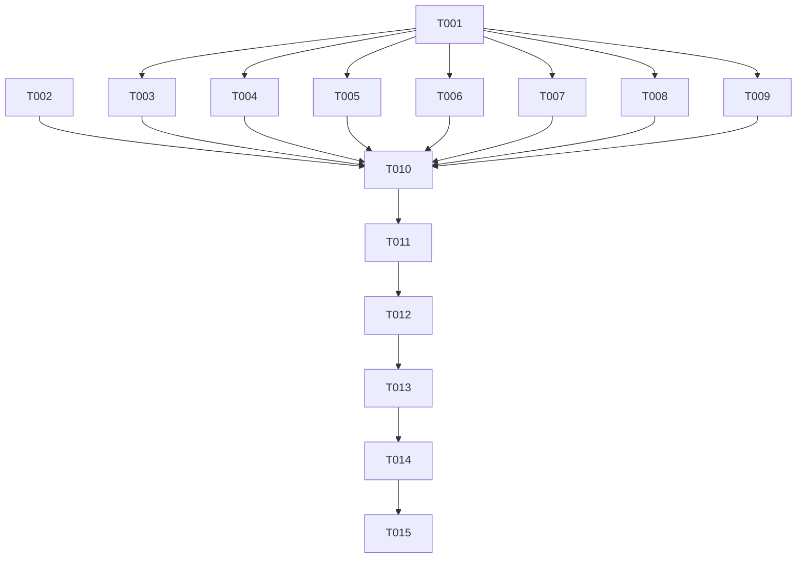

# Tasks: 设置页分类聚合重构

**Input**: Design documents from `spec/settings-regroup/`
**Prerequisites**: plan.md, spec.md

**Organization**: 任务按用户故事分组；US2（子页平移）在文件依赖上先于 US1（首页重写），执行顺序以 Task ID 为准。

## Format: `[ID] [P?] [Story] Description`

- **[P]**: 不同文件、无未完成依赖，可并行
- **[Story]**: 对应 spec.md 用户故事（US1/US2/US3）

## Path Conventions

- 单模块项目：源码在 `entry/src/main/ets/`，路由注册在 `entry/src/main/resources/base/profile/main_pages.json`
- 本特性全部文件位于 `entry/src/main/ets/pages/settings/`

---

## Phase 1: Foundational (Blocking Prerequisites)

**⚠️ CRITICAL**: 以下任务未完成前，任何子页/首页任务不得开始

- [X] T001 创建共享组件模块 `entry/src/main/ets/pages/settings/SettingWidgets.ets`：从 SettingsPage.ets 原样迁出 SettingItem/SwitchItem/SectionHeader/TextInputItem 四个 @Component struct（改为 export）、QualityOption interface、showQualityPicker 模块级函数、全部选项数组（preview/detail/illustManga 质量、networkMode 选项+取值、imageHost 选项+取值、proxyType、downloadConcurrency），并新增 labelOf(options, value) 反查函数
- [X] T002 在 `entry/src/main/resources/base/profile/main_pages.json` 注册 7 个新路由：pages/settings/BrowseSettingsPage、DownloadSettingsPage、FilterSettingsPage、NetworkSettingsPage、RelaySettingsPage、GeneralSettingsPage、AccountSettingsPage

**Checkpoint**: 共享组件与路由就绪，子页可实现

---

## Phase 2: User Story 2 - 既有设置项功能无损平移 (Priority: P1)

**Goal**: 7 个分类子页承载全部既有设置项，交互/副作用/持久化与重构前一致

**Independent Test**: 逐页操作各设置项，对照重构前行为验证（修改生效、持久化、跳转、弹窗一致）

- [X] T003 [P] [US2] 创建 `entry/src/main/ets/pages/settings/BrowseSettingsPage.ets`：浏览与显示 9 项（预览图/详情页/全屏查看/插画/漫画质量 Picker、网格列数 Picker、显示翻译标签/显示 R18 榜单/防社死模式开关），含标题栏+返回，@State settings 重读刷新模式
- [X] T004 [P] [US2] 创建 `entry/src/main/ets/pages/settings/DownloadSettingsPage.ets`：下载与元数据 9 项（下载管理跳转、下载质量/线程数 Picker、文件名模板/EXIF 标签管理跳转、写入元数据/自动合并同义标签/下载时自动收藏开关、备注模板跳转）
- [X] T005 [P] [US2] 创建 `entry/src/main/ets/pages/settings/FilterSettingsPage.ets`：屏蔽管理跳转 + 过滤 AI 作品开关
- [X] T006 [P] [US2] 创建 `entry/src/main/ets/pages/settings/NetworkSettingsPage.ets`：认证方式/API 方式/图床 Picker + 自定义图床输入，搬运 ensureRelayReady 引导弹窗与 applyAuthMode/applyApiMode 全部副作用（prevMode 记录、hoster.init/refreshAll、localProxyServer.start）
- [X] T007 [P] [US2] 创建 `entry/src/main/ets/pages/settings/RelaySettingsPage.ets`：中继组 9 项整体迁移（服务器地址/邀请码/同步账号输入、注册登录、状态行、数据同步开关+六域时间、立即同步、导出同步账号、后端自检含 SelfTestOverlay 与全部 @State、注销确认弹窗），自检 ForEach keyGenerator 保持 `name|status|durationMs` 不变
- [X] T008 [P] [US2] 创建 `entry/src/main/ets/pages/settings/GeneralSettingsPage.ets`：我的收藏/历史记录/关于跳转 + 清理图片缓存（确认弹窗 + imageCacheService 清理 + toast）
- [X] T009 [P] [US2] 创建 `entry/src/main/ets/pages/settings/AccountSettingsPage.ets`：导出 Token（单 AlertDialog 双按钮：复制剪贴板/DocumentSavePicker 导出文件）+ 退出登录（确认后清栈回登录页）

**Checkpoint**: 7 个子页均可通过直接 pushUrl 进入且功能完整

---

## Phase 3: User Story 1 - 分类聚合的设置首页 (Priority: P1) 🎯 MVP

**Goal**: 设置首页仅呈现 7 个分类入口，点击进入对应子页

**Independent Test**: 打开设置 Tab，首页只有 7 个分类行；逐一点击进入并返回

- [X] T010 [US1] 重写 `entry/src/main/ets/pages/settings/SettingsPage.ets`：删除全部已平移的设置组/状态/方法/导入（中继状态、自检、导出 Token、清缓存、网络模式等均已迁出），保留 struct 名 SettingsPage 与既有路由；首页为标题"设置"+7 个分类入口行（用 SettingItem，onItemClick pushUrl 到对应子页）；aboutToAppear 重读 settings/relay 状态

**Checkpoint**: 首页极简，7 分类导航闭环

---

## Phase 4: User Story 3 - 分类入口摘要预览 (Priority: P3)

**Goal**: 首页分类行右侧显示关键当前值摘要，子页修改返回后自动刷新

**Independent Test**: 子页修改设置 → 返回首页 → 对应摘要文字更新

- [X] T011 [US3] 在 SettingsPage.ets 为分类行实现摘要：浏览与显示=`预览:{label} · 网格:{n}列`；下载与元数据=`{下载质量label} · {n}线程`；屏蔽与过滤=`AI过滤:{开/关}`；网络=`认证:{label} · API:{label}`；中继=`{未配置/未注册/已连接 vX} · 同步:{开/关}`；账户=当前用户名；通用无摘要（labelOf 复用 SettingWidgets）

**Checkpoint**: 全部用户故事完成

---

## Phase 5: Polish & Cross-Cutting Concerns

- [X] T012 对全部新增/修改的 .ets 文件运行 arkts_check，修复所有诊断（@kit.* 的 6 条 SDK d.ts 噪音除外）
- [X] T013 确认 SettingsPage.ets 无残留死代码（未用导入/状态/方法），确认无任何文件再从 SettingsPage 导入被移走的私有物

---

## Phase 6: Verification

<!-- verification_scope: build-only -->

**Purpose**: 构建并部署验证可编译性与可部署性（功能回归由用户手动逐项验证）

- [X] T014 运行 build_project 构建并修复全部编译错误（fix → build 循环直至成功）
- [X] T015 通过 start_app 部署到真机 HUAWEI Mate 70 Pro+

---

## 📊 Dependency Graph



## ⚡ Parallel Execution Guide

| Phase | Tasks | Required Files | Execution Notes |
|---|---|---|---|
| Foundational | T001→T002 | SettingWidgets.ets、main_pages.json | T001 先行（T002 独立可并行） |
| US2 子页 | T003–T009 | 7 个子页文件，互不重叠 | 全部 [P]，可并行实现 |
| US1 首页 | T010 | SettingsPage.ets | 依赖 T002+T003–T009 全部完成 |
| US3 摘要 | T011 | SettingsPage.ets | 依赖 T010 |
| Polish | T012–T013 | 全部新/改文件 | 顺序执行 |
| Verification | T014–T015 | — | 顺序执行 |

---

## Dependencies & Execution Order

### Phase Dependencies

- **Foundational (Phase 1)**: 无依赖，可立即开始；阻塞所有用户故事任务
- **US2 子页 (Phase 2)**: 依赖 T001/T002；七个任务相互独立可并行
- **US1 首页 (Phase 3)**: 依赖 Phase 2 全部完成（否则分类入口跳转落空路由）
- **US3 摘要 (Phase 4)**: 依赖 T010
- **Polish / Verification**: 依赖全部故事任务完成

### Within Each User Story

- 子页先建骨架（标题栏+返回）再逐项平移设置行
- 每页完成后 arkts_check 该文件

## Parallel Example: User Story 2

```text
# T003–T009 七个子页文件无交叉，可在同一实现会话内顺序或并行完成：
Task: "创建 BrowseSettingsPage.ets（浏览与显示 9 项）"
Task: "创建 DownloadSettingsPage.ets（下载与元数据 9 项）"
Task: "创建 RelaySettingsPage.ets（中继组 9 项 + 自检覆盖层）"
```

---

## Implementation Strategy

### MVP First

1. 完成 Foundational（T001–T002）
2. 完成 US2 七子页（T003–T009）
3. 完成 US1 首页（T010）→ 即达可用状态：分类导航 + 功能完整
4. **STOP and VALIDATE**: 构建部署，手动回归

### Incremental Delivery

1. T001–T010 → MVP（分类聚合 + 功能平移）
2. T011 → 摘要增强（可裁剪）
3. T012–T013 → 静态检查与死代码清理
4. T014–T015 → 构建部署

---

## Notes

- [P] 任务 = 不同文件、无依赖
- [USx] 标签映射 spec.md 用户故事，保证可追溯
- US2 各子页可独立通过直接 pushUrl 验证；US1 完成后整链路闭环
- 每完成一个逻辑组跑 arkts_check；T014 前不做 build_project（避免重复构建）
- 避免：跨页共享可变状态（各页自读 UserSettingStore）、ForEach key 不含可变显示字段（本项目已知刷新陷阱）

---

## Summary Report

- **总任务数**: 15（T001–T015）
- **按故事分布**: US1 × 1（T010）、US2 × 7（T003–T009）、US3 × 1（T011）；Foundational × 2、Polish × 2、Verification × 2
- **并行机会**: T003–T009 七个子页完全并行
- **独立验证标准**: US1=首页 7 分类导航闭环；US2=子页逐项功能对照回归；US3=摘要修改后返回刷新
- **建议 MVP 范围**: T001–T010（US1+US2 同为 P1，摘要 P3 可延后）
- **验证范围**: build-only（构建+部署，无 UI 自动化验证）
