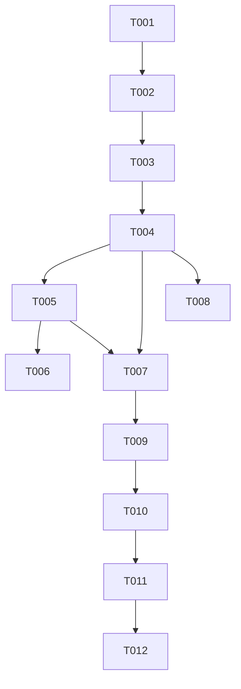

# Tasks: 流式下载改造（Streaming Download）

**Input**: Design documents from `spec/streaming-download/`
**Prerequisites**: plan.md, spec.md

**Tests**: 未请求测试任务（无 TDD 要求），验证走 Verification 阶段 build + deploy。

**Organization**: 任务按用户故事分组；核心改动集中于 `DownloadService.ets` 单文件，故多数任务串行（同文件不标 [P]）。

## Format: `[ID] [P?] [Story] Description`

- **[P]**: 可并行（不同文件、无未完成依赖）
- **[Story]**: 对应 spec.md 用户故事（US1/US2/US3/US4）
- 所有描述含确切文件路径

---

## Phase 1: Setup (Shared Infrastructure)

**Purpose**: 共享参数常量，供 US1/US2/US3 引用

- [X] T001 在 `entry/src/main/ets/utils/Constants.ets` 新增下载传输参数常量：readTimeout 60000、connectTimeout 保持 30000（如已有则复用）、最大尝试次数 3、退避基数（1s 起步指数）、临时文件前缀 `part_`

---

## Phase 2: Foundational (Blocking Prerequisites)

**Purpose**: 本特性无跨故事阻塞性基础设施（常量已在 Setup）；各故事直接基于现有 DownloadService 结构

**Checkpoint**: 无需独立任务，直接进入用户故事

---

## Phase 3: User Story 1 - 流式下载核心 (Priority: P1) 🎯 MVP

**Goal**: requestInStream 流式落盘，解除大小上限，产出实时进度

**Independent Test**: 下载 >5MB 原图成功落盘、文件完整，任务终态 completed

### Implementation for User Story 1

- [X] T002 [US1] 在 `entry/src/main/ets/services/DownloadService.ets` 新增私有方法 `streamOnce`：Promise 封装单次流式传输——请求前订阅 headersReceive（捕获状态码与 Content-Length）/dataReceive（ArrayBuffer 块按递增偏移 writeSync 写入临时文件 fd，累计 receivedBytes）/dataEnd（关 fd，有 Content-Length 时校验 received==total 否则按传输中断 reject）；requestInStream 回调 err 或状态码 ≥400 → reject；结束 off 事件 + destroy()
- [X] T003 [US1] 重写同文件 `downloadToCache`：URL/请求头构建（relay 包装 / applyImageHost+applyDirectIp+Host 头+remoteValidation:'skip'）逻辑保留；传输改为打开 `cacheDir/downloads/part_<taskId>.<ext>`（CREATE|READ_WRITE）并调用 streamOnce；成功后走既有 finalizeDownload（EXIF 嵌入/降级重命名不变）；失败置 failed + notifyTaskChanged（终态语义不变）
- [X] T004 [US1] 进度节流写库（同文件）：streamOnce 内有 Content-Length 时计算 percent，较上次写库提升 ≥2% 才 updateDownloadStatus(taskId,'downloading',percent)；无 Content-Length 保持 0；完成写 100；进度写库不触发 notifyTaskChanged（复用 DownloadPage 1.5s 轮询）

**Checkpoint**: US1 完成——任意大小文件流式下载可用，可独立演示 MVP

---

## Phase 4: User Story 2 - 自动重试与超时调整 (Priority: P2)

**Goal**: 任务内自动重试（指数退避，3 次尝试）+ readTimeout 60s

**Independent Test**: 模拟一次中途断连后恢复，任务自动完成；日志可见重试

### Implementation for User Story 2

- [X] T005 [US2] 在 `entry/src/main/ets/services/DownloadService.ets` 的 downloadToCache 外包尝试循环：最多 3 次（1 初始+2 重试），退避 1s→2s；可重试错误=网络错误/超时/5xx/传输中断，不可重试=4xx 立即失败；重试耗尽置 failed + 既有失败 toast
- [X] T006 [P] [US2] streamOnce 的 reqOptions 接入 T001 常量：readTimeout 60000、connectTimeout 30000（同文件，若 T005 已合入可合并执行）

**Checkpoint**: US1+US2 均独立可用——弱网瞬时抖动自动恢复

---

## Phase 5: User Story 3 - 断点续传 (Priority: P2)

**Goal**: 重试/重下从已下载字节续传，上游不支持 Range 回退整下

**Independent Test**: 大图中断→重试→请求带 Range 头且仅传剩余字节，文件完整

### Implementation for User Story 3

- [X] T007 [US3] 在 `entry/src/main/ets/services/DownloadService.ets` 的 downloadToCache/streamOnce 加入续传：每次尝试前 fileIo.statSync 临时文件，size>0 时请求头加 `Range: bytes=N-`；headersReceive 状态 206→保留内容偏移从 N 追加，200→截断临时文件从头写；有 Content-Length 且 size≥total→直接进 finalize；size 异常（>total）→删临时文件整下

**Checkpoint**: 三个核心故事全部独立可用

---

## Phase 6: User Story 4 - 下载页实时进度显示 (Priority: P3)

**Goal**: DownloadPage 下载中任务行显示实时百分比且不闪烁

**Independent Test**: 大文件下载中观察该行百分比持续增长至完成

### Implementation for User Story 4

- [X] T008 [US4] 核对 `entry/src/main/ets/pages/settings/DownloadPage.ets` 进度展示：确认 downloading 态百分比随轮询增长（行 key 已含 progress）；仅当 0%/无 Content-Length 场景文案抖动时才微调展示态（预期零改动或小改，禁止改动轮询与事件机制）

**Checkpoint**: 全部用户故事完成

---

## Phase 7: Polish & Cross-Cutting Concerns

**Purpose**: 临时文件生命周期收口与边界确认

- [X] T009 改造 `entry/src/main/ets/services/DownloadService.ets` 的 `clearTasksByStatus`：删除记录前枚举匹配任务的 `part_<taskId>.<ext>` 临时文件并删除（FR-008 清理出口）
- [X] T010 边界回归检查（同文件为主）：GIF 无 EXIF 路径、EXIF 嵌入失败降级路径、relay 模式流式、应用重启后 failed 任务续传（残留临时文件可被 T007 识别）、并发上限语义未变

---

## Phase 8: Verification

<!-- verification_scope: build-only -->

**Purpose**: 构建与部署验证

- [X] T011 Build project and fix any compilation errors (invoke build_project; iterate fix → build until success)
- [X] T012 Deploy application to device/emulator (invoke start_app)

---

## Dependencies & Execution Order

### Phase Dependencies

- **Setup (Phase 1)**: 无依赖，立即开始
- **US1 (Phase 3)**: 依赖 T001；T002→T003→T004 同文件串行
- **US2 (Phase 4)**: 依赖 US1（重试循环包裹流式传输）；T005/T006 同文件串行
- **US3 (Phase 5)**: 依赖 US1 的临时文件机制，与 US2 的重试循环集成（每次尝试自动续传）
- **US4 (Phase 6)**: 依赖 US1 的进度写库
- **Polish (Phase 7)**: 依赖全部故事完成
- **Verification (Phase 8)**: 最后执行

### User Story Dependencies

- **US1 (P1)**: 不依赖其他故事
- **US2 (P2)**: 依赖 US1（重试载体是流式传输）
- **US3 (P2)**: 依赖 US1（续传载体是临时文件）；建议 US2 之后实施（与重试循环集成最自然）
- **US4 (P3)**: 依赖 US1（进度产出）

### Within Each User Story

- 核心实现（T002）先于集成（T003）先于增强（T004）
- 故事完成并自验后再进入下一优先级

### Parallel Opportunities

- 本特性核心改动集中于 DownloadService.ets 单文件，**不鼓励并行**（同文件冲突风险）；T008（DownloadPage）可与 T007 并行

---

## 📊 Dependency Graph



---

## ⚡ Parallel Execution Guide

| Phase | Tasks | Required Files | Execution Notes |
|---|---|---|---|
| US4 | T008 | DownloadPage.ets | 唯一可与其他故事并行的任务（不同文件） |
| 其余 | T002–T007, T009, T010 | DownloadService.ets | 同文件，严格串行 |

---

## Summary Report

- **Total tasks**: 12
- **Per-story count**: US1 = 3（T002–T004），US2 = 2（T005–T006），US3 = 1（T007），US4 = 1（T008）
- **Setup/Foundational/Polish/Verification**: 1 / 0 / 2 / 2
- **Parallel opportunities**: 仅 T008 可与 T007 并行；其余同文件串行
- **Independent test criteria**: 见各故事 Phase 头部 Independent Test
- **Suggested MVP scope**: Phase 1 + Phase 3（US1）——大文件流式下载即可交付
- **Format validation**: 全部任务以 `- [ ]` 开头、ID 连续唯一（T001–T012）、US 阶段任务均带 [USx] 标签、Setup/Polish/Verification 无故事标签 ✅

---

## Path Conventions

- 源码：`entry/src/main/ets/`（services/、utils/、pages/settings/）
- 文档：`spec/streaming-download/`

---

## Parallel Example: User Story 4

```text
# T008（DownloadPage 进度核对）可与 T007（断点续传）并行：
Task: "T007 断点续传（DownloadService.ets）"
Task: "T008 下载页进度展示核对（DownloadPage.ets）"
```

---

## Implementation Strategy

### MVP First (User Story 1 Only)

1. 完成 Phase 1: Setup（常量）
2. 完成 Phase 3: User Story 1（流式核心）
3. **STOP and VALIDATE**：下载 >5MB 原图独立验证
4. 可交付 MVP

### Incremental Delivery

1. Setup → 常量就绪
2. US1 → 独立验证 → MVP（大文件可下载）
3. US2 → 独立验证 → 弱网自动恢复
4. US3 → 独立验证 → 续传零重复流量
5. US4 → 独立验证 → 进度可见
6. 每个故事增量交付且不破坏既有故事

### Parallel Team Strategy

1. 单人串行推进 DownloadService.ets 主线（T001→T002→…→T007）
2. 另一人可同步核对 T008（DownloadPage.ets）

---

## Notes

- [P] 任务 = 不同文件、无未完成依赖
- [Story] 标签用于溯源至 spec.md 用户故事
- 每个用户故事可独立完成与测试
- 每完成一个任务或逻辑组建议提交一次
- 可在任意 Checkpoint 暂停独立验证故事
- 避免：模糊任务、同文件并行冲突、破坏故事独立性的跨故事依赖
