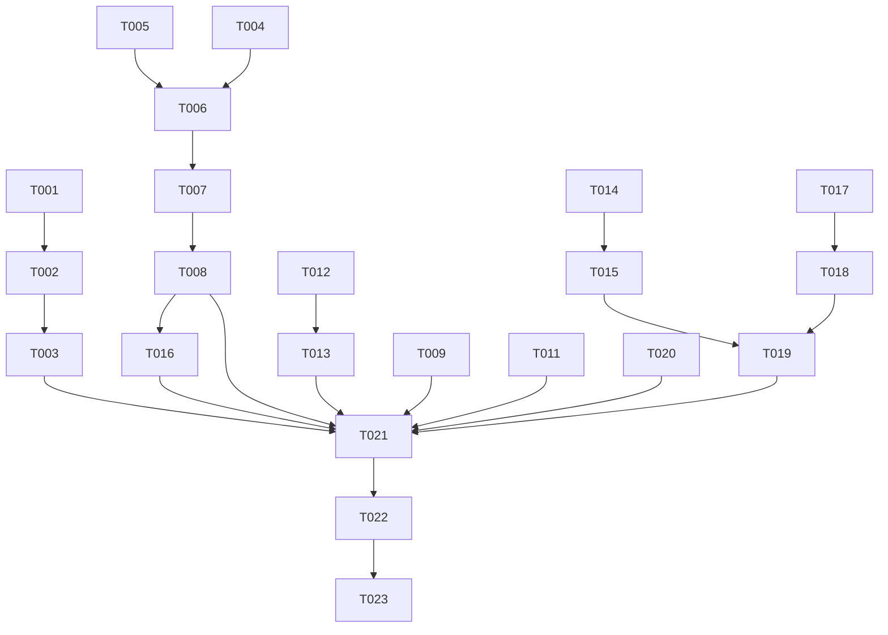

# Tasks: 验证问题修复第一轮（verification-fixes-round1）

**Input**: Design documents from `spec/verification-fixes-round1/`
**Prerequisites**: plan.md, spec.md

**Tests**: 仅 US7 补全纯函数含单测，其余为修复性改动无新测试。

**Organization**: 任务按用户故事分组，每个故事可独立实现与验证。

## Format: `[ID] [P?] [Story] Description`

- **[P]**: 可并行（不同文件、无未完成依赖）
- **[Story]**: 对应 spec.md 用户故事（US1-US7）
- 描述必须含确切文件路径

## Path Conventions

- 源码根：`entry/src/main/ets/`（pages/、stores/、models/、network/、services/、utils/）
- 测试：`entry/src/test/`

## Phase 1: Setup (Shared Infrastructure)

**Purpose**: 本轮无新页面/新基建，仅共享层小改

- [X] T001 修改 `entry/src/main/ets/network/ApiService.ets` 的 `ensureSuccess`：错误消息附加截断后的响应体（约 200 字符），便于定位服务端 4xx/5xx 原因

---

## Phase 2: Foundational (Blocking Prerequisites)

**Purpose**: 本轮无全局阻塞性基建，各故事可直接开始（T001 与所有故事无依赖冲突，唯一约束是同文件任务串行）

**⚠️ 同文件串行约束**：ApiService.ets（T001→T002）；SearchPage.ets（T003→T004→T005）；HistoryPage.ets（T006 与 T013 串行）；IllustDetailPage.ets（T011→T012→T015）；DownloadService.ets/DownloadPage.ets（T009→T010）

**Checkpoint**: 无阻塞，直接进入用户故事

---

## Phase 3: User Story 1 - 评论发表修复（500 错误）(Priority: P1) 🎯 MVP

**Goal**: 主楼/回复楼评论发表成功

**Independent Test**: 评论页发送主楼评论成功；对评论发送回复成功

### Implementation for User Story 1

- [X] T002 [US1] 修改 `entry/src/main/ets/network/ApiService.ets` 的 `addIllustComment`：form 字段名 `'text'` 改为 `'comment'`（illust_id/comment/可选 parent_comment_id 不变）（在 T001 之后同文件串行）
- [X] T003 [US1] 检查 `entry/src/main/ets/stores/CommentStore.ets` 的错误透传：发送失败 toast 展示含响应体的错误信息（依赖 T001/T002），确认失败时输入内容不丢失的既有行为不变

**Checkpoint**: US1 独立可用

---

## Phase 4: User Story 2 - 画师搜索修复与搜索历史全量记录 (Priority: P1)

**Goal**: 画师 Tab 正常渲染；四类搜索行为写历史；历史页按类型回放

**Independent Test**: 作者名搜索画师 Tab 显示真实头像/名称/账号；四类行为各执行后历史页可见且点击回放正确

### Implementation for User Story 2

- [X] T004 [US2] 修改 `entry/src/main/ets/pages/search/SearchPage.ets` 画师 Tab 解析：`user_previews[]` 元素先取 `.user`（RawWrapper{user?:Object} 模式）再喂 `UserPreview.fromJson`，空则跳过；确认头像/名称/账号/点击跳转 userId 正常
- [X] T005 [US2] 修改 `entry/src/main/ets/services/DatabaseService.ets` 的 `addSearchHistory`：先 `DELETE FROM search_history WHERE keyword = ? AND search_type = ?` 再 INSERT（去重）
- [X] T006 [US2] 修改 `SearchPage.ets`：搜索提交按当前结果 Tab 记录类型（插画 Tab='illust'、画师 Tab='user'）；PID/UID 直达 onClick 增加写历史（类型 'pid'/'uid'）（依赖 T005，与 T004 同文件串行）
- [X] T007 [US2] 修改 `SearchPage.ets`：支持可选路由参数 `{keyword?, tab?}`——存在 keyword 时预填并自动提交搜索，tab='user' 时结果区初始定位画师 Tab
- [X] T008 [US2] 修改 `entry/src/main/ets/pages/settings/HistoryPage.ets` 搜索历史 Tab：条目显示类型标识（插画/画师/PID/UID）；点击按类型回放（illust→TagSearchPage{keyword}、user→SearchPage{keyword,tab:'user'}、pid→IllustDetailPage{illustId}、uid→UserProfilePage{userId}）

**Checkpoint**: US2 独立可用

---

## Phase 5: User Story 3 - 历史记录按作品合并展示 (Priority: P1)

**Goal**: 浏览历史展示/导出按 illust_id 合并保留最新

**Independent Test**: 含存量重复数据时历史页同一作品只显示最新一条；导出内容一致

### Implementation for User Story 3

- [X] T009 [US3] 修改 `entry/src/main/ets/services/DatabaseService.ets` 的 `getHistory`：SQL 改为 `SELECT * FROM history WHERE id IN (SELECT MAX(id) FROM history GROUP BY illust_id) ORDER BY timestamp DESC LIMIT ?`（ResultSet 解析不变；不动存量数据）

**Checkpoint**: US3 独立可用

---

## Phase 6: User Story 4 - 登录后返回栈修复 (Priority: P1)

**Goal**: 登录成功后按返回不退回登录页

**Independent Test**: 退出登录→重新登录→首页按返回→不回登录页

### Implementation for User Story 4

- [X] T010 [P] [US4] 修改 `entry/src/main/ets/pages/login/WebViewLoginPage.ets` 登录成功回调：`router.clear()` 后 `router.replaceUrl({ url: 'pages/home/HomePage' })`
- [X] T011 [P] [US4] 修改 `entry/src/main/ets/pages/login/TokenLoginPage.ets` 登录成功回调：同上 `router.clear()` + replaceUrl

**Checkpoint**: US4 独立可用

---

## Phase 7: User Story 5 - 下载管理修复 (Priority: P2)

**Goal**: 重试全部失败任务且结果明细可见；页面进度/状态自动刷新

**Independent Test**: 3 个失败任务点重试→全部重试且 toast 明细；下载中停留页面状态自动更新无 Loading 闪烁

### Implementation for User Story 5

- [X] T012 [US5] 修改 `entry/src/main/ets/services/DownloadService.ets`：`retryAllFailed` 返回分类计数 `{started, succeeded, failed, skipped}`（元信息缺失计 skipped）；新增任务变更事件通知（回调注册表 register/unregister，任务完成/失败时触发）
- [X] T013 [US5] 修改 `entry/src/main/ets/pages/settings/DownloadPage.ets`：可见期 1.5s 轮询静默刷新（`aboutToAppear` 启动定时器 + 注册事件回调，`aboutToDisappear` 清理；静默刷新不置 isLoading，消除列表闪烁）；重试失败按钮 toast 展示分类计数明细（依赖 T012）

**Checkpoint**: US5 独立可用

---

## Phase 8: User Story 6 - 详情页操作区重设计与弹窗修复 (Priority: P1)

**Goal**: 双 FAB 操作区 + tag 下方小号评论按钮；合并对话框恢复可交互；空历史导出提示

**Independent Test**: FAB 收藏/保存/长按下载全部正常；评论文字按钮进评论页；合并对话框可输入可点按钮；空历史导出出提示

### Implementation for User Story 6

- [X] T014 [US6] 修改 `entry/src/main/ets/pages/detail/IllustDetailPage.ets`：根 Stack 主 Column 之后、弹层之前挂 BottomEnd 双 FAB 容器——收藏 FAB（bookmarkState() 着色，点按 store.toggleBookmark()，长按 bindContextMenu 公开/私密收藏）+ 下载 FAB（点按 handleSavePage(0)，长按 bindContextMenu：保存当前页/下载全部，多页才显示下载全部）；可见性条件 illust.id>0 且三个弹层均未打开；InfoRow 删除原按钮区；"查看评论"改为 tag 云行之后、related_header 之前的居中小号文字按钮（pushUrl CommentPage 契约不变）
- [X] T015 [US6] 修改 `IllustDetailPage.ets` 的 MergeDialogOverlay：删除 `.hitTestBehavior(HitTestMode.Block)`，内层改 `.onClick(() => {})` 消费点击（与 T014 同文件串行）
- [X] T016 [US6] 修改 `HistoryPage.ets`：菜单项 onClick 先 `menuShown=false`，`setTimeout(300ms)` 后执行导出/清空逻辑；toast 改用 `this.getUIContext().getPromptAction().showToast()`（与 T008 同文件串行）

**Checkpoint**: US6 独立可用

---

## Phase 9: User Story 7 - tag 合并对话框输入补全 (Priority: P2)

**Goal**: 本地合并规则+本作品 tag 优先即时匹配，API 兜底（防抖、仅本地零匹配时）

**Independent Test**: 输入本地来源前缀即时出建议；本地无匹配停顿后出 API 联想词；点选回填

### Tests for User Story 7

- [X] T017 [P] [US7] 新建 `entry/src/test/MergeSuggest.test.ets`：单测本地候选构建纯函数（合并规则 mainTag/fromTags 拍平去重 + 本作品 tag 前缀匹配 + 跨来源去重）

### Implementation for User Story 7

- [X] T018 [US7] 新建 `entry/src/main/ets/utils/MergeSuggest.ets`：纯函数 `buildLocalSuggestions(input, mergedRules, illustTags): string[]`（前缀匹配、去重、优先级排序）；修改 `entry/src/main/ets/network/PixivEndpoints.ets` 的 `searchAutoComplete` 追加 `&merge_plain_keyword_results=true`
- [X] T019 [US7] 修改 `IllustDetailPage.ets` 的 MergeDialogOverlay：TextInput onChange → 本地建议即时展示（输入框下方建议列表，点选回填 mergeInputText）；本地零匹配且停顿 ≥300ms 时调 `apiService.getAutoComplete`，解析 `tags[].name`（translated_name 过 `Constants.filterTranslatedName`）追加展示；输入为空不请求不显示；API 失败静默降级（依赖 T015、T018）

**Checkpoint**: US7 独立可用，全部故事完成

---

## Phase 10: Polish & Cross-Cutting Concerns

- [X] T020 [P] 更新 `AGENTS.md`：详情页操作区改 FAB 的描述、弹窗约定删除 MergeDialogOverlay"已知例外"（Block 已移除）、搜索历史 search_type 四类取值、下载管理刷新机制、登录导航修复、评论字段名修正说明
- [X] T021 回归走查：详情页 EXIF 保存流程/合并审查弹窗/防社死遮罩与 FAB 层级；搜索页原有插画搜索；历史页导出两格式；评论区全链路（代码走查）

---

## Phase 11: Verification

<!-- verification_scope: build-only -->

**Purpose**: 构建与部署验证（不含 UI 验证）

- [X] T022 构建项目并修复全部编译错误（调用 build_project，迭代 fix → build 直至成功）
- [X] T023 部署应用到设备/模拟器（调用 start_app）

---

## 📊 Dependency Graph



---

## Dependencies & Execution Order

### Phase Dependencies

- **Setup (Phase 1)**: 仅 T001，无依赖
- **Foundational (Phase 2)**: 无全局阻塞，仅同文件串行约束
- **User Stories (Phase 3-9)**: 故事间基本无依赖，US7 依赖 US6 的 T015（对话框去 Block）
- **Polish (Phase 10)**: 依赖全部故事完成
- **Verification (Phase 11)**: 依赖 Polish

### User Story Dependencies

- **US1**: 依赖 T001（同文件）；独立可验证
- **US2**: 内部 T004 与 T005 可并行（不同文件），T006 依赖 T005，T007→T008 串行
- **US3**: 单任务独立
- **US4**: 两任务不同文件可并行
- **US5**: T012→T013 串行
- **US6**: T014→T015 同文件串行；T016 依赖 T008（同文件 HistoryPage）
- **US7**: T018 依赖 T017；T019 依赖 T015（US6）与 T018

### Within Each User Story

- 服务/工具层先行，再页面层
- 每个故事完成后即可独立验证

### Parallel Opportunities

- US2 的 T004（SearchPage 解析）与 T005（DB 去重）并行
- US3、US4、US5 跨文件彼此完全并行
- T017 单测与 T018 实现并行启动
- US1/US3/US4/US5 四组可并行推进

---

## ⚡ Parallel Execution Guide

| Phase | Tasks | Required Files | Execution Notes |
|-------|-------|----------------|-----------------|
| US2 | T004 + T005 | SearchPage.ets / DatabaseService.ets | 不同文件并行；T006 待 T005 |
| US3+US4+US5 | T009, T010+T011, T012 | DatabaseService / login 两页 / DownloadService | 三组跨文件完全并行 |
| US6+US7 | T014→T015→T019 | IllustDetailPage.ets | 同文件严格串行 |
| Tests | T017 | entry/src/test/ | 与 T018 并行 |

---

## Parallel Example: 跨故事并行

```bash
# 三组无交集修复可同时推进：
Task: "US3 getHistory SQL 去重 in DatabaseService.ets"
Task: "US4 登录返回栈修复 in WebViewLoginPage/TokenLoginPage"
Task: "US5 retryAllFailed 计数 in DownloadService.ets"
```

---

## Implementation Strategy

### MVP First

1. T001 + US1（评论 500 一行修复）→ 最快恢复核心功能可用
2. US2/US3/US4（P1 搜索/历史/导航）→ 独立验证
3. US6（P1 详情页重设计）→ 独立验证
4. US5/US7（P2）→ 独立验证
5. Polish → Verification

### Incremental Delivery

每个故事独立可交付；建议顺序 US1 → US4 → US3 → US2 → US6 → US5 → US7。

---

## Notes

- [P] 任务 = 不同文件、无未完成依赖
- [USx] 标签用于需求追溯（spec.md User Story x）
- 同文件串行约束是本轮最大执行风险（SearchPage×3、IllustDetailPage×3、HistoryPage×2），实施时按编号顺序
- 每个故事修复后即可独立人工验证
- 建议每个故事一组提交
- 避免：并行修改同一文件；改变存量 DB 数据；引入 ActionSheet

---

## Summary Report

- **总任务数**: 23（Setup 1 / US1 2 / US2 5 / US3 1 / US4 2 / US5 2 / US6 3 / US7 3 / Polish 2 / Verification 2）
- **并行机会**: US2 内 T004+T005；US3/US4/US5 三组跨故事并行；T017 与 T018 并行
- **独立验证**: US1 评论发送成功；US2 画师列表正常+四类历史回放；US3 历史无重复；US4 返回不回登录页；US5 重试全部+自动刷新；US6 FAB+对话框+导出提示；US7 补全三级来源
- **建议 MVP**: T001+US1（评论修复）→ US4/US3（导航/历史）先行交付
