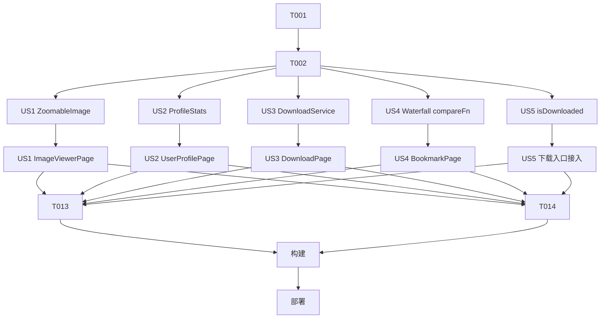

# Tasks: 查看器与用户主页修复 + 下载/收藏管理增强

**Input**: Design documents from `spec/viewer-profile-download-fixes/`
**Prerequisites**: plan.md, spec.md

**Organization**: 按用户故事分组；US1（查看器）与 US2（用户主页）为 P1 缺陷修复先行，US3~US5 为 P2 增强，文件互不冲突可并行。

## Format: `[ID] [P?] [Story] Description`

- **[P]**: 可并行（不同文件、无未完成依赖）
- **[Story]**: 映射 spec.md 用户故事（US1~US5）
- 所有路径基于仓库根 `D:\work\pixiv-\`

---

## Phase 1: Setup (Shared Infrastructure)

- [X] T001 阅读 spec/viewer-profile-download-fixes/ 三份文档与上一轮产出组件（IllustWaterfall/IllustCard/ZoomableImage/DownloadService），确认改造锚点，无需新建文件/目录

---

## Phase 2: Foundational (Blocking Prerequisites)

**⚠️ CRITICAL**: 本轮无阻塞性基础设施（全部复用上一轮组件/服务），此阶段仅为共享校验

- [X] T002 确认 `entry/src/main/ets/models/Illust.ets` 已解析 createDate 与 totalBookmarks 字段（收藏排序依赖）；缺失则补充 fromJson 映射（create_date/total_bookmarks）

**Checkpoint**: 排序依赖字段就绪

---

## Phase 3: User Story 1 - 全屏查看器翻页与缩放修复 (Priority: P1) 🎯 MVP

**Goal**: 按官方样例模式根治手势竞争：手势静态常驻 + Pan distance 动态化 + 边界释放

**Independent Test**: ≥3P 查看器横滑翻页、双指缩放、放大拖动、双击还原后翻页恢复

- [X] T003 [US1] 重构 `entry/src/main/ets/components/viewer/ZoomableImage.ets`：GestureGroup(Parallel, Pinch+Pan+Tap) 静态常驻挂载（移除按 scale 条件切换手势组）；PinchGesture({fingers:2, distance:1})；PanGesture distance 动态（scale=1 时 50、scale>1 时 3）；拖到 X 边界时通过 onZoomChange(false) 释放翻页；保留 1~5 限幅/边界钳制/双击 1↔2.5 切换
- [X] T004 [US1] 适配 `entry/src/main/ets/pages/detail/ImageViewerPage.ets`：onScaleChange 契约改为 onZoomChange(isZoomed)，disableSwipe 绑定该标志；确认单 P 时页码隐藏与保存按钮不受影响

**Checkpoint**: 查看器四项手势交互全部可用

---

## Phase 4: User Story 2 - 用户主页瀑布流与统计数据修复 (Priority: P1) 🎯 MVP

**Goal**: 统计数据解析 profile 对象；作品列表接入公共瀑布流

**Independent Test**: 作者主页关注数/作品数显示真实值；作品按宽高比瀑布流展示且可分页

- [X] T005 [US2] 在 `entry/src/main/ets/models/User.ets` 新增 ProfileStats 接口与 profileStatsFromJson()（解析 total_follow_users/total_illusts/total_manga/total_illust_bookmarks_public）
- [X] T006 [US2] 修改 `entry/src/main/ets/pages/user/UserProfilePage.ets`：loadProfile 解析 response.profile 渲染关注数/作品数；作品列表移除旧 List.lanes，接入 IllustWaterfall（fetchFirst 封装 getUserIllusts(userId)，复用 parseIllustListPage，自动获得分页/角标/长按菜单）

**Checkpoint**: 主页统计正确 + 作品瀑布流分页

---

## Phase 5: User Story 3 - 下载管理批量操作 (Priority: P2)

**Goal**: 一键重试失败 / 清空失败 / 清空已完成

**Independent Test**: 制造失败与完成任务，三个批量操作各执行一次，列表状态与 toast 数量正确

- [X] T007 [US3] 增强 `entry/src/main/ets/services/DownloadService.ets`：新增 retryAllFailed()（查 failed 任务逐条重新下载，返回发起数，元信息缺失条目跳过计数）与 clearTasksByStatus(status)（仅删 DB 记录不删文件，返回删除数）
- [X] T008 [US3] 增强 `entry/src/main/ets/pages/download/DownloadPage.ets`：顶部操作行三按钮（重试失败/清空失败/清空完成）+ AlertDialog 确认 + 操作后刷新列表 + toast 反馈处理数量

**Checkpoint**: 批量操作闭环

---

## Phase 6: User Story 4 - 我的收藏多种排序 (Priority: P2)

**Goal**: 4 种本地排序规则，即时重排且不持久化

**Independent Test**: 切换"收藏旧→新"列表反转；分页追加数据遵守当前排序

- [X] T009 [US4] 增强 `entry/src/main/ets/components/illust/IllustWaterfall.ets`：新增可选入参 compareFn；提供时数据入库后按之排序，compareFn 引用变更时对已加载数据全量重排（IDataSource reload）
- [X] T010 [US4] 增强 `entry/src/main/ets/pages/bookmark/BookmarkPage.ets`：顶栏排序按钮 + ActionSheet（收藏新→旧默认/收藏旧→新/上传时间新→旧/收藏数高→低），切换更新 compareFn；排序状态仅存页面 @State 不持久化

**Checkpoint**: 排序切换即时生效

---

## Phase 7: User Story 5 - 下载前重复检测 (Priority: P2)

**Goal**: 按 插画ID+页码 检测，命中弹窗确认

**Independent Test**: 已下载页再次保存弹确认框，取消 0 重复下载；文件已删则直接重下

- [X] T011 [US5] 增强 `entry/src/main/ets/services/DownloadService.ets`：新增 isDownloaded(illustId, part)（completed 记录 + fs.access 文件存在双条件）
- [X] T012 [US5] 各下载入口接入确认流程：单页命中弹 AlertDialog（仍要下载/取消）；saveAll 汇总命中页一次弹窗（跳过已下载/全部重下/取消），覆盖 `entry/src/main/ets/stores/IllustDetailStore.ets`（savePage/saveAll）、`entry/src/main/ets/pages/detail/ImageViewerPage.ets`（handleSave）、`entry/src/main/ets/components/illust/IllustCard.ets`（长按菜单保存）

**Checkpoint**: 全部下载入口去重生效

---

## Phase 8: Polish & Cross-Cutting Concerns

- [X] T013 更新 `AGENTS.md`：ZoomableImage 手势方案说明、DownloadService 新方法、IllustWaterfall compareFn 契约
- [X] T014 全局检查本轮改动文件的未使用 import 与残留调试代码，运行 code-linter 修复告警

---

## Phase 9: Verification

<!-- verification_scope: build-only -->

**Purpose**: 构建并部署验证可编译性与可部署性（UI 验证由用户人工进行）

- [X] T015 构建项目并修复所有编译错误（调用 build_project，迭代 修复→构建 直至成功）
- [X] T016 部署应用到模拟器/真机（调用 start_app）

---

## 📊 Dependency Graph



---

## ⚡ Parallel Execution Guide

| Phase | Tasks | Required Files | Execution Notes |
|---|---|---|---|
| US1~US5 主体 | T003/T005/T007/T009/T011 | ZoomableImage / User / DownloadService / IllustWaterfall / DownloadService | T007 与 T011 同文件需串行合并执行；其余故事文件互不重叠可并行 |
| Polish | T013, T014 | AGENTS.md / 各改动文件 | T014 依赖全部故事完成 |

---

## Summary Report

- **总任务数**: 16（Setup 1 / Foundational 1 / US1 2 / US2 2 / US3 2 / US4 2 / US5 2 / Polish 2 / Verification 2）
- **并行机会**: 5 个故事主体改造原则上可并行（仅 T007/T011 同文件需合并）
- **建议 MVP 范围**: T001-T006（US1+US2 缺陷修复），6 个任务
- **独立测试标准**: 各故事 Phase 头部 Independent Test 即验收入口

---

## Path Conventions

- 源码根 `entry/src/main/ets/`；本轮零新增文件，全部增量修改既有文件
- 验证部署：模块 `entry`，Ability `EntryAbility`

## Dependencies & Execution Order

### Phase Dependencies

- Setup → Foundational（T002 字段确认）→ 五故事（互不依赖，可并行；建议按 P1→P2 顺序）→ Polish → Verification

### User Story Dependencies

- **US1**: T003→T004（同查看器契约，串行）
- **US2**: T005→T006（模型先行）
- **US3**: T007→T008（服务先行）
- **US4**: T009→T010（容器钩子先行）
- **US5**: T011→T012（服务先行）；T011 与 T007 同文件，实施时合并改动 DownloadService 一次完成

## Implementation Strategy

### MVP First

1. T001-T002 准备
2. US1（查看器修复）→ US2（主页修复）→ 构建部署人工验证
3. US3→US4→US5 增量叠加 → Polish → Verification

### Incremental Delivery

每个故事独立可测；任何 Checkpoint 失败不进入下一阶段。

## Notes

- [P] 任务 = 不同文件无依赖；同文件任务（T007/T011）串行或合并
- US1 是本轮最高风险点：手势方案需严格按 plan.md R1 实施，禁止回退到条件手势组
- 实现完成后用户将人工进行 UI 验证（本轮验证范围为 build-only）

## Parallel Example: 五故事主体改造

```text
# T002 完成后，以下任务文件互不重叠，可并行推进：
Task: "重构 ZoomableImage 手势层 (T003)"
Task: "User.ets 新增 ProfileStats (T005)"
Task: "DownloadService 批量操作+isDownloaded 合并改造 (T007+T011)"
Task: "IllustWaterfall 新增 compareFn (T009)"
```
