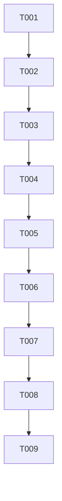

# Tasks: ZoomableImage 手势修复

**Input**: Design documents from `spec/zoomable-image-gesture-fix/`
**Prerequisites**: plan.md (required), spec.md (required for user stories)

**Tests**: 未要求，不生成测试任务

**Organization**: 任务按用户故事分组，确保每个故事可独立实现和验证

## Format: `[ID] [P?] [Story] Description`

- **[P]**: 可并行执行（不同文件、无依赖）
- **[Story]**: 所属用户故事（US1, US2 等）
- 描述中包含具体文件路径

## Path Conventions

- 项目根目录: `D:\work\pixiv-`
- 源码: `entry/src/main/ets/`

## Phase 1: Setup

**Purpose**: 阅读现有代码确认改造锚点

- [X] T001 阅读 spec/zoomable-image-gesture-fix/ 三份文档（spec.md/plan.md/tasks.md）及 ZoomableImage.ets、ImageViewerPage.ets，确认改造锚点与约束

---

## Phase 2: Foundational (Blocking Prerequisites)

**Purpose**: 实现核心修复——PanGestureOptions 动态 distance + .priorityGesture() 优先级提升，这两个改动是所有 US 的前置依赖

**⚠️ CRITICAL**: 无此改动则所有用户故事均无法工作

- [X] T002 在 `entry/src/main/ets/components/viewer/ZoomableImage.ets` 中新增 `private panOptions: PanGestureOptions = new PanGestureOptions({ fingers: 1, distance: 50 })` 字段；将 `PanGesture({ fingers: 1, distance: this.scaleValue > 1 ? 3 : 50 })` 替换为 `PanGesture(this.panOptions)`；将 `.gesture(GestureGroup(...))` 改为 `.priorityGesture(GestureGroup(...))`

---

## Phase 3: User Story 1 + 2 + 3 — 双指缩放 / 放大平移 / Swiper 翻页 (Priority: P1) 🎯 MVP

**Goal**: 修复手势核心功能：双指缩放放大图片、放大后单指拖动平移、未放大时 Swiper 翻页

**Independent Test**: 打开多页插画 → 进入查看器 → 双指放大 → 单指拖动 → 缩回 1 倍 → 左右滑动翻页

### Implementation for US1+US2+US3

- [X] T003 [US1+US2+US3] 在 `entry/src/main/ets/components/viewer/ZoomableImage.ets` 的 `applyScale()` 方法末尾增加 `this.panOptions.setDistance(this.scaleValue > 1 ? 3 : 50)` 调用，确保每次 scaleValue 变化后 PanGesture distance 同步更新；同时在 PinchGesture.onActionEnd 和 TapGesture.onAction 的双击切换中也确保 applyScale() 被调用（当前已调用，确认无遗漏）

**Checkpoint**: 双指缩放、放大后平移、未放大时翻页三项功能全部可用

---

## Phase 4: User Story 4 — 双击切换缩放 (Priority: P2)

**Goal**: 双击图片在 1 倍和 2.5 倍间切换，切换后 distance 同步更新

**Independent Test**: 打开查看器 → 双击放大到 2.5 倍 → 单指可跟手平移 → 再双击回 1 倍 → 单指左右滑可翻页

### Implementation for US4

- [X] T004 [US4] 确认 `entry/src/main/ets/components/viewer/ZoomableImage.ets` 中 TapGesture 双击切换走 `applyScale()` 路径（当前已走），验证 applyScale() 末尾的 `panOptions.setDistance()` 在双击切换后正确更新 distance（scale=1→50vp, scale=2.5→3vp）；若无遗漏则仅确认

**Checkpoint**: 双击切换缩放后，后续手势行为立即适配

---

## Phase 5: User Story 5 — 边界释放回 Swiper (Priority: P3)

**Goal**: 放大后拖到 X 边界继续外拖时临时释放回 Swiper 翻页

**Independent Test**: 放大图片 → 拖到右边界 → 继续右拖 → Swiper 接管翻页

### Implementation for US5

- [X] T005 [US5] 确认 `entry/src/main/ets/components/viewer/ZoomableImage.ets` 中 PanGesture.onActionUpdate 的边界释放逻辑（releasedAtEdge + onZoomChange(false)）和 onActionEnd 的恢复逻辑（onZoomChange(true)）在 .priorityGesture() 下仍然正确工作；因为 .priorityGesture() 让 ZoomableImage 手势优先，边界释放时需确保 Swiper 能接管——此时 onZoomChange(false) 设置 isZoomed=false → disableSwipe=false，Swiper 内置手势重新可用；若逻辑正确则仅确认

**Checkpoint**: 边界释放回 Swiper 翻页功能正常

---

## Phase 6: Polish & Cross-Cutting Concerns

**Purpose**: 文档更新与代码质量

- [X] T006 更新 `AGENTS.md` 中 ZoomableImage 手势方案描述：PanGestureOptions.setDistance() 动态 distance + .priorityGesture() 优先级提升
- [X] T007 对 `entry/src/main/ets/components/viewer/ZoomableImage.ets` 运行 arkts_check 自检，修复非 SDK 噪音类报错；确认无未使用 import 或调试残留

---

## Phase 7: Verification

<!-- verification_scope: build-only -->

**Purpose**: 构建并部署验证可编译性与可部署性（手势功能需真机人工验证）
- [X] T008 构建项目并修复所有编译错误（调用 build_project，迭代 修复→构建 直至成功）

- [X] T009 部署应用到模拟器/真机（调用 start_app）

---

## 📊 Dependency Graph

## ⚡ Parallel Execution Guide

| Phase | Tasks | Required Files | Execution Notes |
|-------|-------|----------------|-----------------|
| Setup | T001 | ZoomableImage.ets, ImageViewerPage.ets | 阅读确认，无修改 |
| Foundational | T002 | ZoomableImage.ets | 核心修复，串行 |
| US1+2+3 | T003 | ZoomableImage.ets | applyScale 增加 setDistance |
| US4 | T004 | ZoomableImage.ets | 确认任务，可能无实际修改 |
| US5 | T005 | ZoomableImage.ets | 确认任务，可能无实际修改 |
| Polish | T006, T007 | AGENTS.md, ZoomableImage.ets | T006 和 T007 不同文件可并行 |
| Verification | T008, T009 | — | 串行：先构建后部署 |

## Implementation Strategy

### MVP (US1+US2+US3)

1. T001 阅读 → T002 核心修复 → T003 applyScale 联动
2. 构建部署 → 真机验证双指缩放+平移+翻页
3. MVP 即可交付

### 完整交付

4. T004 + T005 确认 → T006 + T007 Polish → T008 + T009 验证

---

## Notes

- T004、T005 为确认任务（核心改动在 T002+T003 完成），若 applyScale() 已覆盖所有路径则仅标记完成无需额外修改
- .priorityGesture() 需真机验证与 Swiper 的竞争效果
- 手势功能无法通过自动 UI 验证工具测试，必须人工在真机/模拟器上操作
- arkts_check 对 @kit.* 引用固定报 6 条 SDK d.ts 噪音，属已知环境问题
